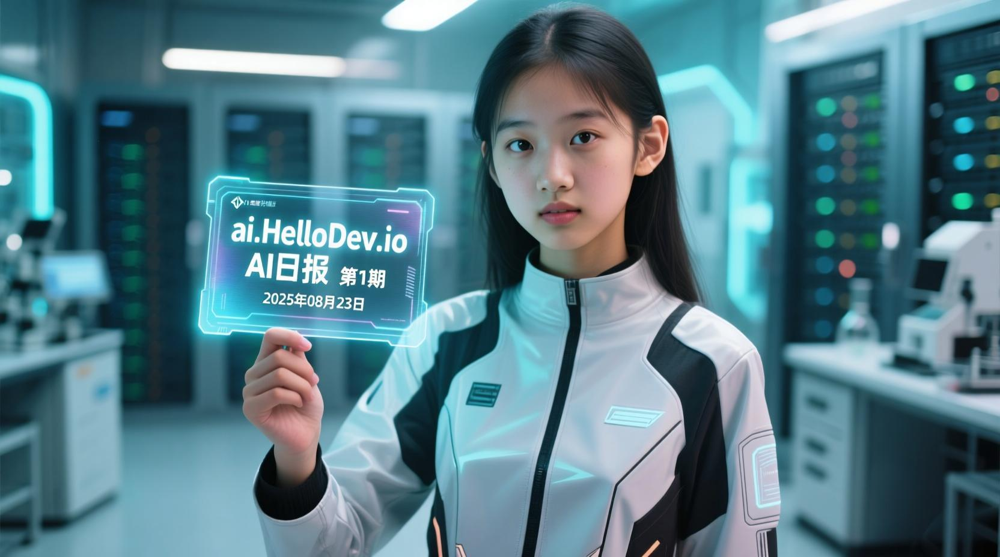

# ai.HelloDev.io AI日报 - 第 1 期 (2025 年 08 月 23 日)

嘿，朋友们！🎉 第 1 期AI日报又来啦！今天的AI世界就像个大游乐场，到处都是新奇的玩意儿和让人眼前一亮的技术突破。

你知道吗？OpenAI一口气发布了好几个重磅消息，从能跑在你手机上的开源模型，到能自己动手干活的ChatGPT Agent，再到超级聪明的GPT-5，简直让人应接不暇！而且，GitHub上也冒出来一堆超实用的AI神器和学习资料，简直是开发者的天堂。接下来的内容保证让你大开眼界，快来看看今天AI又玩出了什么新花样吧！

## 🚀 重磅炸弹

### Introducing gpt-oss - 开源AI模型也能这么强？

**一句话概括**：OpenAI发布了两款强大的开源AI模型，让你的普通电脑也能跑AI！

想象一下，你不用花大钱租GPU服务器，就能在自己的笔记本上运行接近顶级水平的AI模型，是不是有点做梦的感觉？OpenAI这次发布的gpt-oss系列模型就实现了这一点。gpt-oss-120b能在一张80GB显卡上媲美自家的o4-mini，而gpt-oss-20b更是只需要16GB内存，手机都能带动！它们都采用了Apache 2.0许可证，意味着你可以随便改、随便用，简直是开发者的梦中情模。

**简单来说就是**：把顶级AI能力带到了每个人的电脑上。

**我的想法**：这简直是给所有想玩AI但又囊中羞涩的开发者们发了一张“免费门票”！未来用AI会不会像用Office一样普遍呢？

🔗 [去看看](https://openai.com/index/introducing-gpt-oss/) | 💬 你觉得怎么样？欢迎留言

### Introducing ChatGPT agent: bridging research and action - 你的AI秘书上线了！

**一句话概括**：ChatGPT不再只是聊天工具，它现在能帮你完成复杂任务了！

这次的ChatGPT Agent就像是给你配了个能上网、会思考、还能动手做事的秘书。它可以在自己的虚拟电脑里查资料、分析数据、做PPT，甚至帮你规划晚餐。最酷的是，你可以随时介入、暂停或接管它的操作，全程可控，安全感满满。

**简单来说就是**：一个能帮你干活的AI助手，而且全程透明可控。

**我的想法**：这感觉就像科幻电影照进了现实！以后是不是再也不用加班了？AI替我们干活，我们去喝咖啡？

🔗 [去看看](https://openai.com/index/introducing-chatgpt-agent/) | 💬 你觉得怎么样？欢迎留言

### Introducing GPT-5 - AI界的“最强大脑”来了！

**一句话概括**：OpenAI发布了迄今为止最智能、最快、最有用的AI模型GPT-5！

GPT-5就像一个拥有博士学位的助手，知道什么时候该快速回答，什么时候该深入思考。它在写作、编程、健康咨询等多个领域都表现出色，而且更懂你，减少了胡说八道和盲目迎合的情况。无论是学生、开发者还是普通用户，GPT-5都能让你的生活和工作变得更轻松有趣。

**简单来说就是**：一个更聪明、更可靠的全能AI助手。

**我的想法**：GPT-5的到来，感觉就像AI界又升级了一次操作系统。我们离“AI无处不在”的时代又近了一步！

🔗 [去看看](https://openai.com/index/introducing-gpt-5/) | 💬 你觉得怎么样？欢迎留言

### GPT-5 and the new era of work - 工作方式的革命开始了！

**一句话概括**：GPT-5已经开始向企业用户推出，有望彻底改变我们的工作方式！

GPT-5不仅在准确性、速度和推理能力上有巨大飞跃，还能更好地理解上下文和解决复杂问题。它已经开始向Team用户推出，Enterprise和Edu用户下周就能用上。从写代码到写诗，从分析数据到理解健康问题，GPT-5都能大显身手，让AI真正成为每个人的智能助手。

**简单来说就是**：GPT-5将让工作变得更智能、更高效。

**我的想法**：这不仅仅是技术的升级，更是工作方式的变革。未来，我们和AI的关系会是什么样的呢？

🔗 [去看看](https://openai.com/index/gpt-5-new-era-of-work/) | 💬 你觉得怎么样？欢迎留言

## 🛠️ 神器推荐

### dair-ai/ML-YouTube-Courses - AI学习者的“宝藏地图”！

**一句话概括**：这个GitHub项目收录了YouTube上最优质的机器学习和AI课程，一站式学习资源！

无论你是AI小白还是想深入某个专业领域，这个项目都能帮你找到宝藏课程。从斯坦福、MIT等名校的深度学习课程，到最新的大语言模型应用，应有尽有。再也不用担心找不到好的学习资源了！

**简单来说就是**：把全世界最好的AI课程都给你整理好了。

**我的想法**：这简直是知识的“拼多多”，把分散的优质资源都整合到了一起，学习效率直接翻倍！

🔗 [去看看](https://github.com/dair-ai/ML-YouTube-Courses) | 💬 你觉得怎么样？欢迎留言

### rasbt/MachineLearning-QandAI-book - AI进阶的“知识盛宴”！

**一句话概括**：由AI教育界大神Sebastian Raschka带来的机器学习知识盛宴，帮你扫清知识盲区！

这本书通过30个核心问题，帮你快速掌握从基础到进阶的各种知识。每个章节都配有图解和丰富的参考资料，让你轻松掌握多GPU训练、Transformer微调等前沿技术。无论你是开发者还是AI探索者，这本书都能让你在轻松愉快的阅读中，get到最实用的AI技能！

**简单来说就是**：一本帮你从“知道”到“精通”的AI秘籍。

**我的想法**：这种问答式的结构特别适合碎片化学习，而且内容深入浅出，简直是AI学习的“加速器”！

🔗 [去看看](https://github.com/rasbt/MachineLearning-QandAI-book) | 💬 你觉得怎么样？欢迎留言

### lutzroeder/netron - AI模型的“透视镜”！

**一句话概括**：Netron能让你看清楚AI模型内部的神经网络连接方式，就像医生用X光看人体骨骼一样！

无论是做深度学习还是机器学习的模型，Netron都能帮你“解剖”开来，让你一目了然地看到这些“黑盒子”里到底藏着什么秘密。支持几乎所有主流的AI框架格式，开源免费，人人都能用。

**简单来说就是**：让复杂的AI模型变得可视化、易理解。

**我的想法**：对于想深入了解AI内部机制的人来说，Netron简直就是“神器”！它让AI不再神秘，而是变得透明可理解。

🔗 [去看看](https://github.com/lutzroeder/netron) | 💬 你觉得怎么样？欢迎留言

### dair-ai/ML-Course-Notes - 机器学习学习的“导航仪”！

**一句话概括**：汇集了各种顶级大学和平台的机器学习课程笔记，帮你系统学习AI知识！

这个项目收集了Andrew Ng的经典机器学习专项课程、MIT深度学习入门、斯坦福的Transformer专题课程等顶级资源的笔记。每门课程都有配套的视频链接和详细的学习笔记，让你可以边看视频边做笔记，学习效率翻倍。

**简单来说就是**：为你提供结构化的AI学习路径和高质量笔记。

**我的想法**：这简直是为AI学习者量身定做的“学习包”，省去了自己整理笔记的麻烦，直接站在巨人的肩膀上！

🔗 [去看看](https://github.com/dair-ai/ML-Course-Notes) | 💬 你觉得怎么样？欢迎留言

### krishnakumarsekar/awesome-quantum-machine-learning - 量子机器学习的“知识宝库”！

**一句话概括**：这是一个关于量子机器学习的超棒资源集合，从基础理论到实际代码应有尽有！

如果你对量子计算和人工智能的结合感兴趣，这个项目就像是为你准备的“量子大餐”。它收集了量子机器学习的基础知识、算法、学习材料、项目和相关研究论文，让你从基础理论到实际代码都能一站式搞定。

**简单来说就是**：通往量子AI世界的“通行证”。

**我的想法**：量子计算听起来很遥远，但这个项目让普通人也能窥见其一二。未来已来，只是分布不均！

🔗 [去看看](https://github.com/krishnakumarsekar/awesome-quantum-machine-learning) | 💬 你觉得怎么样？欢迎留言

### stas00/ml-engineering - AI训练的“炼丹秘籍”！

**一句话概括**：由实战经验凝结成的AI训练秘籍，帮你少走弯路！

作者Stas Bekman把他参与训练BLOOM-176B和IDEFICS-80B等大模型时的所知所想，全都倒了出来。这里没有空洞的理论，全是如何搞定硬件、优化训练、部署推理的实操干货。想训练自己的AI模型？这里面的脚本和命令能让你少走很多弯路。

**简单来说就是**：一本手把手教你训练大模型的实战指南。

**我的想法**：这本书就像一位经验丰富的老师傅，把毕生所学都传授给你，简直是AI工程师的“葵花宝典”！

🔗 [去看看](https://github.com/stas00/ml-engineering) | 💬 你觉得怎么样？欢迎留言

### dair-ai/ML-Notebooks - 机器学习的“工具箱”！

**一句话概括**：里面装满了各种即拿即用的Jupyter笔记本，代码示例丰富，特别适合学习和研究使用！

无论你是想学PyTorch基础、构建神经网络，还是玩转最新的Transformer模型，这里都有现成的代码示例。这些笔记本都经过精心设计，代码简洁明了，就像乐高积木一样容易组合和扩展。

**简单来说就是**：一个装满AI代码积木的工具箱。

**我的想法**：对于初学者来说，这些现成的代码示例简直是“福音”！可以边学边练，快速上手各种AI技术。

🔗 [去看看](https://github.com/dair-ai/ML-Notebooks) | 💬 你觉得怎么样？欢迎留言

### replicate/cog: Containers for machine learning - AI模型部署的“瑞士军刀”！

**一句话概括**：Cog让你可以轻松地将机器学习模型打包到标准的、可用于生产的容器中！

它解决了研究人员在将模型部署到生产环境时遇到的复杂问题，比如Docker配置、CUDA版本兼容性等。通过简单的配置文件，Cog能自动生成包含所有最佳实践的Docker镜像，让你专注于模型本身而不是部署细节。

**简单来说就是**：让AI模型部署变得像点外卖一样简单。

**我的想法**：这简直是给AI模型穿上了“快递盒”，让它们能安全、快速地到达用户手中！

🔗 [去看看](https://github.com/replicate/cog) | 💬 你觉得怎么样？欢迎留言

## 📰 吃瓜时间

### Rachel James, AbbVie: Harnessing AI for corporate cybersecurity - AI是盾牌还是利剑？

**一句话概括**：在网络安全这场看不见硝烟的战争中，AI既是防御的坚盾，也可能被黑客变成攻击的利刃。

AbbVie公司的Rachel James分享了她如何用AI来保护公司安全，比如用大语言模型来分析海量警报、找出威胁模式，甚至预测攻击者的下一步动作。她还提醒大家，使用AI的同时也要警惕它的风险，比如"提示注入"这类新型攻击方式。

**简单来说就是**：AI在网络安全中扮演着双刃剑的角色。

**我的想法**：看来AI不仅能让我们的生活更便利，也让我们面临的挑战更复杂了。知己知彼，才能百战不殆！

🔗 [去看看](https://www.artificialintelligence-news.com/news/rachel-james-abbvie-harnessing-ai-for-corporate-cybersecurity/) | 💬 你觉得怎么样？欢迎留言

### Huawei Cloud's broad, open approach wins it Gartner honours - 华为云的逆袭之路！

**一句话概括**：华为云凭借其开放和全面的策略，首次在Gartner容器管理魔力象限中跻身领导者象限。

尽管面临国际上的竞争压力，华为云仍以高客户认可度和创新技术赢得了全球企业的青睐，尤其是在AI和云原生服务领域。它在客户认可度上获得了最高分，超过了AWS、微软和谷歌等巨头。

**简单来说就是**：华为云在全球舞台上证明了自己的实力。

**我的想法**：这不仅是技术的胜利，更是策略的胜利。开放和全面，才是赢得未来的王道！

🔗 [去看看](https://www.artificialintelligence-news.com/news/huawei-clouds-open-approach-wins-it-gartner-honours-magic-quadrant-2025-for-container-management/) | 💬 你觉得怎么样？欢迎留言

### Proton's privacy-first Lumo AI assistant gets a major upgrade - 隐私优先的AI助手升级了！

**一句话概括**：Proton的Lumo AI助手进行了重大升级，变得更快、更聪明，而且你的聊天记录完全加密！

Lumo AI assistant升级后推理能力提升了200%，上下文理解提升了170%。最酷的是，你的聊天记录是端到端加密的，连Proton自己都看不到。而且，他们还把移动应用的代码开源了，任何人都可以验证其隐私声明。

**简单来说就是**：一个既强大又保护隐私的AI助手。

**我的想法**：在AI时代，隐私保护变得越来越重要。Lumo的升级，让我们看到了技术与伦理可以并行不悖。

🔗 [去看看](https://www.artificialintelligence-news.com/news/proton-privacy-lumo-ai-assistant-major-upgrade/) | 💬 你觉得怎么样？欢迎留言

### How AI servers are transforming Taiwan's electronics manufacturing giants - AI服务器让台湾“躺赢”了！

**一句话概括**：AI服务器现在比iPhone更能赚钱，台湾的电子制造巨头们正在转型！

公司 like Foxconn are seeing their traditional consumer electronics business being overtaken by the booming demand for AI infrastructure. It's like watching a quiet library suddenly turn into the hottest nightclub in town!

**简单来说就是**：AI基础设施的需求让台湾的制造业迎来了第二春。

**我的想法**：真是三十年河东，三十年河西！谁能想到，做手机的工厂现在靠AI服务器赚得更多了呢？

🔗 [去看看](https://www.artificialintelligence-news.com/news/ai-servers-transform-taiwan-manufacturing-giants/) | 💬 你觉得怎么样？欢迎留言

### Gen AI makes no financial difference in 95% of cases - AI真的那么值钱吗？

**一句话概括**：一项新研究发现，95%的商业案例中，生成式AI其实并没有真正帮公司赚到钱！

这就像你花了大价钱买了一个看起来很厉害的厨房神器，结果发现它做的菜还不如你用普通锅做的好吃。这个发现让很多人开始重新思考：AI到底是不是真的那么值钱？

**简单来说就是**：AI的商业价值可能被高估了。

**我的想法**：这就像给火热的AI泼了一盆冷水，提醒我们不要盲目跟风。技术再好，也要看用在哪儿！

🔗 [去看看](https://www.artificialintelligence-news.com/news/gen-ai-makes-no-financial-difference-in-95-of-cases/) | 💬 你觉得怎么样？欢迎留言

## 📖 学霸专区

### Prompt Orchestration Markup Language - 给AI写指令就像搭乐高！

**一句话概括**：POML是一种全新的结构化提示词标记语言，让复杂的AI指令变得井井有条！

想象一下，给AI助手写指令就像搭乐高积木一样简单明了！POML（Prompt Orchestration Markup Language）就是这样一套“乐高式”的提示词语言。它让复杂的AI指令变得井井有条，就像给AI一本结构清晰的说明书。通过简单的标签，你可以轻松插入文档、表格、图片等各种数据，还能像换皮肤一样随意改变提示词的“外观”风格，而不用每次都重写内容。

**简单来说就是**：让提示词工程变得像写网页一样简单。

**我的想法**：这简直是提示词工程界的“工业革命”！让AI开发变得更规范、更高效。

🔗 [去看看](https://arxiv.org/abs/2508.13948) | 💬 你觉得怎么样？欢迎留言

### Intern-S1: A Scientific Multimodal Foundation Model - 科学界的AI尖子生！

**一句话概括**：科学家们搞出了一个叫Intern-S1的AI模型，它能同时看懂文字、图片，甚至化学分子式和物理图表！

这个模型有280亿个活跃参数，训练用了5万亿个数据片段，其中超过一半来自科学文献。它在科学推理任务上表现得比其他开源模型都要出色，甚至能挑战那些闭源的顶级模型。简单说，它就是科学界的AI尖子生，未来可能帮科学家们更快地发现新药物、新材料。

**简单来说就是**：一个专门处理科学数据的“学霸”AI。

**我的想法**：这让我们离“AI科学家”又近了一步！未来，AI或许能和人类科学家并肩作战，共同探索未知世界。

🔗 [去看看](https://arxiv.org/abs/2508.15763) | 💬 你觉得怎么样？欢迎留言

### DINOv3 - AI视觉专家的“稳定器”！

**一句话概括**：DINOv3通过一种叫做"Gram锚定"的新方法，解决了AI视觉模型在长时间训练中“跑偏”的问题！

就像一位画家在长时间作画时容易手抖一样，AI模型在长时间训练时也会"跑偏"。DINOv3通过巧妙的"锚定"技术，让AI的"画笔"始终保持稳定，从而创造出更高质量的视觉特征。这个模型就像是一个全能的视觉专家，不需要特别的培训就能在各种图像任务中表现出色。

**简单来说就是**：让AI视觉模型训练更稳定、效果更好。

**我的想法**：这就像给AI装上了“防抖系统”，让它在复杂的视觉任务中也能稳如老狗！

🔗 [去看看](https://arxiv.org/abs/2508.10104) | 💬 你觉得怎么样？欢迎留言

### Qwen-Image Technical Report - 既能画画又能写字的AI艺术家！

**一句话概括**：通义实验室推出的Qwen-Image在复杂文本渲染和精确图像编辑方面表现出色！

它能轻松应对中英文混排等复杂场景，还能精准修改图片内容。就像一个既会画画又会写字的全能艺术家，让图像创作变得更加简单有趣。

**简单来说就是**：一个能处理复杂图文任务的AI图像生成模型。

**我的想法**：这让我们离“人人都是设计师”的梦想又近了一步！未来，创作精美的海报、宣传图或许会变得像发朋友圈一样简单。

🔗 [去看看](https://arxiv.org/abs/2508.02324) | 💬 你觉得怎么样？欢迎留言

## 🎮 AI新玩意

### Steve.AI - 全球最快的AI视频生成工具！

**一句话概括**：号称世界最快的人工智能视频生成工具，让你几分钟内就能做出专业视频！

只需输入一个想法或文字提示，它就能在几分钟内生成动画或实拍视频。对于想要在社交媒体上快速发布内容、提升影响力的人来说，这简直是个"视频制作外挂"！

**简单来说就是**：一个能快速把想法变成视频的AI工具。

**我的想法**：这简直是内容创作者的“超级英雄”！以后做视频是不是就像发微博一样简单了？

🔗 [去看看](https://www.producthunt.com/products/steve-ai) | 💬 你觉得怎么样？欢迎留言

### MemSync - 给所有AI工具装上“共享大脑”！

**一句话概括**：让你在ChatGPT、Claude等平台间切换时，AI能记住你是谁、你在做什么！

你有没有遇到过这样的困扰：每次换不同的AI工具，都得重新解释一遍自己的需求和背景？MemSync就像给所有AI工具装上了一个"共享大脑"，让你在不同平台间切换时，AI能记住你的上下文。这就像你有一个私人助理，不管你换哪个电话联系他，他都知道你之前说了什么，再也不用重复解释了！

**简单来说就是**：让AI工具变得更聪明、更连贯。

**我的想法**：这感觉就像给所有AI工具建立了一个“统一战线”，让它们能协同作战，效率翻倍！

🔗 [去看看](https://www.producthunt.com/products/memsync) | 💬 你觉得怎么样？欢迎留言

### Dream Story Live - AI Journaling App - 你的AI日记伙伴！

**一句话概括**：一个用AI帮你整理思绪、记录生活、实现梦想的日记应用！

它就像一个贴心的日记伙伴，用AI帮你整理思绪，给你灵感提示，让你轻松记录每天的想法和梦想。不仅能自己写日记，还能和全世界的"梦想家"们一起设定目标、分享故事，简直就是一个充满正能量的创意社区。

**简单来说就是**：一个能帮你更好地了解自己、实现梦想的AI日记本。

**我的想法**：这不仅仅是记日记，更是一种自我探索和成长的方式。AI在这里扮演的不是替代者，而是引导者和陪伴者。

🔗 [去看看](https://www.producthunt.com/products/dream-story) | 💬 你觉得怎么样？欢迎留言

### PicDoc - 1秒钟把文字变成专业图表！

**一句话概括**：PicDoc能让你的文字在1秒钟内变成专业级别的图表、流程图和信息图！

想象一下，你只需要输入文字，它就能自动帮你生成视觉内容，就像有个专业的设计师在为你服务一样。无论是做报告、演示还是头脑风暴，PicDoc都能帮你快速搞定，而且完全不需要任何设计技能。

**简单来说就是**：一个能快速把文字变成图表的AI神器。

**我的想法**：这简直是为“图表恐惧症”患者量身定做的！以后做PPT再也不用愁了！

🔗 [去看看](https://www.producthunt.com/products/picdoc) | 💬 你觉得怎么样？欢迎留言

### Figma - 设计师的在线协作神器！

**一句话概括**：Figma是一个让设计师和开发人员能够实时协作的设计工具！

想象一下，你和朋友们一起在线编辑同一个文档，每个人都能看到其他人的光标在做什么，这就是Figma的魅力所在！它让界面设计变得像在线共享文档一样简单。

**简单来说就是**：一个让设计协作变得像聊天一样简单的工具。

**我的想法**：这彻底打破了设计的孤岛效应，让团队协作变得更加高效和透明！

🔗 [去看看](https://www.producthunt.com/products/figma/shoutouts) | 💬 你觉得怎么样？欢迎留言

### OpenAI - AI界的乐高积木盒！

**一句话概括**：OpenAI不只是那个火爆全网的ChatGPT背后的大脑，它还是开发者们的超级工具箱！

从GPT系列到Codex，它提供了一系列强大的API和工具，让开发者能轻松构建各种AI应用。无论你是想让APP变得更聪明，还是想训练一个专属的AI助手，OpenAI都能给你"开挂"般的体验。

**简单来说就是**：一个让每个人都能构建AI应用的“乐高盒”。

**我的想法**：OpenAI就像AI世界的“基础设施”，为无数创新应用提供了土壤。未来，我们可能会看到更多令人惊叹的AI产品从这里诞生！

🔗 [去看看](https://www.producthunt.com/products/openai) | 💬 你觉得怎么样？欢迎留言

---

## 写在最后

感谢你花时间看完今天的AI日报！🎉

希望这些内容能给你带来一些新的想法和灵感。AI世界每天都在变化，我们也在努力用最有趣的方式为你呈现这些精彩的发展。

如果你觉得某个内容特别有意思，不妨分享给朋友们吧！毕竟，好东西要和好朋友一起分享嘛~

**今日AI关键词**：#AI黑科技 #神器推荐 #AI新玩意 #有趣技术

---

## 互动时间 📢

**今日话题**：你最期待AI在哪个领域有突破？为什么？

🎯 **猜猜看**：下期日报会出现什么有趣的AI内容？
💡 **分享一下**：你最近发现了什么好玩的AI工具吗？
🤔 **聊聊看**：你觉得今天哪个内容最有趣？

欢迎在评论区留言，让我们一起聊聊AI的那些事儿！

---

*本期日报由小编精心整理，如有遗漏或错误欢迎指正。我们下期见！👋*