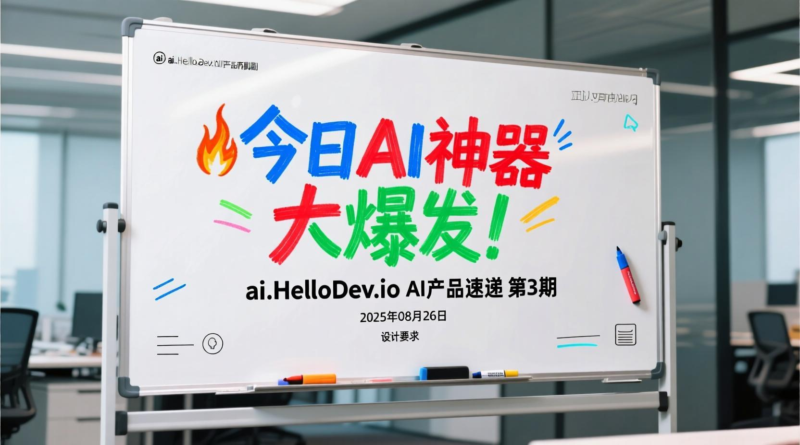
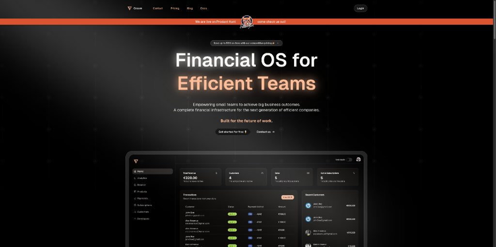
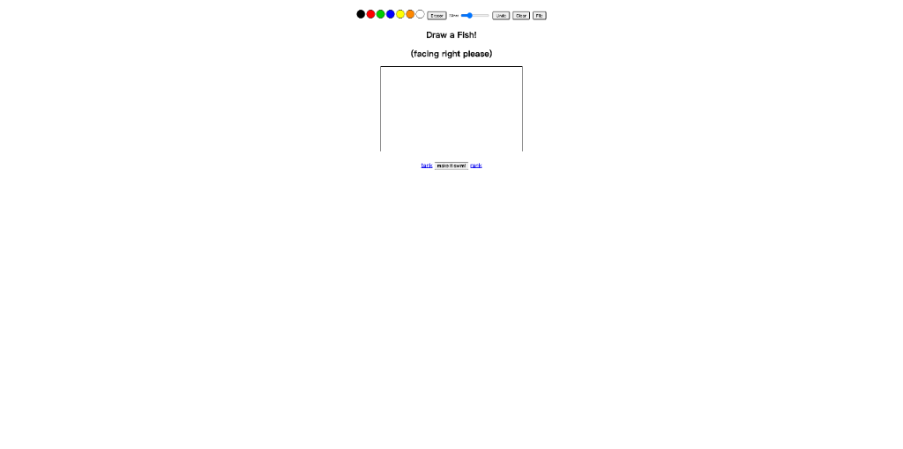
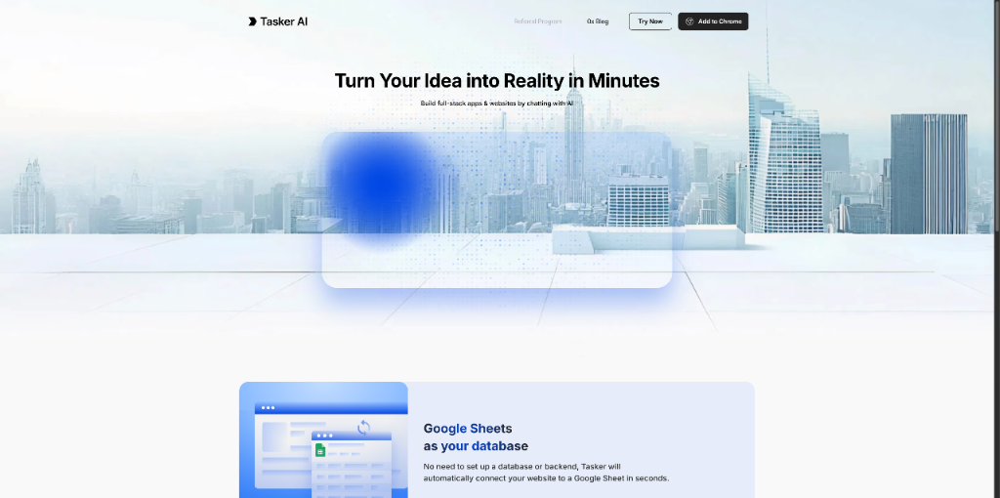

# ai.HelloDev.io AI产品速递 - 第 3 期 (2025 年 08 月 26 日)

各位产品猎人们！🚀 第 3 期AI产品速递来了！今天在 Product Hunt 上发现了 5 个超棒的AI工具，从智能设计平台到创意互动游戏，应有尽有。

从 SaaS 收入分成解决方案到让你的 Instagram 互动自动化的AI助手，这些AI产品正在让我们的工作和生活变得更加高效有趣。准备好了吗？一起来看看今天都有哪些值得收藏的AI神器吧！

## 🚀 今日精选 AI 产品

### 🎨 Creem 1.0 - SaaS收入分成与支付解决方案

**适合人群**：SaaS创业者、AI公司、需要全球支付的现代企业
**核心功能**：收入分成、多币种支付、AI财务助手

Creem 是一款专为 SaaS 和 AI 公司打造的支付与财务操作系统。它不仅能帮你处理复杂的收入分成问题，还支持全球80+货币和稳定币支付，让你的业务轻松拓展全球市场。

- 🎯 解决什么问题：传统支付系统对SaaS公司来说过于复杂，特别是涉及合作伙伴收入分成时
- ⚡ 核心 AI 特性：内置AI助手，能理解你的客户和业务数据，提供智能化财务建议
- 🌟 独特亮点：市场上最具竞争力的定价，支持订阅、一次性支付、许可证等多种模式
- 💡 使用场景举例：与海外合作伙伴共同开发产品时自动分配收入；为全球用户提供本地化支付选项；通过AI助手分析客户支付行为

**Maker说**：Creem 团队由 Paul Mit、Jason Pijnaker、Giovanni Braghieri 和 Gabriel Ferraz 共同创立，他们致力于为SaaS和AI公司打造流畅的支付解决方案。

**推荐理由**：对于正在拓展国际业务的SaaS公司来说，Creem 提供了一站式的支付和财务解决方案，特别是其AI助手功能，能大大减少财务管理的复杂性。

🔗 去 Product Hunt 看看：[Creem 1.0](https://www.producthunt.com/products/creem)

---

### 🐠 Draw A Fish - 画条鱼，看它在数字海洋中游弋

**适合人群**：创意爱好者、艺术创作者、游戏爱好者
**核心功能**：AI辅助绘画、全球共享鱼缸、创意社交

这是一个充满创意和趣味性的AI绘画游戏。你只需画一条鱼，AI会实时评估你的作品"鱼-like"程度，一旦通过识别，你的鱼就会在数字海洋中与其他用户的创作一起游弋。

- 🎯 解决什么问题：为用户提供轻松有趣的创意表达平台
- ⚡ 核心 AI 特性：实时AI反馈，评估绘画作品的"鱼-like"相似度
- 🌟 独特亮点：全球共享鱼缸概念，让每个人的创作都能被看见
- 💡 使用场景举例：闲暇时的创意放松；与朋友一起参与绘画挑战；在社交媒体分享有趣的创作成果

**Maker说**：Alden Hallak 和 MCBananaPeelZ 是 Draw A Fish 的创作者。他们认为这个概念简单而 brilliant：画条鱼，看AI如何评价，然后看着它在数字世界中活过来。

**推荐理由**：如果你喜欢轻松有趣的创意活动，Draw A Fish 绝对值得一试。它将AI技术与艺术创作完美结合，让每个人都能体验到创造的乐趣。

🔗 去 Product Hunt 看看：[Draw A Fish](https://www.producthunt.com/products/draw-a-fish)

---

### 💬 Jotform Instagram Agent - Instagram自动回复助手

**适合人群**：社交媒体运营者、品牌方、内容创作者
**核心功能**：Instagram消息自动回复、多语言支持、知识库集成

Jotform Instagram Agent 能够自动回复你的Instagram私信、评论和故事回复，使用你的语调和知识库内容，帮你处理常见问题，让你无需雇佣团队就能扩大社交媒体影响力。

- 🎯 解决什么问题：社交媒体互动量大时难以及时回复所有消息
- ⚡ 核心 AI 特性：基于你的知识库和语调进行智能回复，支持任何语言
- 🌟 独特亮点：完全自动化的工作流程，所有互动记录都会保存在AI代理收件箱中
- 💡 使用场景举例：品牌官方账号的常见问题自动回复；内容创作者与粉丝的互动管理；跨境电商的客户咨询服务

**Maker说**：Jotform 创始人兼CEO Aytekin 推出了这款 Instagram Agent，旨在解决创作者、品牌和团队在Instagram上面临的评论、私信和故事回复堆积如山的问题。

**推荐理由**：对于依赖Instagram进行品牌推广或客户互动的用户来说，这是一个能显著提升效率的工具。它不仅节省了大量时间，还能保持一致的品牌语调。

🔗 去 Product Hunt 看看：[Jotform Instagram Agent](https://www.producthunt.com/products/jotform)

---

### 🖌️ Pikto AI Studio - 一站式AI设计工具套件

**适合人群**：设计师、营销人员、内容创作者、无设计基础的用户
**核心功能**：AI图像生成、编辑、增强一体化平台

Pikto AI Studio 是一个整合了多种AI设计功能的平台，让你无需设计技能就能轻松创建专业级视觉内容。它集成了图像生成、修改、放大、修复等多项功能于一身。

- 🎯 解决什么问题：传统设计工具功能单一，需要多个软件配合使用
- ⚡ 核心 AI 特性：多合一AI设计套件，包括图像生成器、修改器、放大器、修复器等
- 🌟 独特亮点：一个平台替代多个设计工具订阅，大幅降低成本
- 💡 使用场景举例：快速生成营销活动所需的视觉素材；修复老旧照片并提升质量；为社交媒体内容创建吸引眼球的图像

**Maker说**：Pikto 团队推出了这款AI设计套件，旨在解决大多数AI图像工具只能解决单一问题的痛点。Pikto AI Studio 整合了整个创意流程，提供了一个简单的平台来生成、编辑和增强图像。

**推荐理由**：对于需要频繁制作视觉内容但又不想学习复杂设计软件的用户来说，Pikto AI Studio 是一个革命性的解决方案。它不仅功能全面，还提供了针对Product Hunt用户的独家优惠。

🔗 去 Product Hunt 看看：[Pikto AI Studio](https://www.producthunt.com/products/piktochart)

---

### 🏗️ Tasker Builder - 从想法到产品的AI构建平台

**适合人群**：创业者、开发者、产品经理、无代码应用构建者
**核心功能**：提示词编程、Google Sheets数据库、AI代理集成

Tasker Builder 是一个革命性的AI应用构建平台，让你能够通过简单的描述快速构建可工作的应用程序，并通过AI代理网络处理市场研究、客户拓展、分析和融资等工作。

- 🎯 解决什么问题：从想法到产品实现过程复杂，需要大量技术知识
- ⚡ 核心 AI 特性：Vibe代码编程、AI代理网络、智能应用构建
- 🌟 独特亮点：不仅构建应用，还能连接AI代理帮你运营和扩展业务
- 💡 使用场景举例：快速验证创业想法并构建MVP；自动化客户拓展和市场研究；连接用户行为到智能工作流

**Maker说**：Tasker团队在三周前推出了能代表你执行操作的AI助手，今天他们又推出了Builder。他们知道有很多vibe编码工具，但大多数在你有了webapp后就停止了。Builder走得更远，它像承包商一样与你合作，询问问题，优化构建，交付你真正需要的东西。

**推荐理由**：对于想要快速将想法转化为产品的创业者来说，Tasker Builder 提供了一个前所未有的解决方案。它不仅帮你构建应用，还能通过AI代理网络帮你运营和扩展业务。

🔗 去 Product Hunt 看看：[Tasker Builder](https://www.producthunt.com/products/tasker-builder)

---

## 产品推荐总结

今天为大家发现了 5 个超棒的AI产品！🚀

从 SaaS支付解决方案 到 创意绘画游戏，每个工具都有独特的价值。希望你能找到适合自己的AI助手，让工作和生活变得更高效有趣。

如果你试用了某个产品，别忘了回来分享体验！好产品需要大家一起发现和推荐~

**今日产品标签**：#ProductHunt精选 #AI工具推荐 #效率神器 #AI产品

---

## 互动时间 💬

**产品体验分享**：你试用过今天推荐的哪个产品？体验如何？

🔍 **产品推荐**：你最近发现了什么好用的AI工具？分享给大家吧！
⭐ **需求征集**：你希望有什么样的AI工具来解决你的困扰？
💡 **使用技巧**：有什么AI工具的使用小技巧想要分享？

在评论区留言，让我们一起构建最实用的AI产品库！

---

## 明日预告 🔮

明天会为大家带来更多 Product Hunt 上的AI新品，敬请期待！

有想看的特定类型产品吗？留言告诉我们吧~

---

*本期产品速递由 HelloAI 团队精心筛选，致力于发现最有价值的AI产品。我们下期见！👋*