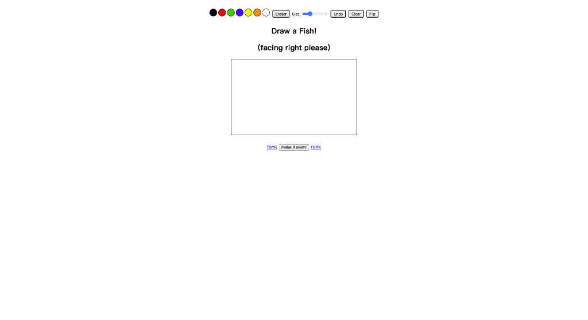

# ai.HelloDev.io AI 产品速递 - 第 1 期 (2025 年 08 月 27 日)\n\n各位产品猎人们！🚀 第 1 期 AI 产品速递来了！今天在 Product Hunt 上发现了 5 个超棒的 AI 工具，从 SaaS 收入分账神器到创意绘画社区，再到 Instagram 自动回复机器人，这些 AI 产品正在让我们的工作和生活变得更加高效有趣。准备好了吗？一起来看看今天都有哪些值得收藏的 AI 神器吧！\n\n## 🚀 今日精选 AI 产品\n\n### 🐟 Draw A Fish - 用 AI 让你的涂鸦游起来\n\n**推荐指数**：⭐⭐⭐⭐\n**适合人群**：喜欢涂鸦、创意绘画的朋友们\n\n今天在 Product Hunt 上发现了一个超有趣的项目 —— Draw A Fish！你只需要画一条鱼，它就会游进一个全球共享的水族馆，和全世界用户的鱼儿一起游弋。这不仅是一个简单的涂鸦应用，更是一个全球创意社区，你可以在这里分享、点赞别人的鱼儿。\n\n- 🎯 主要功能：在线涂鸦、全球共享、社区互动\n- ⚡ AI 特色：AI 让你的鱼儿“活”起来，在虚拟世界中自由游动\n- 🌟 独特之处：将简单的涂鸦变成一个全球互动的艺术装置\n- 💡 使用场景：1. 释放你的创意涂鸦；2. 与全球用户互动；3. 寻找灵感和乐趣\n\n**为什么推荐**：这是一款轻松有趣的创意工具，适合任何想要释放创意、寻找乐趣的人。AI 让涂鸦变得生动，全球社区让创作变得更有意义。\n\n**Maker 故事**：这个项目由 Alden Hallak 和 MCBananaPeelZ 共同创建，他们希望用简单有趣的方式连接全球的创意爱好者。\n\n\n\n🔗 [立即体验](https://www.producthunt.com/products/draw-a-fish) | 💬 用过的朋友说说体验如何？\n\n### 💰 Creem 1.0 - SaaS 收入分账从未如此简单\n\n**推荐指数**：⭐⭐⭐⭐⭐\n**适合人群**：SaaS 创业者、AI 初创团队、独立开发者\n\n如果你是 SaaS 或 AI 产品的创始人，那你一定遇到过收入分账、全球支付、税务合规等头疼的问题。Creem 1.0 就是为了解决这些痛点而生的！它不仅是一个支付处理商，更是一个完整的财务操作系统，让你可以轻松地与合作伙伴分账、处理全球支付、自动处理税务和合规问题。\n\n- 🎯 主要功能：收入分账、全球支付、税务合规、AI 财务洞察\n- ⚡ AI 特色：AI 驱动的财务洞察，帮助你分析客户和支付数据，发现趋势\n- 🌟 独特之处：一站式解决 SaaS 团队的所有财务问题，特别是收入分账\n- 💡 使用场景：1. 与合作伙伴自动分账；2. 全球收款和支付；3. 自动生成财务报告\n\n**为什么推荐**：对于初创团队来说，Creem 1.0 可以节省大量时间和精力，让你专注于产品开发而不是财务琐事。\n\n**Maker 故景**：Gabriel 是 Creem 的联合创始人，他和其他 SaaS 创始人一样，曾为支付、税务和合规问题烦恼不已。于是他们决定打造一个工具来解决这些问题，并将“收入分账”作为核心功能。\n\n\n\n🔗 [立即体验](https://www.producthunt.com/products/creem) | 💬 用过的朋友说说体验如何？\n\n### 📩 Jotform Instagram Agent - 你的 Instagram 私域管家\n\n**推荐指数**：⭐⭐⭐⭐\n**适合人群**：Instagram 创作者、品牌运营、社交媒体营销人员\n\n还在为 Instagram 上的私信、评论和故事回复忙得焦头烂额？Jotform Instagram Agent 可以帮你自动回复！它不是普通的聊天机器人，而是基于你已有的 Jotform AI Agent 知识库，用你的语气和风格自动回复用户，还能引导对话、收集数据、生成潜在客户。\n\n- 🎯 主要功能：自动回复 DM、评论、故事；引导对话；收集数据\n- ⚡ AI 特色：基于你的知识库和语气，提供个性化的自动回复\n- 🌟 独特之处：与 Jotform 生态深度集成，无需额外学习成本\n- 💡 使用场景：1. 自动回复常见问题；2. 收集潜在客户信息；3. 引导用户完成特定操作\n\n**为什么推荐**：对于依赖 Instagram 进行营销和客户互动的品牌和个人来说，这是一个强大的工具，可以显著提升效率。\n\n**Maker 故事**：Aytekin，Jotform 的创始人兼 CEO，他们已经推出了多个 AI Agent，而 Instagram Agent 是专门为 Instagram 用户设计的。\n\n🔗 [立即体验](https://www.producthunt.com/products/jotform) | 💬 用过的朋友说说体验如何？\n\n### 🎨 Pikto AI Studio - 一个 AI 套件，取代所有设计工具\n\n**推荐指数**：⭐⭐⭐⭐⭐\n**适合人群**：内容创作者、营销人员、非设计专业人士\n\n厌倦了在多个 AI 图像工具之间切换？Pikto AI Studio 提供了一个集成平台，集成了图像生成、编辑、增强等多种功能。无论你是想生成品牌视觉、修复老照片，还是去除背景，它都能轻松搞定。\n\n- 🎯 主要功能：AI 图像生成、修改、放大、修复、背景/文字移除\n- ⚡ AI 特色：多合一的 AI 图像处理平台，无需设计技能\n- 🌟 独特之处：一站式解决所有图像设计需求，未来还将支持 AI 视频\n- 💡 使用场景：1. 快速生成营销素材；2. 修复老照片；3. 批量处理图片\n\n**为什么推荐**：对于没有专业设计技能但又需要高质量图像内容的人来说，这是一个不可多得的工具。\n\n**Maker 故事**：Pikto 团队，包括 Chris Messina 等，致力于打造一个可以替代多个设计工具的 AI 套件，让图像创作变得简单。\n\n\n\n🔗 [立即体验](https://www.producthunt.com/products/piktochart) | 💬 用过的朋友说说体验如何？\n\n### 🛠️ Tasker Builder - 从想法到产品的 AI 助手\n\n**推荐指数**：⭐⭐⭐⭐\n**适合人群**：独立开发者、创业者、想要快速验证想法的人\n\n想要快速将一个想法变成可运行的应用？Tasker Builder 可以帮你实现！它允许你通过提示词快速创建一个 Web 应用，并连接 Google Sheets 数据库。更厉害的是，它还可以连接到一个 AI 代理网络，帮你处理市场调研、客户拓展、数据分析甚至融资。\n\n- 🎯 主要功能：Vibe Coding、Google Sheets 集成、AI 代理网络\n- ⚡ AI 特色：不仅仅是创建应用，还能帮你处理业务运营\n- 🌟 独特之处：将应用构建与业务运营自动化结合\n- 💡 使用场景：1. 快速验证创业想法；2. 自动化市场调研；3. 管理客户关系\n\n**为什么推荐**：对于想要快速将想法落地并进行市场验证的创业者来说，这是一个强大的工具。\n\n**Maker 故事**：David Stone-Resneck、Hesham Ghandour 和 AJ 是 Tasker Builder 的创造者。他们之前推出了 Tasker，一个可以代表你执行操作的 AI 助手，而 Tasker Builder 则更进一步，帮助你从零开始构建产品和业务。\n\n\n\n🔗 [立即体验](https://www.producthunt.com/products/tasker-builder) | 💬 用过的朋友说说体验如何？\n\n---\n\n## 🔗 今日产品链接一览\n\n方便大家收藏和分享：\n\n1. [Draw A Fish](https://www.producthunt.com/products/draw-a-fish)\n2. [Creem 1.0](https://www.producthunt.com/products/creem)\n3. [Jotform Instagram Agent](https://www.producthunt.com/products/jotform)\n4. [Pikto AI Studio](https://www.producthunt.com/products/piktochart)\n5. [Tasker Builder](https://www.producthunt.com/products/tasker-builder)\n\n---\n\n## 互动时间 💬\n\n**产品体验分享**：你试用过今天推荐的哪个产品？体验如何？\n\n🔍 **产品推荐**：你最近发现了什么好用的 AI 工具？分享给大家吧！\n⭐ **需求征集**：你希望有什么样的 AI 工具来解决你的困扰？\n💡 **使用技巧**：有什么 AI 工具的使用小技巧想要分享？\n\n在评论区留言，让我们一起构建最实用的 AI 产品库！\n\n---\n\n## 明日预告 🔮\n\n明天会为大家带来更多 Product Hunt 上的 AI 新品，敬请期待！\n\n有想看的特定类型产品吗？留言告诉我们吧~\n\n---