# AI终于能动手了！🔥 AI 产品头条 - 第 1 期 | 2025年08月28日

> 💎 **今日AI大爆发！**

👋 嗨，欢迎来到 AI 产品头条！

今天在 Product Hunt 上发现了 **17 个超棒的 AI 工具**，最让人兴奋的是：**AI 终于不再只是聊天，而是真正开始动手做事了！**

从用一句话自动安排日程的 Trace，到让 AI 直接操作 600+ 应用的 Rube，再到 Webvizio 将非技术反馈秒变可执行代码——AI 正在从“智能助手”进化为“执行伙伴”。

更别提 Google 全新发布的“nano-banana”图像模型，性能惊艳全场。这不仅是工具的升级，更是工作方式的彻底变革！

准备好了吗？让我们一起进入 AI 主动干活的新时代！🚀

---

## 🎯 今日精选产品

### Webvizio for AI Coding Agents - 将非技术反馈秒变可执行代码

**适合人群**：Web 开发团队、产品经理、技术负责人

你是否经历过这样的场景：客户说“这个按钮点不动”，但你却找不到复现路径？Webvizio 彻底解决了这个问题。它允许团队或客户直接在网页上点击反馈问题，自动捕获技术日志、用户行为路径和上下文，并生成精准的 AI 提示词，直接推送给 Cursor 或 Windsurf 等 AI 编码工具。

- 🎯 **主要功能**：浏览器内一键反馈 + 自动技术数据采集
- ⚡ **AI 特色**：为 AI 编码代理提供完整上下文，避免“无限循环修 Bug”
- 🌟 **独特之处**：MCP 服务器让 AI 直接调用 Webvizio API，实现闭环修复
- 💡 **使用场景**：
  1. 客户提交“页面加载慢”，自动附带网络请求日志
  2. 产品经理标记 UI 问题，AI 自动生成修复代码草案
  3. 团队协作时，无需再写冗长的 Bug 描述文档

> **Maker 这么说**：即使在 AI 时代，修复现有代码依然缓慢。AI 编码助手擅长写新代码，但在修 Bug 时常陷入循环，因为它缺乏上下文——用户反馈、复现步骤、技术日志。Webvizio 正是为填补这一空白而生。

产品链接：[https://www.producthunt.com/products/webvizio](https://www.producthunt.com/products/webvizio)

---

### Rube - 让 AI 真正为你办事的通用 MCP

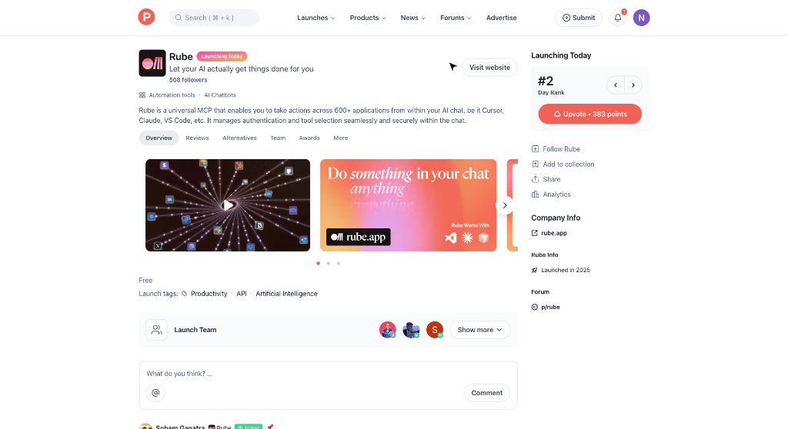

**适合人群**：效率控、远程团队、多工具使用者

AI 只会聊天不会做事？Rube 改变了这一切。它是一个通用 MCP（Model Context Protocol），让 AI 能在 Cursor、Claude、VS Code 等聊天界面中直接操作 600+ 应用，如 Linear、Slack、Asana、Stripe、GitHub 等。

- 🎯 **主要功能**：跨应用任务执行
- ⚡ **AI 特色**：智能路由查询，避免上下文窗口过载
- 🌟 **独特之处**：零配置魔法——OAuth、API 密钥自动处理，企业级安全（SOC2 合规）
- 💡 **使用场景**：
  1. “总结未读邮件，把待办事项创建到 Linear”
  2. “拉取 Stripe 收入数据，更新 Google Slides 投资人报告”
  3. “监控 GitHub PR，按专长自动分配评审人”

> **Maker 这么说**：我们看到成千上万的人苦恼于 AI 无法真正做事。Rube 让 AI 成为你最能干的团队成员，而不仅仅是聪明的顾问。

产品链接：[https://www.producthunt.com/products/rube](https://www.producthunt.com/products/rube)

---

### SoWork: The Glow-Up Edition - 远程团队的虚拟总部

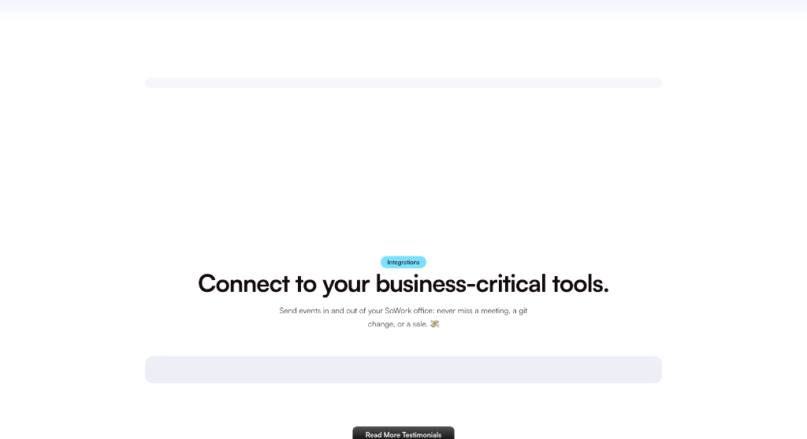

**适合人群**：远程办公团队、分布式公司、创意协作小组

厌倦了在 Slack、Zoom、日历之间来回切换？SoWork 是你的全天候虚拟总部，融合空间视频通话、内置聊天、AI 会议摘要、团队分析和个性化办公室。

- 🎯 **主要功能**：空间视频 + 异步协作 + AI 生产力工具
- ⚡ **AI 特色**：自动生成会议录音、转录和摘要
- 🌟 **独特之处**：内置游戏和宠物，增强团队连接感；移动端“游戏世界”超酷
- 💡 **使用场景**：
  1. 空间视频让远程会议像在同一个房间
  2. AI 自动生成会议纪要，节省整理时间
  3. 团队分析帮助理解远程工作习惯，优化协作

> **Maker 这么说**：我们重建了 SoWork，解决了 1.0 版本的所有痛点。如果你曾因远程工作感到疏离，SoWork 可能正是你等待的改变者。

产品链接：[https://www.producthunt.com/products/sowork](https://www.producthunt.com/products/sowork)

---

### Trace - 超快 AI 日历，告别规划痛苦

**适合人群**：讨厌规划的创业者、工程师、忙碌的家长

“项目评审会，找周五前的两小时”——说完这句话，Trace 已为你安排好。它跳过繁琐表单，直接从文字、语音或截图生成日程。

- 🎯 **主要功能**：自然语言 → 瞬间排程
- ⚡ **AI 特色**：真正靠谱的 AI，减少纠错时间
- 🌟 **独特之处**：无冗余功能，专注日历本质；支持语音、文本、截图输入
- 💡 **使用场景**：
  1. 语音输入“下周和团队脑暴新功能”，自动协调时间
  2. 截图会议邀请，AI 自动解析并加入日历
  3. 文本输入“找3小时写报告”，智能分配空档

> **Maker 这么说**：大多数 AI 日历功能臃肿、AI 拙劣。我们建了 Trace——简单、快速、无负担，让日历真正为你思考。

产品链接：[https://www.producthunt.com/products/trace-16](https://www.producthunt.com/products/trace-16)

---

### Roark - 语音代理的测试与监控平台

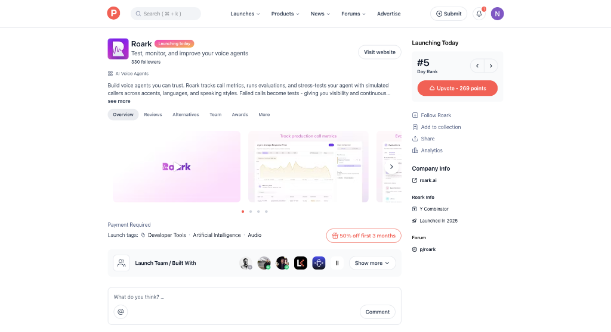

**适合人群**：语音 AI 开发者、客服系统负责人、对话式 AI 团队

构建语音代理容易，但如何确保它可靠？Roark 提供监控、评估和压力测试，用模拟呼叫覆盖不同口音、语言和说话风格。

- 🎯 **主要功能**：语音代理监控 + 自动化测试
- ⚡ **AI 特色**：支持15人通话、情绪分析、定制转录模型
- 🌟 **独特之处**：失败通话自动转为测试用例，防止回归
- 💡 **使用场景**：
  1. 监控生产环境语音代理，实时报警
  2. 模拟带口音的用户呼叫，测试理解能力
  3. 自动生成边缘案例测试，提升鲁棒性

> **Maker 这么说**：我们曾手动反复呼叫代理测试，监控缺失，修复不持久。Roark 是语音 AI 的 QA 与可观测性层。

产品链接：[https://www.producthunt.com/products/roark](https://www.producthunt.com/products/roark)

---

### Gemini 2.5 Flash Image - “nano-banana”惊艳登场

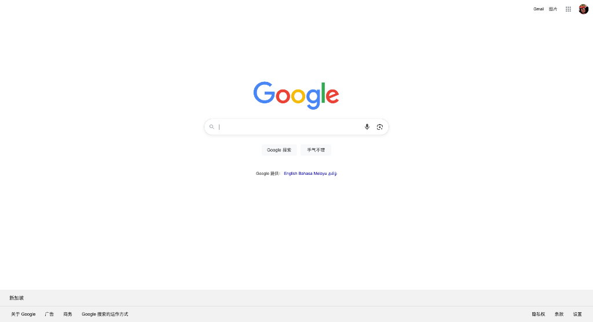

**适合人群**：设计师、内容创作者、多模态 AI 爱好者

Google 新发布的“nano-banana”图像模型，SOTA 级性能，擅长角色一致性、多图融合与自然语言精确编辑。

- 🎯 **主要功能**：图像生成与编辑
- ⚡ **AI 特色**：角色一致性极强，支持多图融合
- 🌟 **独特之处**：可通过 API、Gemini App 或 Google AI Studio 使用
- 💡 **使用场景**：
  1. 生成系列插画，保持角色形象一致
  2. 融合多张图片创意，生成新构图
  3. 用自然语言“把帽子变红色”精确编辑

> **Maker 这么说**：这个模型的出现震惊了世界，它是多模态模型的又一里程碑，堪比 GPT-4o。

产品链接：[https://www.producthunt.com/products/google](https://www.producthunt.com/products/google)

---

### Conductor - 并行运行多个 Claude Code

**适合人群**：Mac 用户、Claude Code 深度使用者、高效开发者

想同时运行多个 Claude Code？Conductor 让你在 Mac 上并行运行多个 Claude 实例，每个拥有独立代码副本，一目了然地查看、审查和合并更改。

- 🎯 **主要功能**：并行 AI 编码
- ⚡ **AI 特色**：集成 Claude Sonnet 4，提升开发效率
- 🌟 **独特之处**：免费使用，利用现有 Claude 登录
- 💡 **使用场景**：
  1. 同时处理多个功能开发任务
  2. 对比不同 AI 生成的解决方案
  3. 自动化代码重构与优化

> **Maker 这么说**：我们曾克隆代码库手动运行多个 Claude，太笨拙。Conductor 让我们享受高效开发的乐趣。

产品链接：[https://www.producthunt.com/products/conductor-aa77ddef-e6d3-4805-a179-7b2e17b6e22e](https://www.producthunt.com/products/conductor-aa77ddef-e6d3-4805-a179-7b2e17b6e22e)

---

### Tot 2.0 - 你的微型文本伴侣

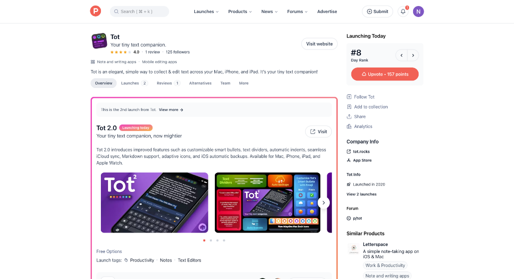

**适合人群**：笔记爱好者、文字工作者、Apple 生态用户

Tot 2.0 带来可自定义智能项目符号、文本分隔符、自动缩进、iCloud 同步、Markdown 支持等。

- 🎯 **主要功能**：轻量级文本编辑
- ⚡ **AI 特色**：虽无 AI 功能，但极致简洁提升写作心流
- 🌟 **独特之处**：支持表情符号作为项目符号，iOS 自动备份
- 💡 **使用场景**：
  1. 快速记录灵感，无需复杂格式
  2. 跨设备无缝同步笔记
  3. 用 emoji 组织待办事项

> **Maker 这么说**：表情符号作为项目符号——为什么不是每个文本编辑器都支持这个显而易见的功能？

产品链接：[https://www.producthunt.com/products/tot](https://www.producthunt.com/products/tot)

---

### NotchFlow - 将 Mac 的刘海变为生产力中心

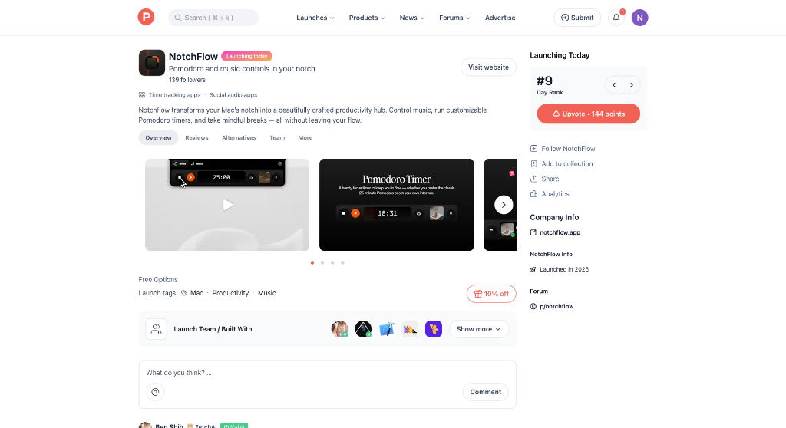

**适合人群**：Mac 用户、专注力追求者、音乐爱好者

NotchFlow 将 Mac 的刘海变为生产力中心，集成 Pomodoro 计时器和 Apple Music/Spotify 控制。

- 🎯 **主要功能**：专注计时 + 音乐控制
- ⚡ **AI 特色**：无 AI，但设计极简，减少分心
- 🌟 **独特之处**：悬停查看，点击展开，快速返回工作
- 💡 **使用场景**：
  1. 开启番茄钟，专注25分钟
  2. 暂停音乐，无需切换应用
  3. 提醒休息，保持工作节奏

> **Maker 这么说**：我们想用更平静的方式专注，不再在窗口间切换。

产品链接：[https://www.producthunt.com/products/notchflow](https://www.producthunt.com/products/notchflow)

---

### Hex Notebook Agent - 数据分析的智能笔记本

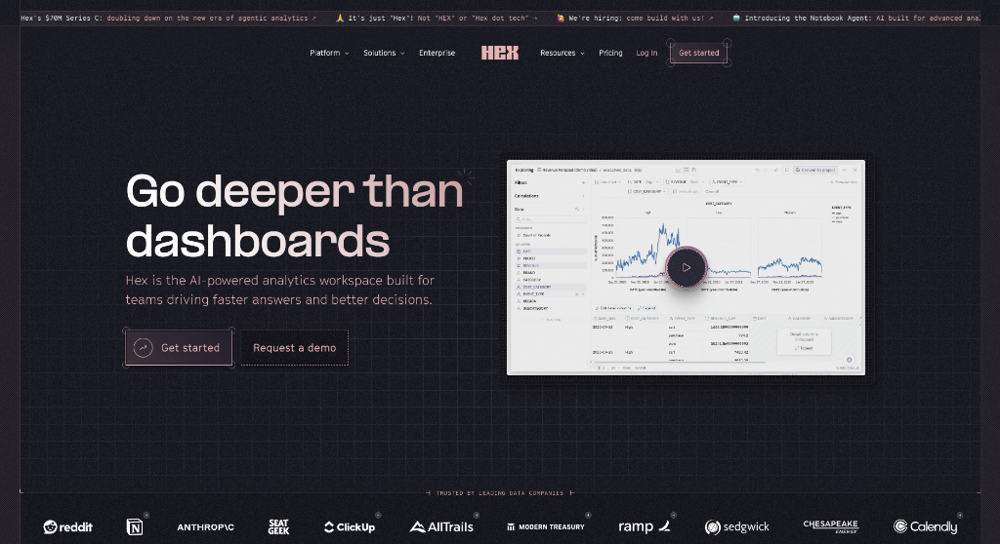

**适合人群**：数据分析师、数据科学家、商业智能团队

Hex 的 Notebook Agent 将 Claude Sonnet 4 带入数据笔记本，自动生成 SQL、Python、可视化图表和 Markdown 总结。

- 🎯 **主要功能**：自动化数据工作流
- ⚡ **AI 特色**：连接项目、文件和数据仓库，上下文完整
- 🌟 **独特之处**：在笔记本内直接迭代复杂分析
- 💡 **使用场景**：
  1. 输入“分析上月销售趋势”，自动生成图表
  2. 提问“哪些用户流失率最高”，返回 SQL 与洞察
  3. 快速探索数据，无需手动写代码

> **Maker 这么说**：数据人员看着工程师享受 AI 工具而羡慕。我们为数据团队带来了第一流的代理能力。

产品链接：[https://www.producthunt.com/products/hex](https://www.producthunt.com/products/hex)

---

### TaskGPT Mobile - 用短信指挥你的 Mac

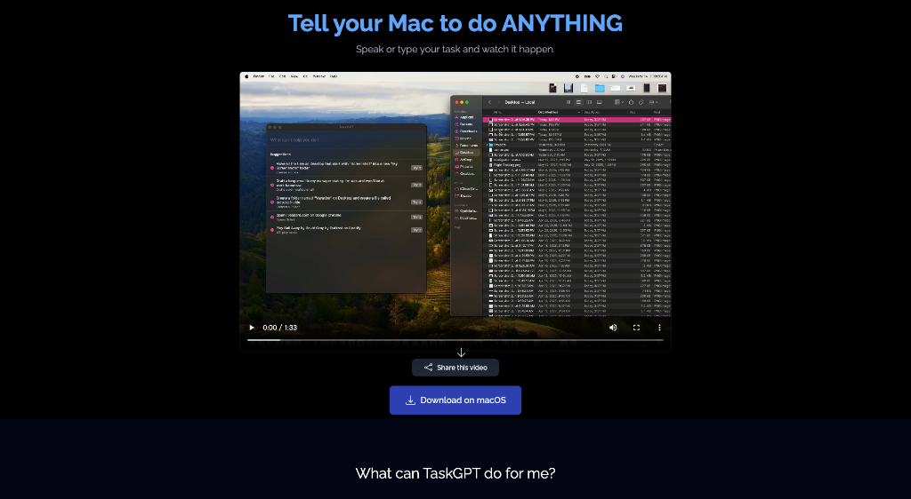

**适合人群**：Mac 用户、效率极客、隐私重视者

通过短信告诉 Mac 做什么，TaskGPT Mobile 用 NLP 将请求转为可执行操作，**所有处理在本地完成，不上传文件**。

- 🎯 **主要功能**：远程控制 Mac
- ⚡ **AI 特色**：自然语言转命令，注重隐私
- 🌟 **独特之处**：完全离线处理，保障安全
- 💡 **使用场景**：
  1. “打开 VS Code 并克隆项目”
  2. “查找上周的会议记录”
  3. “重启并更新系统”

> **Maker 这么说**：我们发布了 TaskGPT Mobile，让你能无缝指挥 Mac 或询问它问题。

产品链接：[https://www.producthunt.com/products/taskgpt-2](https://www.producthunt.com/products/taskgpt-2)

---

### CodeX - 免费 AI 开发平台

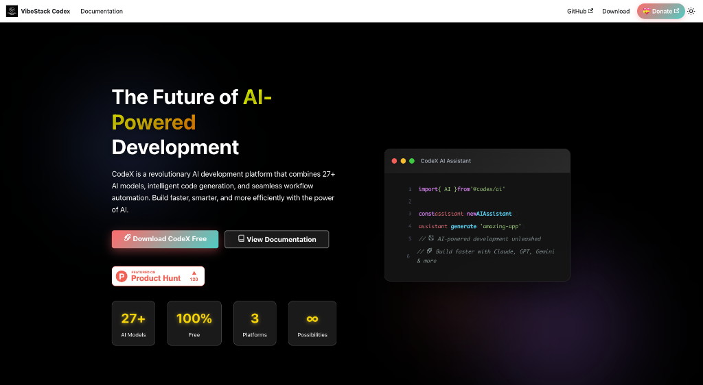

**适合人群**：独立开发者、学生、开源爱好者

CodeX 支持 27+ AI 模型，提供 Designer Mode、Thinking Budget System，完全免费下载使用。

- 🎯 **主要功能**：AI 驱动的 Web 应用开发
- ⚡ **AI 特色**：多模型支持，自动化工作流
- 🌟 **独特之处**：永久免费，支持 Windows、macOS、Linux
- 💡 **使用场景**：
  1. 快速原型设计
  2. 自动化重复开发任务
  3. 学习 AI 编程

> **Maker 这么说**：我们承诺永久免费，通过捐赠支持项目成长。

产品链接：[https://www.producthunt.com/products/codex-6](https://www.producthunt.com/products/codex-6)

---

### Codalogy - 一键可视化任意代码库

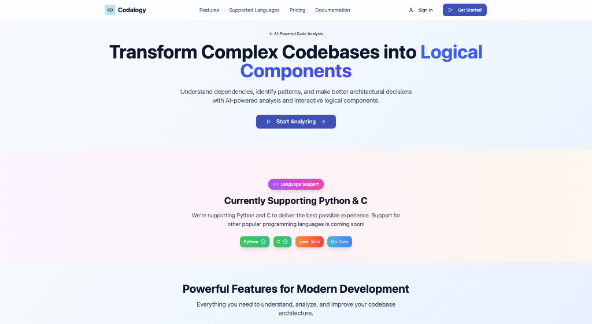

**适合人群**：开发者、技术主管、代码审计人员

Codalogy 分析代码库，分解组件，映射功能与依赖，让你用视觉方式探索代码。

- 🎯 **主要功能**：代码架构可视化
- ⚡ **AI 特色**：自动识别模块与依赖关系
- 🌟 **独特之处**：无需文档，点击即看架构
- 💡 **使用场景**：
  1. 接手遗留项目，快速理解结构
  2. 查找隐藏依赖
  3. 团队代码审查

> **Maker 这么说**：我想改进一个模块，但不知道组件如何连接。Codalogy 让你停止翻找，开始可视化。

产品链接：[https://www.producthunt.com/products/codalogy](https://www.producthunt.com/products/codalogy)

---

### Oppla AI IDE - 上下文永存的 AI IDE

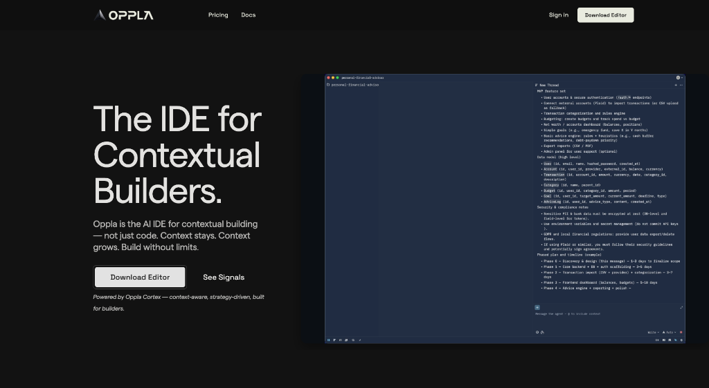

**适合人群**：独立开发者、创业者、产品构建者

Oppla 是为“情境构建者”设计的 AI IDE，上下文永不丢失，支持 Rust 构建，极速运行。

- 🎯 **主要功能**：上下文感知开发
- ⚡ **AI 特色**：无限上下文窗口，AI 理解产品目标
- 🌟 **独特之处**：执行与战略结合，不止于编码
- 💡 **使用场景**：
  1. 构建 MVP 后，AI 建议下一步功能
  2. 复杂项目开发，AI 始终理解全局
  3. 快速迭代产品，保持思路连贯

> **Maker 这么说**：编码工具变快了，但产品构建没变快。Oppla 让 AI 知道用户需求和产品目标，构建更聪明的产品。

产品链接：[https://www.producthunt.com/products/oppla-ai](https://www.producthunt.com/products/oppla-ai)

---

### doola: AI Co-Founder - 电商创业者的 AI 联合创始人

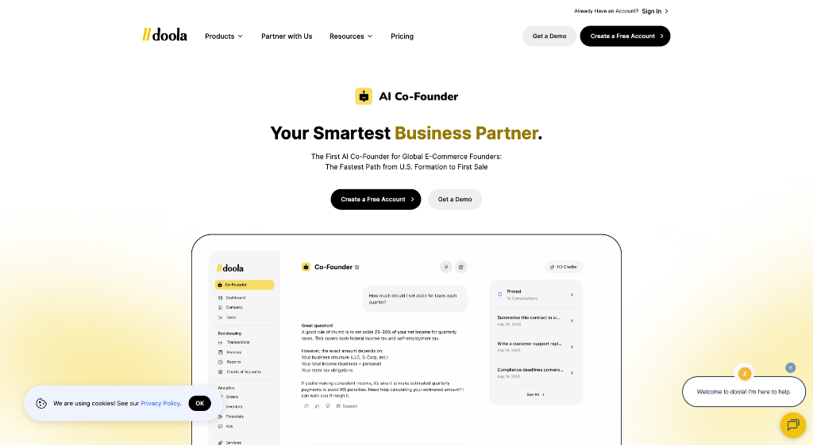

**适合人群**：Shopify/Amazon 电商创业者、独立站运营者

doola 的 AI 联合创始人将后台工作从每周数小时缩短至几分钟，支持 175+ 国家业务。

- 🎯 **主要功能**：自动化电商后台
- ⚡ **AI 特色**：24/7 在线，越用越聪明
- 🌟 **独特之处**：首个 AI 商业一体机（Business-in-a-Box™）
- 💡 **使用场景**：
  1. 自动生成财务报告
  2. 处理跨国税务合规
  3. 管理公司注册与银行账户

> **Maker 这么说**：开网店容易，运营难。doola 的 AI 联合创始人是你永不睡觉的业务伙伴。

产品链接：[https://www.producthunt.com/products/doola-ai-co-founder](https://www.producthunt.com/products/doola-ai-co-founder)

---

### Magic Sandbox - 拥有应用商店的 AI 助手

**适合人群**：开发者、AI 应用创作者、效率工具爱好者

Magic Sandbox 让 AI 助手能与社区构建的应用互动，开发者可轻松发布并 monetize 应用。

- 🎯 **主要功能**：AI + 社区应用生态
- ⚡ **AI 特色**：AI 可调用第三方应用完成任务
- 🌟 **独特之处**：平台处理托管、认证、支付，开发极简
- 💡 **使用场景**：
  1. 聊天控制笔记应用
  2. 构建 AI 驱动的 Fantasy Football 助手
  3. 自动化个人工作流

> **Maker 这么说**：你的 AI 助手不仅能聊天，还能代表你使用应用。

产品链接：[https://www.producthunt.com/products/magic-sandbox-2](https://www.producthunt.com/products/magic-sandbox-2)

---

### Higgsfield Records - 成为下一个全球 AI 偶像

**适合人群**：内容创作者、数字偶像爱好者、社交媒体达人

Higgsfield Records 让任何人通过 AI 成为全球偶像，无需传统才艺，首个 AI K-Pop 偶像 Kion 已诞生。

- 🎯 **主要功能**：AI 偶像孵化平台
- ⚡ **AI 特色**：AI 转化个人形象为数字超级明星
- 🌟 **独特之处**：名利的民主化，脸和数字存在即足够
- 💡 **使用场景**：
  1. 提交申请，成为 AI 偶像候选人
  2. 通过社交互动参与选拔
  3. 构建个人数字明星品牌

> **Maker 这么说**：你无需才艺，就能成为全球偶像。已有百万级合同在推进。

产品链接：[https://www.producthunt.com/products/higgsfield](https://www.producthunt.com/products/higgsfield)

---

## 🔗 今日产品链接一览

> 方便大家收藏和分享：

1. **Webvizio for AI Coding Agents(将非技术反馈秒变代码)**: [https://www.producthunt.com/products/webvizio](https://www.producthunt.com/products/webvizio)
2. **Rube(让AI操作600+应用)**: [https://www.producthunt.com/products/rube](https://www.producthunt.com/products/rube)
3. **SoWork: The Glow-Up Edition(远程团队虚拟总部)**: [https://www.producthunt.com/products/sowork](https://www.producthunt.com/products/sowork)
4. **Trace(超快AI日历)**: [https://www.producthunt.com/products/trace-16](https://www.producthunt.com/products/trace-16)
5. **Roark(语音代理测试平台)**: [https://www.producthunt.com/products/roark](https://www.producthunt.com/products/roark)
6. **Gemini 2.5 Flash Image(“nano-banana”图像模型)**: [https://www.producthunt.com/products/google](https://www.producthunt.com/products/google)
7. **Conductor(并行运行多个Claude)**: [https://www.producthunt.com/products/conductor-aa77ddef-e6d3-4805-a179-7b2e17b6e22e](https://www.producthunt.com/products/conductor-aa77ddef-e6d3-4805-a179-7b2e17b6e22e)
8. **Tot 2.0(微型文本伴侣)**: [https://www.producthunt.com/products/tot](https://www.producthunt.com/products/tot)
9. **NotchFlow(刘海生产力中心)**: [https://www.producthunt.com/products/notchflow](https://www.producthunt.com/products/notchflow)
10. **Hex Notebook Agent(数据分析智能笔记本)**: [https://www.producthunt.com/products/hex](https://www.producthunt.com/products/hex)
11. **TaskGPT Mobile(短信控制Mac)**: [https://www.producthunt.com/products/taskgpt-2](https://www.producthunt.com/products/taskgpt-2)
12. **CodeX(免费AI开发平台)**: [https://www.producthunt.com/products/codex-6](https://www.producthunt.com/products/codex-6)
13. **Codalogy(代码库可视化)**: [https://www.producthunt.com/products/codalogy](https://www.producthunt.com/products/codalogy)
14. **Oppla AI IDE(上下文永存的IDE)**: [https://www.producthunt.com/products/oppla-ai](https://www.producthunt.com/products/oppla-ai)
15. **doola: AI Co-Founder(AI电商联合创始人)**: [https://www.producthunt.com/products/doola-ai-co-founder](https://www.producthunt.com/products/doola-ai-co-founder)
16. **Magic Sandbox(带应用商店的AI助手)**: [https://www.producthunt.com/products/magic-sandbox-2](https://www.producthunt.com/products/magic-sandbox-2)
17. **Higgsfield Records(成为AI偶像)**: [https://www.producthunt.com/products/higgsfield](https://www.producthunt.com/products/higgsfield)

---

## 💬 互动时间

**🎯 产品体验分享**：你试用过今天推荐的哪个产品？体验如何？

**🔍 产品推荐**：你最近发现了什么好用的 AI 工具？分享给大家吧！  
**⭐ 需求征集**：你希望有什么样的 AI 工具来解决你的困扰？  
**💡 使用技巧**：有什么 AI 工具的使用小技巧想要分享？

> 💬 在评论区留言，让我们一起构建最实用的 AI 产品库！

---

## 🔮 明日预告

🚀 明天会为大家带来更多 Product Hunt 上的 AI 新品，敬请期待！

❓ 有想看的特定类型产品吗？留言告诉我们吧~

---