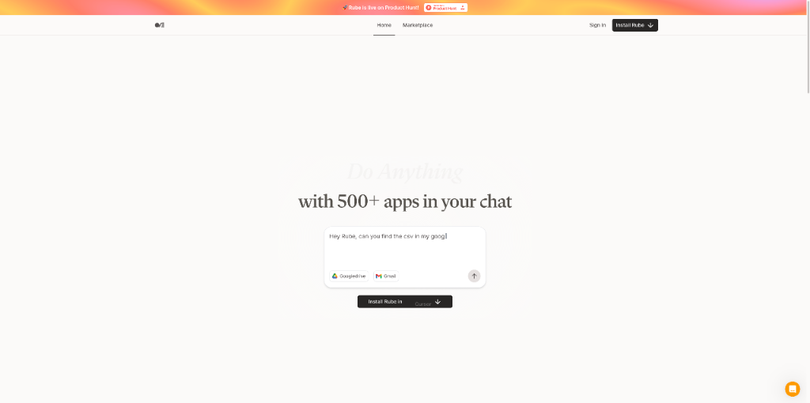

# AI员工来了！ AI 产品头条 - 第 1 期 | 2025年08月29日

> 🌟 **今日封面推荐**：本期我们见证AI从“助手”进化为“员工”！封面图中的数字工牌、AI团队协作界面与自动化流程，正是本期主题——让AI真正为你打工的生动写照。🔥

👋 嗨，欢迎来到 AI 产品头条！

今天在 Product Hunt 上发现了 **18 个超棒的 AI 工具**，最让人兴奋的是：**AI 正在从“提供建议”进化为“直接执行任务”**！

从能自动招聘的 AI HR，到可一键变身动漫风的视频神器，再到无需登录即可使用的去中心化 AI 代理——这些产品正在重新定义“生产力”的边界。

如果你也厌倦了重复劳动，渴望拥有一个24小时在线的数字团队，那今天这期绝对不容错过！

---

## 🎯 今日精选产品

### Marblism - 你的AI员工团队，轻松应对多重角色

**适合人群**：创业者、独立开发者、小型团队负责人

你是否也经历过一人身兼数职的崩溃时刻？CEO、市场、销售、客服全靠自己——Marblism 正是为此而生。它将创始人曾花费数千美元雇佣的虚拟助理角色，转化为即开即用的AI员工团队。从管理收件箱、运营社交媒体，到生成SEO内容、处理客户支持，Marblism 的AI员工能帮你接管日常琐事。

- 🎯 **主要功能**：提供执行助理、社交媒体经理、销售代表等角色的AI员工
- ⚡ **AI 特色**：模拟真人助理行为，持续处理任务而非单次响应
- 🌟 **独特之处**：将“AI助手”升级为“AI员工”，实现角色化分工
- 💡 **使用场景**：自动化内容发布、客户邮件回复、潜在客户挖掘、SEO优化

> **Maker 这么说**："几年前我将公司做到500万美元收入，但每周工作100小时。真正改变我生活的是虚拟助理——执行助理每天为我节省数小时，LinkedIn代笔带来数百个潜在客户，SEO专家填满漏斗。现在，我把这些角色AI化了。"

产品链接：[https://www.producthunt.com/products/marblism-2](https://www.producthunt.com/products/marblism-2)

---

### KomikoAI Video to Video - 一键将视频变身为动漫/赛博朋克风格

**适合人群**：内容创作者、短视频运营、社交媒体营销人员

想让你的视频瞬间拥有吉卜力动画或火影忍者风格？KomikoAI Video to Video 让这一切变得轻而易举。只需上传视频，选择80+种创意模板（如动漫、黏土动画、赛博朋克、K-pop偶像风），AI即可自动完成风格迁移。更支持自定义提示词与参考图，打造独一无二的视觉效果。

- 🎯 **主要功能**：视频风格转换，支持多种预设模板与自定义输入
- ⚡ **AI 特色**：基于图像到视频的深度学习模型，保持动作连贯性
- 🌟 **独特之处**：专为社交传播设计，测试显示前后对比视频播放量提升3倍
- 💡 **使用场景**：短视频内容创作、品牌营销视频、个人Vlog特效、AI艺术实验

> **Maker 这么说**："一切始于吉卜力风格热潮——一张照片如何变得如此魔幻？我们想：为什么不把这种魔法用在视频上？于是我们日夜打造了KomikoAI Video to Video，让每个人都能把普通片段变成惊艳的可分享内容。"

产品链接：[https://www.producthunt.com/products/framepack-ai-video-generator](https://www.producthunt.com/products/framepack-ai-video-generator)

---

### HiveMind - 招聘自动化代理，让ATS真正“活”起来

**适合人群**：招聘经理、HR团队、初创公司创始人

传统招聘系统（ATS）本质上只是个“美化过的电子表格”——候选人申请后就静静躺在列表里，等待人工处理。HiveMind 则是首个**代理式招聘平台**，它在候选人申请的瞬间自动启动预设工作流：筛选简历、发送技能测试、跟进反馈、安排面试，全程无需人工干预。

- 🎯 **主要功能**：自动化简历筛选、技能评估、面试安排
- ⚡ **AI 特色**：基于1200个岗位的数万道专家设计问题库进行技能验证
- 🌟 **独特之处**：工作流优先设计，系统是“主动代理”而非“被动数据库”
- 💡 **使用场景**：大规模招聘筛选、技术岗位能力评估、初创团队快速组建

> **Maker 这么说**："YC的Michael Seibel曾称这是个‘胡扯的想法’。但我们坚持做了。因为我知道，招聘决策决定公司生死。而现在，HiveMind就是那个能帮你找到最佳候选人的‘第一辆车’。"

产品链接：[https://www.producthunt.com/products/hivemind-ai](https://www.producthunt.com/products/hivemind-ai)

---

### Macrowave - 将Mac变成私人电台，实时共享音频

**适合人群**：远程协作团队、音乐爱好者、播客创作者

Macrowave 让你的 Mac 瞬间变身为私人广播电台。通过P2P技术，你可以将任何Mac音频（音乐、会议、白噪音）实时流式传输给他人，延迟极低，完美同步。听众无需安装应用，点击链接即可收听，非常适合远程共听、虚拟办公室背景音共享。

- 🎯 **主要功能**：Mac音频实时广播、P2P低延迟传输
- ⚡ **AI 特色**：无AI，但极致体验设计，交互充满趣味
- 🌟 **独特之处**：P2P架构实现近乎零延迟，远超YouTube/Twitch等传统流媒体
- 💡 **使用场景**：远程团队共听音乐、虚拟办公室氛围营造、私人直播分享

> **Maker 这么说**："我们希望简单地把Mac变成电台，和朋友共享正在听的音乐。Macrowave只需三步：下载、选择音频源、分享链接。P2P技术让我们能同时感受音乐的节拍，即使身处不同城市的联合办公空间。"

产品链接：[https://www.producthunt.com/products/macrowave](https://www.producthunt.com/products/macrowave)

---

### brek.ai - 免费追踪你的网站在ChatGPT中的提及情况

**适合人群**：网站运营者、数字营销人员、SEO从业者

随着越来越多用户转向LLM而非搜索引擎，你的品牌在ChatGPT中如何被提及？brek.ai 免费帮你监控这一点。它能发现谁在真正提及你，识别真实竞争对手，并提供可操作的改进建议，所有功能无需注册即可使用。

- 🎯 **主要功能**：LLM中品牌提及监控、竞争对手分析、可见性优化建议
- ⚡ **AI 特色**：专为“生成式引擎优化”（GEO）设计，填补传统SEO工具空白
- 🌟 **独特之处**：完全免费、无登录墙、提供清晰可执行的洞察
- 💡 **使用场景**：品牌声誉管理、内容策略调整、GEO优化、竞品监控

> **Maker 这么说**："大多数GEO工具要么功能被注册墙封锁，要么提供模糊的洞察，要么定价过高。brek.ai不同：免费起步、无需注册、提供真正可用的建议。这是我在探索AI内容发现新规则的方式。"

产品链接：[https://www.producthunt.com/products/brek-ai](https://www.producthunt.com/products/brek-ai)

---

### Eternal AI - 去中心化AI应用，自由、免费、无需登录

**适合人群**：注重隐私的用户、开源爱好者、AI实验者

Eternal AI 是一个完全去中心化的AI应用平台，运行在P2P网络上，无需登录即可免费使用。它提供能为你工作的AI代理，涵盖网站原型设计、编程、图像生成等任务。没有中央控制，无审查，计算由全球家庭电脑完成，真正实现“无审查、免许可、低成本”。

- 🎯 **主要功能**：AI代理执行编程、设计、内容生成等任务
- ⚡ **AI 特色**：P2P架构，任务在用户间直接处理，无中央服务器
- 🌟 **独特之处**：完全去中心化，抗审查，无需账户，真正自由
- 💡 **使用场景**：敏感内容创作、隐私保护型开发、去中心化应用实验

> **Maker 这么说**："Eternal AI 让你拥有能思考、行动并为你工作的AI代理：网站原型、编程、图像生成等。完全无审查，无需登录，免费使用。它运行在P2P网络上，没有中央控制或企业守门人。"

产品链接：[https://www.producthunt.com/products/nobullshit-exe](https://www.producthunt.com/products/nobullshit-exe)

---

### Dreambase.ai - 直连Supabase的集成化分析平台

**适合人群**：Supabase用户、开发者、数据分析师、初创团队

Dreambase.ai 直接构建在 Supabase 之上，提供开箱即用的完整分析能力。无需引入第三方库或工具，即可从Supabase数据中创建产品报告与仪表盘。它集成了AI代理，能自动分析、生成报告，并将分析、运营与内部工具整合于同一平台。

- 🎯 **主要功能**：直连Supabase的数据可视化、AI驱动分析、内部工具构建
- ⚡ **AI 特色**：AI代理可自动化数据探索与报告生成
- 🌟 **独特之处**：数据库优先的分析，数据源即分析源，避免多工具数据不同步
- 💡 **使用场景**：产品数据监控、用户行为分析、内部管理工具开发

> **Maker 这么说**："我们厌倦了在BI仪表盘、内部工具和事件追踪器之间跳转。我们希望一切从数据源——数据库本身开始。Dreambase.ai就是为此而生，专为使用Supabase/Postgres的构建者、运营团队和创始人打造。"

产品链接：[https://www.producthunt.com/products/dreambase-ai](https://www.producthunt.com/products/dreambase-ai)

---

### apiJuice - 用自然语言为任意网站创建API

**适合人群**：开发者、自动化工程师、数据分析师

厌倦了为杂乱的网站写爬虫？apiJuice 让你只需粘贴URL并用英文描述所需数据，AI就能瞬间创建一个自定义API，返回干净的JSON数据。支持通过API、n8n节点或自定义应用调用，几秒内将网页变结构化数据源。

- 🎯 **主要功能**：网页数据提取、自然语言生成API、结构化数据输出
- ⚡ **AI 特色**：理解自然语言指令，智能解析网页结构
- 🌟 **独特之处**：极简操作，无需编码即可为任何网站创建API
- 💡 **使用场景**：竞品数据监控、价格抓取、内容聚合、自动化数据集成

> **Maker 这么说**："我们都遇到过信息被淹没在杂乱网站中的情况。写爬虫费时费力。所以我们打造了apiJuice——只需点击几下，就能将任何网站变成你想要的结构化数据，并即时部署为定制应用。"

产品链接：[https://www.producthunt.com/products/apijuice](https://www.producthunt.com/products/apijuice)

---

### Qwen Chat - 现在可直接读取网页内容

**适合人群**：研究人员、学生、内容创作者、开发者

通义千问（Qwen）聊天模型迎来重大更新：现在只需粘贴网页链接，它就能直接读取并处理页面内容。这一功能极大提升了信息获取效率，让AI能基于最新网页内容进行问答、摘要与分析，无需手动复制粘贴。

- 🎯 **主要功能**：网页内容直接读取、多模态理解、信息摘要
- ⚡ **AI 特色**：支持图文问答、数学题求解、视频理解、文档解析、多语言OCR
- 🌟 **独特之处**：强大的视觉理解能力，尤其擅长图像数学题与文档解析
- 💡 **使用场景**：学术研究、新闻摘要、技术文档解析、多语言内容处理

> **Maker 这么说**："Qwen-VL在多模态能力上表现惊人，尤其在视觉理解方面。它能描述图像内容、解决图像中的数学题、分析视频、定位物体、解析文档并支持11+种语言的OCR。"

产品链接：[https://www.producthunt.com/products/qwq-max](https://www.producthunt.com/products/qwq-max)

---

### Stratify AI - 数小时内获取用户反馈，而非数周

**适合人群**：早期创业者、产品经理、用户体验研究员

传统用户研究耗时数周：冷启动联系、收集浅层反馈、耗费数小时整理笔记。Stratify AI 作为AI用户研究副驾驶，能在数小时内完成全过程：自动招募并调查潜在用户，AI深入访谈挖掘痛点，即时分析发现模式与机会，帮助你在投入大量开发前验证想法。

- 🎯 **主要功能**：自动用户招募、AI深度访谈、即时反馈分析
- ⚡ **AI 特色**：AI能像真人研究员一样追问，挖掘深层需求
- 🌟 **独特之处**：将数周的研究周期压缩至数小时，专为早期验证设计
- 💡 **使用场景**：产品创意验证、用户痛点发现、市场调研、MVP测试

> **Maker 这么说**："作为早期创始人，最难的不是编码，而是确定是否有人在乎你的想法。我们曾困于冷联系、浅层反馈和耗时的笔记整理。Stratify就是那个能放入口袋的研究团队，即使你是一个人。"

产品链接：[https://www.producthunt.com/products/stratify-ai-2](https://www.producthunt.com/products/stratify-ai-2)

---

### Air MCP - 通用AI集成工具，让AI使用你的应用

**适合人群**：开发者、技术负责人、AI应用构建者

Air MCP 是一个通用的MCP（Model Context Protocol）工具，让AI能无缝连接现实世界的应用，无需开发开销。它提供集中的连接管理、用户与数据管理，以及易于配置的MCP助手，是AI与应用集成的“万能适配器”。

- 🎯 **主要功能**：统一管理AI与各类应用的连接
- ⚡ **AI 特色**：作为MCP中间件，简化AI调用外部工具的复杂性
- 🌟 **独特之处**：解决开发者需为每个工具单独配置MCP服务器的痛点
- 💡 **使用场景**：构建AI代理工作流、自动化系统集成、降低AI应用开发门槛

> **Maker 这么说**："我们发现配置和管理多个MCP服务器非常困难。因此我们构建了Air MCP——一个开箱即用的一体化解决方案，集成了所有你需要的工具。"

产品链接：[https://www.producthunt.com/products/air-mcp](https://www.producthunt.com/products/air-mcp)

---

### ManabiDojo - 通过动漫学习日语

**适合人群**：日语学习者、动漫爱好者、语言教育用户

ManabiDojo 是一款Chrome扩展，将互动字幕融入你喜欢的流媒体平台。点击单词即可查看词典释义，利用AI解析复杂句子，并可保存单词生成闪卡复习，让看动漫成为高效的日语学习方式。

- 🎯 **主要功能**：流媒体平台互动字幕、单词点击查询、AI句子解析、闪卡复习
- ⚡ **AI 特色**：AI辅助解析复杂语言结构，提供上下文学习
- 🌟 **独特之处**：将娱乐与学习无缝结合，提升学习动机与效率
- 💡 **使用场景**：日语自学、词汇积累、听力训练、文化沉浸学习

> **Maker 这么说**："这是个很棒的想法。点击单词查看意思非常方便。动漫迷的完美选择！❤️"

产品链接：[https://www.producthunt.com/products/manabidojo](https://www.producthunt.com/products/manabidojo)

---

### Autobound for Clay & n8n - GTM工作流的洞察引擎

**适合人群**：GTM（Go-To-Market）团队、销售运营、市场人员

Autobound 将300+实时洞察（如SEC文件、招聘趋势、播客）和150+购买信号转化为品牌合规的个性化外联信息。通过与Clay和n8n的原生集成，可将丰富数据自动转化为高转化的外联消息，实现规模化个性化营销。

- 🎯 **主要功能**：基于实时数据生成个性化外联信息
- ⚡ **AI 特色**：AI洞察引擎结合品牌安全与合规层
- 🌟 **独特之处**：企业级控制，确保规模化外联不失控
- 💡 **使用场景**：销售外联、潜在客户开发、市场推广、品牌安全自动化

> **Maker 这么说**："GTM团队拥有海量数据，却无法规模化转化为收入对话。Autobound连接Clay和n8n，将你的数据转化为超个性化、品牌安全的邮件，在几秒内完成。"

产品链接：[https://www.producthunt.com/products/autobound](https://www.producthunt.com/products/autobound)

---

### First Answer - 监控并提升你的AI品牌可见性

**适合人群**：营销人员、品牌经理、SEO专家

你的品牌在ChatGPT、Gemini、Perplexity中如何被描述？First Answer 监控你的品牌在主流AI平台的呈现，与竞争对手对比，发现机会，并提供明确步骤提升AI可见性，应对“生成式搜索”时代的挑战。

- 🎯 **主要功能**：AI平台品牌提及监控、竞品对比、优化建议
- ⚡ **AI 特色**：专为AI生成答案（AEO）设计的监控工具
- 🌟 **独特之处**：填补传统SEO工具无法追踪AI回答的空白
- 💡 **使用场景**：品牌声誉管理、AEO优化、市场策略调整

> **Maker 这么说**："营销人员在AI搜索面前‘盲目飞行’。First Answer让你看到AI平台真实回答，与竞品对比，发现机会，并获得清晰的数据驱动步骤来提升存在感。"

产品链接：[https://www.producthunt.com/products/first-answer](https://www.producthunt.com/products/first-answer)

---

### NeuralAgent - 桌面AI接口，像人类一样操作电脑

**适合人群**：效率追求者、自动化爱好者、普通办公用户

NeuralAgent 是未来的电脑接口，它像人类一样在你的桌面上操作：点击、打字、滚动、导航应用，完成真实任务。只需告诉它你想做什么，它就会自动执行，是真正的“行动型AI”。

- 🎯 **主要功能**：桌面自动化，执行点击、输入、导航等操作
- ⚡ **AI 特色**：具备屏幕理解与操作能力的AI代理
- 🌟 **独特之处**：可在macOS和Windows上运行，支持后台模式
- 💡 **使用场景**：数据录入、跨应用信息搬运、日常任务自动化

> **Maker 这么说**："NeuralAgent变得更聪明、更强大，现已支持macOS、命令栏、屏幕建议和后台模式。我们还推出了NeuralAgent PRO。"

产品链接：[https://www.producthunt.com/products/neuralagent](https://www.producthunt.com/products/neuralagent)

---

### SongBoard - DJ活动规划门户

**适合人群**：DJ、活动策划人、婚礼策划

SongBoard 是DJ的活动规划门户，用于收集歌曲请求、整理活动细节。它生成的结构化播放列表可直接同步到Serato、VirtualDJ等DJ软件，简化活动准备流程。

- 🎯 **主要功能**：歌曲请求收集、活动信息管理、播放列表同步
- ⚡ **AI 特色**：无明确AI功能，但流程高度数字化
- 🌟 **独特之处**：直接与主流DJ软件集成，减少手动操作
- 💡 **使用场景**：婚礼、派对、商业活动的DJ服务

> **Maker 这么说**：Hunter评论已删除。

产品链接：[https://www.producthunt.com/products/songboard](https://www.producthunt.com/products/songboard)

---

### Webvizio for AI Coding Agents - 将非技术反馈转化为代码

**适合人群**：开发团队、产品经理、前端工程师

Webvizio 解决AI编码助手“卡壳”问题：它们擅长写新代码，却难修旧Bug，因缺乏上下文。Webvizio 允许用户直接在网页上点击反馈，自动收集技术数据（日志、复现步骤），生成完整AI提示，让Cursor等AI工具瞬间理解并修复问题。

- 🎯 **主要功能**：网页反馈收集、自动上下文生成、AI编码辅助
- ⚡ **AI 特色**：为AI编码代理提供完整上下文，提升修复成功率
- 🌟 **独特之处**：MCP服务器让AI直接与Webvizio API通信，实现闭环
- 💡 **使用场景**：Bug报告、产品反馈处理、前端开发协作

> **Maker 这么说**："AI编码助手常因缺乏上下文（用户反馈、日志、复现步骤）而在修复代码时陷入循环。Webvizio填补了这一空白，为AI提供所需的一切，让任务瞬间解决。"

产品链接：[https://www.producthunt.com/products/webvizio](https://www.producthunt.com/products/webvizio)

---

### SoWork: The Glow-Up Edition - 高绩效远程团队的虚拟总部

**适合人群**：远程团队、分布式公司、协作团队

SoWork 是远程团队的全天候虚拟总部，整合空间视频通话、类Slack聊天、AI会议摘要、团队分析与自定义工作区。它让远程协作如真实办公室般自然，甚至更好——还内置宠物和游戏增进连接。

- 🎯 **主要功能**：空间视频、集成聊天、AI会议工具、团队分析
- ⚡ **AI 特色**：AI生成会议摘要、录音与转录
- 🌟 **独特之处**：从零重建，性能更强，UI/UX全面升级，移动App含游戏世界
- 💡 **使用场景**：远程团队日常协作、虚拟办公室、异步沟通

> **Maker 这么说**："我们花了两年时间从零重建SoWork。现在它拥有超快性能、全新UI、AI会议工具、团队分析和移动游戏世界。如果你厌倦了在Slack、Zoom间跳转，SoWork可能是你的游戏规则改变者。"

产品链接：[https://www.producthunt.com/products/sowork](https://www.producthunt.com/products/sowork)

---

### Rube - 让你的AI真正为你完成任务

**适合人群**：重度工具用户、自动化专家、效率极客

Rube 是一个通用MCP，让你的AI聊天（如Cursor、Claude）能操作600+应用。它无缝管理认证与工具选择，让AI能真正“做事”：总结未读邮件并创建任务、在Slack中收集反馈生成报告、检查日历并协调团队、从Stripe拉取数据更新幻灯片等。

- 🎯 **主要功能**：跨应用自动化执行任务
- ⚡ **AI 特色**：AI作为主动执行者，而非被动回答者
- 🌟 **独特之处**：零配置魔法，自动处理OAuth与API密钥，支持并行执行
- 💡 **使用场景**：跨工具信息整合、日常自动化、企业级AI代理

> **Maker 这么说**："AI能提供建议，却无法真正‘做事’。Rube连接你的LLM与500+应用，赋予AI执行任务的超能力。只需聊天，就能让AI为你完成复杂工作流。"

产品链接：[https://www.producthunt.com/products/rube](https://www.producthunt.com/products/rube)

---

## 🔗 今日产品链接一览

> 方便大家收藏和分享：

1. **Marblism(你的AI员工团队)**: [https://www.producthunt.com/products/marblism-2](https://www.producthunt.com/products/marblism-2)
2. **KomikoAI Video to Video(一键视频风格化)**: [https://www.producthunt.com/products/framepack-ai-video-generator](https://www.producthunt.com/products/framepack-ai-video-generator)
3. **HiveMind(自动化招聘代理)**: [https://www.producthunt.com/products/hivemind-ai](https://www.producthunt.com/products/hivemind-ai)
4. **Macrowave(私人音频广播)**: [https://www.producthunt.com/products/macrowave](https://www.producthunt.com/products/macrowave)
5. **brek.ai(免费追踪AI提及)**: [https://www.producthunt.com/products/brek-ai](https://www.producthunt.com/products/brek-ai)
6. **Eternal AI(去中心化AI代理)**: [https://www.producthunt.com/products/nobullshit-exe](https://www.producthunt.com/products/nobullshit-exe)
7. **Dreambase.ai(直连Supabase分析)**: [https://www.producthunt.com/products/dreambase-ai](https://www.producthunt.com/products/dreambase-ai)
8. **apiJuice(用自然语言创建API)**: [https://www.producthunt.com/products/apijuice](https://www.producthunt.com/products/apijuice)
9. **Qwen Chat(可读取网页的聊天模型)**: [https://www.producthunt.com/products/qwq-max](https://www.producthunt.com/products/qwq-max)
10. **Stratify AI(数小时内获取用户反馈)**: [https://www.producthunt.com/products/stratify-ai-2](https://www.producthunt.com/products/stratify-ai-2)
11. **Air MCP(通用AI集成工具)**: [https://www.producthunt.com/products/air-mcp](https://www.producthunt.com/products/air-mcp)
12. **ManabiDojo(通过动漫学日语)**: [https://www.producthunt.com/products/manabidojo](https://www.producthunt.com/products/manabidojo)
13. **Autobound for Clay & n8n(GTM洞察引擎)**: [https://www.producthunt.com/products/autobound](https://www.producthunt.com/products/autobound)
14. **First Answer(监控AI品牌可见性)**: [https://www.producthunt.com/products/first-answer](https://www.producthunt.com/products/first-answer)
15. **NeuralAgent(桌面AI操作代理)**: [https://www.producthunt.com/products/neuralagent](https://www.producthunt.com/products/neuralagent)
16. **SongBoard(DJ活动规划门户)**: [https://www.producthunt.com/products/songboard](https://www.producthunt.com/products/songboard)
17. **Webvizio for AI Coding Agents(将反馈转为代码)**: [https://www.producthunt.com/products/webvizio](https://www.producthunt.com/products/webvizio)
18. **SoWork: The Glow-Up Edition(远程团队虚拟总部)**: [https://www.producthunt.com/products/sowork](https://www.producthunt.com/products/sowork)
19. **Rube(让AI真正为你做事)**: [https://www.producthunt.com/products/rube](https://www.producthunt.com/products/rube)

---

## 💬 互动时间

**🎯 产品体验分享**：你试用过今天推荐的哪个产品？体验如何？

**🔍 产品推荐**：你最近发现了什么好用的 AI 工具？分享给大家吧！  
**⭐ 需求征集**：你希望有什么样的 AI 工具来解决你的困扰？  
**💡 使用技巧**：有什么 AI 工具的使用小技巧想要分享？

> 💬 在评论区留言，让我们一起构建最实用的 AI 产品库！

---

## 🔮 明日预告

🚀 明天会为大家带来更多 Product Hunt 上的 AI 新品，敬请期待！

❓ 有想看的特定类型产品吗？留言告诉我们吧~

---