# 逆天了！AI带你边玩边吃！ AI 产品头条 - 第 2 期 | 2025年08月30日

> 🔥 **封面语**：今日 AI 神器大爆发！

👋 嗨，欢迎来到 AI 产品头条！

今天在 Product Hunt 上发现了 **15+ 个超棒的 AI 工具**，最让人兴奋的是：**AI 现在能实时看懂 TikTok 和 Instagram 视频，自动推荐你附近的神级餐厅和活动**！

从吃喝玩乐推荐到加密投资、智能笔记、销售拓客、开发者工具……这期简直是全能爆发。Wanderboat 2.0 让本地探索像刷短视频一样直观，Surf 让你像机构一样玩转加密市场，HyNote 帮专业人士每月省下 10 小时整理时间。

准备好迎接一个更聪明、更高效的生活方式了吗？让我们一起开启今天的 AI 探索之旅！

---

## 🎯 今日精选产品

### Wanderboat 2.0 - 社交+本地+AI地图搜索

**适合人群**：城市探索者、美食爱好者、旅行规划者、内容创作者

还在刷个没完地找附近好吃好玩的？Wanderboat 2.0 彻底改变了本地推荐的方式。它不像传统平台依赖用户评分，而是让 AI 模型实时观看数百万条 Instagram 和 TikTok 视频，像真人一样“看”懂哪些地方真正火爆、氛围超赞。

- 🎯 **主要功能**：在地图上直观展示附近最热门的餐厅、酒吧、活动和景点
- ⚡ **AI 特色**：多步骤思考代理 + 视觉理解模型，从海量社交媒体视频中提炼真实体验
- 🌟 **独特之处**：推荐基于“真实画面”而非文字评论，发现那些还没被写烂的宝藏地点
- 💡 **使用场景**：
  - 周末不知道去哪玩？打开地图看“AI 推荐热力图”
  - 想找氛围感拉满的咖啡馆拍大片？看 AI 筛选的“高颜值出片地”
  - 用自然语言搜索：“找一家有现场音乐的深夜甜品店”

> **Maker 这么说**：“‘向我展示，不要告诉我。’ 发现应该是视觉化的——在去之前先看看一个地方的特别之处。‘用你习惯的方式提问。’ 地图不擅长自然搜索（比如‘最适合深夜甜品和现场音乐的地方’），但这就是我们真实的提问方式。”

产品链接：[https://www.producthunt.com/products/wanderboat-2-0](https://www.producthunt.com/products/wanderboat-2-0)

---

### Surf - AI驱动的加密洞察与交易平台

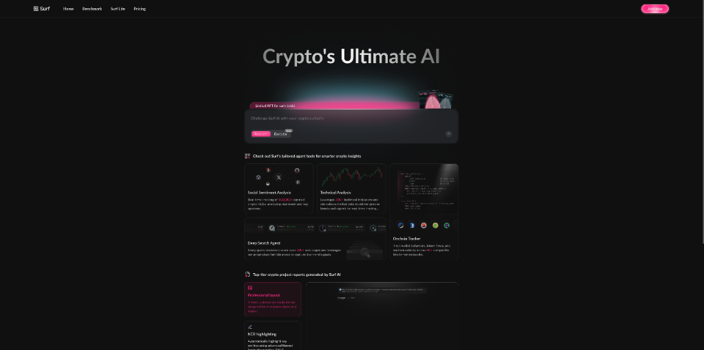

**适合人群**：加密货币新手、资深投资者、交易员、金融科技从业者

进入加密世界就像闯入一个巨大的迷宫？Surf 就是你的专属向导。它把散落在各处的研究资料、嘈杂的社交媒体情绪和复杂的链上数据，整合成一个由 AI 驱动的“一站式”平台。

- 🎯 **主要功能**：发现 → 分析 → 交易，全流程覆盖
- ⚡ **AI 特色**：提供用 plain-English（大白话）解释的 RWA、稳定币等复杂概念，并附带信息来源
- 🌟 **独特之处**：感觉像是拥有一个既懂行又贴心的“内部朋友”，能快速告诉你机会在哪、为什么重要
- 💡 **使用场景**：
  - 新手想了解“什么是 RWA”？Surf 给你一份带来源的机构级简报
  - 想跟踪某个币种的市场情绪？AI 实时分析社交媒体情感
  - 用自然语言下达交易指令：“买入 0.5 ETH，如果价格跌破 2500”

> **Maker 这么说**：“我们构建 Surf 是为了把那个迷宫变成一条有指引的路径。无论你是刚入门还是加密老手，Surf 都适合你。”

产品链接：[https://www.producthunt.com/products/surf-9](https://www.producthunt.com/products/surf-9)

---

### HyNote AI - 专业人士的全栈 AI 笔记本

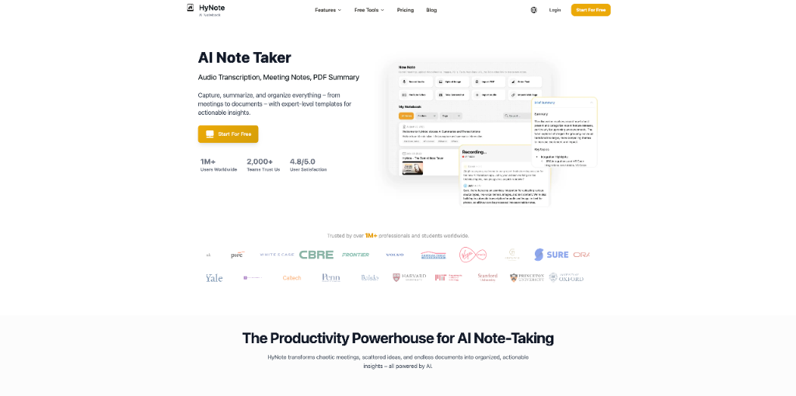

**适合人群**：职场专业人士、学生、研究员、频繁开会的管理者

笔记散落各处，回顾时却看不懂自己的“天书”？HyNote AI 的诞生源于创始人 Sandy 的亲身痛点。它不只是记录，而是帮你把零散的信息（会议录音、PPT、网页链接）整合成有上下文的、可行动的洞察。

- 🎯 **主要功能**：跨平台笔记、会议自动总结、文档关联
- ⚡ **AI 特色**：AI 不仅转录会议，还能把相关的 PDF、截图、链接都塞进同一个笔记里，保持完整上下文
- 🌟 **独特之处**：真正解决“信息孤岛”问题，让笔记不再只是文字，而是完整的“信息包”
- 💡 **使用场景**：
  - 开完会，AI 立刻生成摘要和待办事项
  - 找去年某次会议的某个决策？AI 帮你精准定位
  - 把研究报告、数据表和会议记录关联起来，形成知识库

> **Maker 这么说**：“一个好的笔记不仅仅是你写下来的东西，更重要的是你之后能否完全理解它。我想要构建一个工具，不仅能转录会议的每一句话，还能让你把相关的文档，比如演示文稿PDF、截图、网站链接，都放在同一个笔记里。”

产品链接：[https://www.producthunt.com/products/ai-notebook-app](https://www.producthunt.com/products/ai-notebook-app)

---

### Contact Finder by Jeeva AI - 秒级获取验证过的邮箱和直拨电话

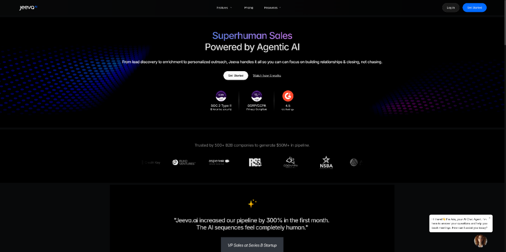

**适合人群**：销售、招聘人员、创业者、需要拓展人脉的自由职业者

找一个人的邮箱或电话，为什么还这么难？Jeeva AI 推出了免费的 Contact Finder，号称是“最快从联系人到对话的路径”。

- 🎯 **主要功能**：通过姓名（和公司/域名）查找验证过的邮箱和手机号
- ⚡ **AI 特色**：提供 AI 生成的背景信息（职位、公司等）和一键生成个性化外联草稿（邮件+领英）
- 🌟 **独特之处**：免费、无需信用卡、不靠爬虫、提供信心评分和验证时间戳
- 💡 **使用场景**：
  - 想联系某位投资人？输入名字秒出联系方式
  - 准备销售外联？AI 直接给你写好个性化的邮件开头
  - 招聘时想快速了解候选人背景？AI 汇总关键信息

> **Maker 这么说**：“我们相信：每份工作都是一份销售工作……找到某人的验证邮箱或手机号仍然出奇地困难。所以今天，我们来解决它。”

产品链接：[https://www.producthunt.com/products/jeeva-ai](https://www.producthunt.com/products/jeeva-ai)

---

### Codex by OpenAI - 你的新软件工程队友

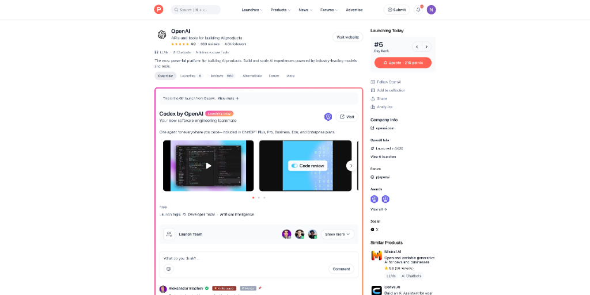

**适合人群**：开发者、工程师、技术团队

Codex 再次升级，现在作为 ChatGPT Plus 及以上计划的一部分，直接成为你编码时的“队友”。

- 🎯 **主要功能**：在你编码的地方提供 AI 支持（IDE 扩展、CLI）
- ⚡ **AI 特色**：由 GPT-5 驱动，支持云↔本地平滑切换，内置 GitHub 代码审查
- 🌟 **独特之处**：深度集成，无需离开开发环境，任务切换更流畅
- 💡 **使用场景**：
  - 在 VS Code 里直接让 AI 帮你写代码、解释代码
  - 通过 CLI 在终端快速生成脚本
  - 提交 PR 前，让 Codex 自动进行代码审查

> **Hunter 这么说**：“Codex 刚刚获得了一次重大升级。全新 IDE 扩展、平滑的任务切换、内置 GitHub 代码审查、焕然一新的 Codex CLI，全部由 GPT-5 驱动。”

产品链接：[https://www.producthunt.com/products/openai](https://www.producthunt.com/products/openai)

---

### Optibase - Webflow 的终极 A/B 测试应用

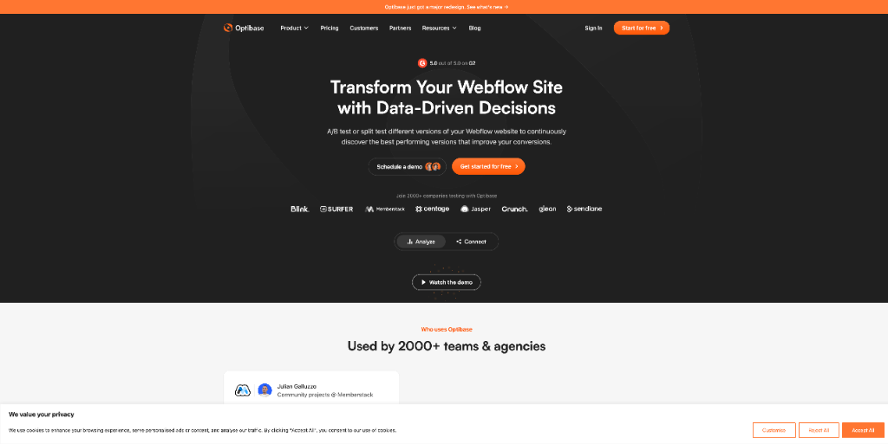

**适合人群**：Webflow 用户、数字营销人员、产品经理、设计师

Google Optimize 停服后，Webflow 用户急需替代方案。Optibase 应运而生，并已成为 2500+ 公司的选择。最新版本带来了全面的重构。

- 🎯 **主要功能**：在 Webflow Designer 中原生设置 A/B 或分流测试
- ⚡ **AI 特色**：虽然非 AI 核心，但其“向导”功能通过智能引导简化了测试流程
- 🌟 **独特之处**：原生集成 Webflow，不影响网站加载性能，支持团队协作（工作区）
- 💡 **使用场景**：
  - 测试网站按钮是红色好还是蓝色好？
  - 想知道标题文案哪个转化率更高？
  - 和团队成员协作管理多个测试项目

> **Maker 这么说**：“当 Google 停止 Optimize 时，Webflow 上的营销人员就失去了一个简单或实惠的测试方式。这就是 Optibase 诞生的契机。”

产品链接：[https://www.producthunt.com/products/a-b-testing-for-webflow](https://www.producthunt.com/products/a-b-testing-for-webflow)

---

### Oh Dear - 你整个网站的一体化监控工具

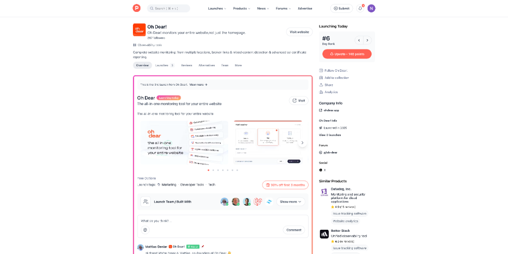

**适合人群**：网站管理员、开发者、运维工程师、数字营销团队

你的网站真的 24/7 正常运行吗？Oh Dear 提供全方位的“外部视角”监控，从 SSL 证书到数据库连接。

- 🎯 **主要功能**：多地点 Uptime 监控、SSL 证书报告、断链检测、TCP 服务检查（新）
- ⚡ **AI 特色**：虽然核心是监控，但其 Lighthouse 集成提供智能的 SEO 和可访问性建议
- 🌟 **独特之处**：覆盖从底层服务器（PING）到应用层（HTTPS）的全栈监控，新支持 MySQL、Redis、PostgreSQL 等 TCP 服务
- 💡 **使用场景**：
  - SSL 证书快过期了？提前收到警报
  - 数据库宕机？Oh Dear 立刻通知你
  - 网站出现断链影响 SEO？爬虫自动帮你发现

> **Maker 这么说**：“我们解决了最难的问题之一——全面的网站监控……现在，我们深入得更远。你可以直接监控 MySQL、Redis、RabbitMQ 等核心服务。”

产品链接：[https://www.producthunt.com/products/oh-dear](https://www.producthunt.com/products/oh-dear)

---

### KushoAI - 命令行里的开源 AI 测试员

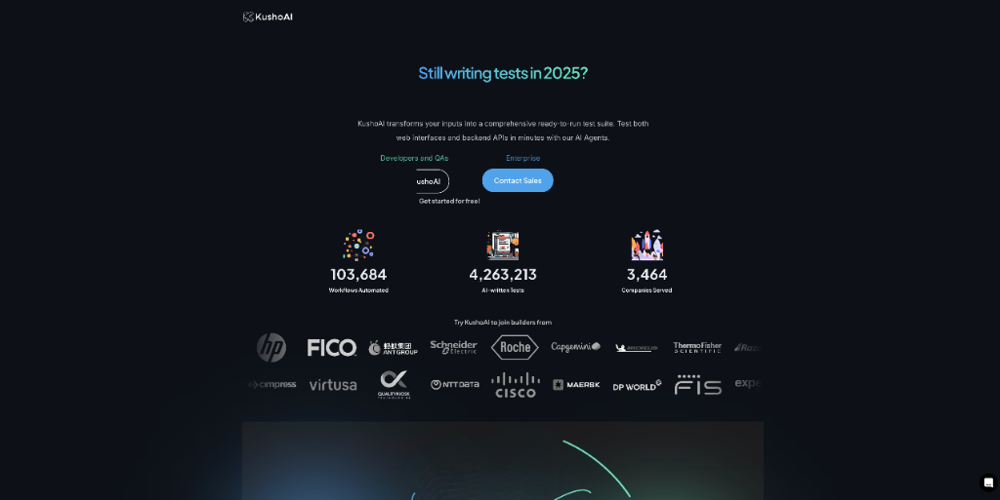

**适合人群**：开发者、QA 工程师、DevOps、技术负责人

厌倦了编写脆弱、繁琐的测试脚本？KushoAI 是一个开源的 AI 代理，就住在你的终端里，能为你的 Web 界面和后端 API 生成全面的测试套件。

- 🎯 **主要功能**：用一条命令生成 UI 测试，并可集成到 CI/CD 流水线
- ⚡ **AI 特色**：AI 能构想出开发者可能花几小时才能设计出的真实场景，覆盖边缘情况
- 🌟 **独特之处**：开源、终端原生、Git 友好，专为开发者的工作流设计
- 💡 **使用场景**：
  - 为新功能快速生成测试用例
  - 在每次代码提交时自动运行 AI 生成的测试
  - Fork 代码库，根据团队需求自定义 AI 测试逻辑

> **Maker 这么说**：“Meet the KushoAI CLI Agent，一个开源的 AI 测试员，住在你的终端里，为你编写 UI 测试……它经过优化，可以在单个命令中为任何 Web 界面生成 UI 测试。”

产品链接：[https://www.producthunt.com/products/kushoai](https://www.producthunt.com/products/kushoai)

---

### Peony Dataroom - 创始人喜爱的 DocSend 替代品

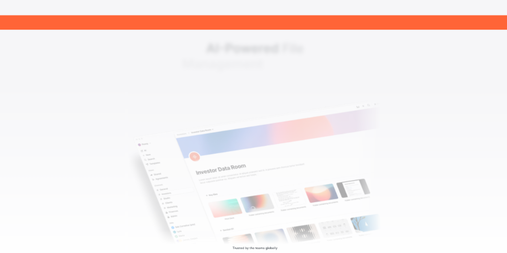

**适合人群**：创始人、销售、法务、HR、财务

还在为 DocSend 的 $300/月账单肉疼？Peony 自称是“地球上最好看的数据室”，以创业公司价格提供企业级安全。

- 🎯 **主要功能**：安全分享、AI 查询文档、电子签名、访问管理
- ⚡ **AI 特色**：可以用 AI 查询你共享的文档内容
- 🌟 **独特之处**：颜值极高、价格亲民、深受真实创始人喜爱，被誉为“苹果的工艺感+嘻哈的能量”
- 💡 **使用场景**：
  - 为融资准备精美的、可追踪的数据室
  - 安全地共享合同并获取电子签名
  - 让投资人用 AI 快速搜索你上传的财务报告

> **Maker 这么说**：“Peony 如果是一个品牌，那它就是苹果的精致加上嘻哈的能量：足够简洁以让人信任百万交易，足够大胆到真正享受使用。”

产品链接：[https://www.producthunt.com/products/peony-0-5](https://www.producthunt.com/products/peony-0-5)

---

### Streamdown by Vercel - react-markdown 的即插即用替代品

**适合人群**：前端开发者、React 工程师、AI 应用构建者

在构建 AI 应用时，流式输出 Markdown（如 AI 聊天）常因格式不完整而显示错乱。Streamdown 专为此而生。

- 🎯 **主要功能**：无缝渲染从 AI 模型流式传输的 Markdown 内容
- ⚡ **AI 特色**：完美处理不完整或未终止的 Markdown 块，确保格式正确
- 🌟 **独特之处**：即插即用，Vercel 出品，专为 AI 流式场景优化
- 💡 **使用场景**：
  - 开发 AI 聊天机器人，实时显示 AI 生成的 Markdown 响应
  - 构建需要流式文档生成的应用
  - 替换现有项目中无法处理流式内容的 react-markdown

> **Maker 这么说**：“Streamdown 专为处理从 AI 模型流式传输 Markdown 内容的独特需求而构建，即使 Markdown 块不完整或未终止，也能提供无缝的格式化。”

产品链接：[https://www.producthunt.com/products/vercel](https://www.producthunt.com/products/vercel)

---

### Grok Code Fast 1 - 快速且经济的编码 AI

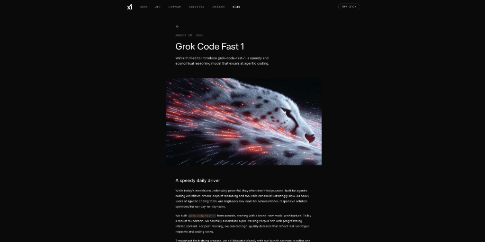

**适合人群**：开发者、程序员、技术爱好者

xAI 推出的 Grok Code Fast 1，定位为“快速且经济的日常编码驱动”，已在 GitHub Copilot、Cursor 等热门平台集成。

- 🎯 **主要功能**：AI 辅助编程，代码生成与补全
- ⚡ **AI 特色**：专为“代理式编码”(agentic coding) 优化，在性能和成本间取得良好平衡
- 🌟 **独特之处**：发布即集成到多个主流平台，免费限时体验
- 💡 **使用场景**：
  - 在 Cursor 或 GitHub Copilot 中体验 Grok 的编码能力
  - 通过 xAI API 构建自己的 AI 编程工具
  - 寻找一个成本效益高的 AI 编程助手

> **Maker 这么说**：“Grok Code Fast 1 最令人印象深刻的是它从第一天起就具备广泛的可用性。它已经集成到许多最受欢迎的代理编码平台中。”

产品链接：[https://www.producthunt.com/products/xai-api](https://www.producthunt.com/products/xai-api)

---

### Twistly - Microsoft PowerPoint 的 AI 演示文稿制作插件

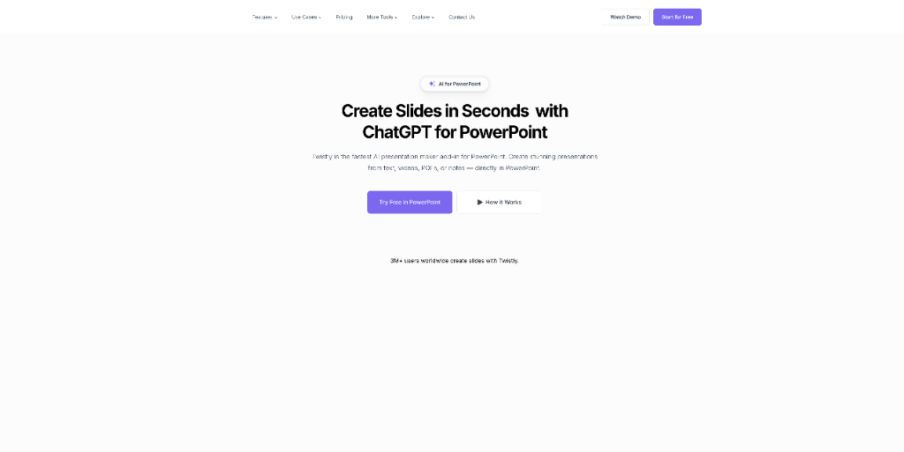

**适合人群**：商务人士、教师、学生、内容创作者

还在为 PPT 设计头疼？Twistly 是一个直接集成在 PowerPoint 中的 AI 插件，利用内置的 ChatGPT 快速创建和优化演示文稿。

- 🎯 **主要功能**：在 PowerPoint 内创建、编辑和美化演示文稿
- ⚡ **AI 特色**：深度集成 Office 生态，操作在几秒内完成
- 🌟 **独特之处**：无需离开 PowerPoint，流程无缝，已获超 300 万用户信任
- 💡 **使用场景**：
  - 输入主题，AI 自动生成完整的 PPT 大纲和设计
  - 一键优化现有幻灯片的布局和配色
  - 快速将长文档转换为简洁的演示文稿

> **Maker 这么说**：“这太厉害了。再也不用为设计发愁了。祝贺你们发布这个产品！”

产品链接：[https://www.producthunt.com/products/twistly](https://www.producthunt.com/products/twistly)

---

### Microsoft AI (MAI) Voice-1 - 高度拟真和自然的语音生成模型

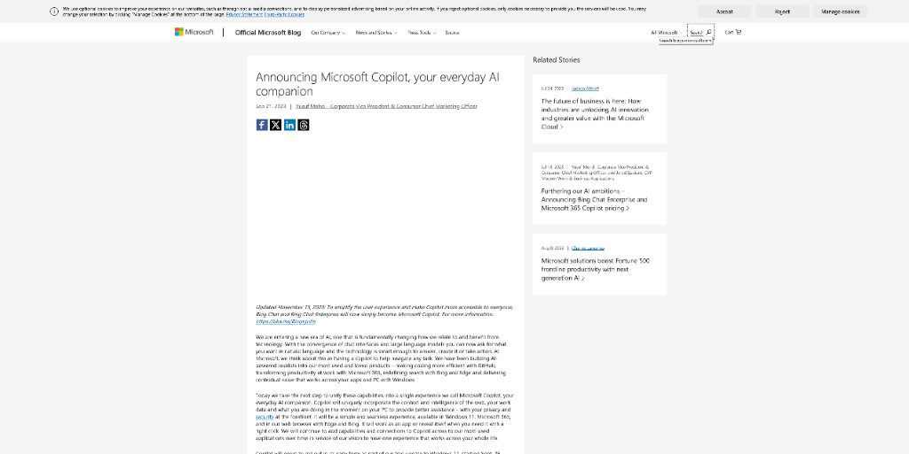

**适合人群**：内容创作者、播客、游戏开发者、无障碍应用开发者

微软推出的 MAI-Voice-1，号称是“闪电般快速”的语音生成模型，效率极高。

- 🎯 **主要功能**：生成高度拟真、富有表现力的语音
- ⚡ **AI 特色**：在单个 GPU 上，不到一秒就能生成一整分钟的音频
- 🌟 **独特之处**：极高的生成效率，是当今最高效的语音系统之一
- 💡 **使用场景**：
  - 为视频快速生成旁白
  - 创建个性化的语音助手
  - 为游戏中的角色生成自然的对话

> **Maker 这么说**：“Microsoft coming after @ElevenLabs — /me grabs popcorn.”

产品链接：[https://www.producthunt.com/products/microsoft-copilot](https://www.producthunt.com/products/microsoft-copilot)

---

### Never lose your work again - Claude Code 的检查点管理

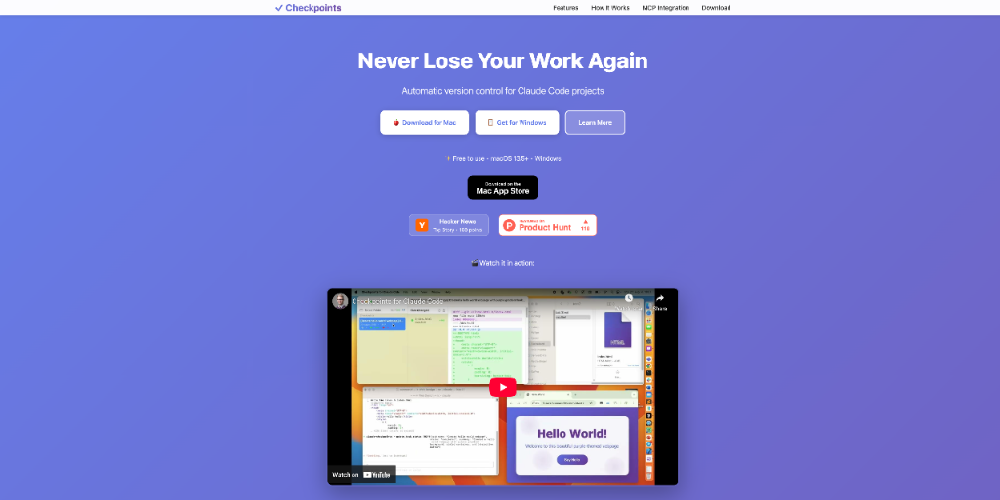

**适合人群**：使用 Claude Code 的开发者、AI 编程探索者

在用 AI 编程时，一不小心改错想回退？这个工具为 Claude Code 项目提供自动版本控制。

- 🎯 **主要功能**：自动创建检查点、追踪变更、恢复到任意历史状态
- ⚡ **AI 特色**：专为 AI 代码生成的非线性工作流设计
- 🌟 **独特之处**：让你可以轻松回退到 7 条甚至 70 条消息之前的状态，然后重新开始
- 💡 **使用场景**：
  - 在 AI 生成的代码变“坏”之前，一键恢复
  - 对比不同 AI 建议的代码版本
  - 安全地尝试大胆的重构

> **Maker 这么说**：“可以返回到之前的任何一个状态。也可以切换到比如 7 条消息前（或 70 条），删除新的，重新开始 😉”

产品链接：[https://www.producthunt.com/products/never-lose-your-work-again](https://www.producthunt.com/products/never-lose-your-work-again)

---

### LaunchMMO - 这个周末就上线你的浏览器 MMO

**适合人群**：独立游戏开发者、全栈工程师、游戏爱好者

想做 MMO 却要花数月造轮子？LaunchMMO 是一个启动套件，让你能用一个周末就上线一个基础的在线浏览器游戏。

- 🎯 **主要功能**：包含登录、聊天、角色移动、战斗系统等 MMO 基础模块
- ⚡ **AI 特色**：虽非 AI 核心，但可结合 AI 快速生成游戏内容（如任务、对话）
- 🌟 **独特之处**：省去数百小时的引擎开发，直接在坚实基础上添加特色功能
- 💡 **使用场景**：
  - 快速验证一个 MMO 游戏创意
  - 作为学习在线游戏开发的教学项目
  - 基于其架构开发其他类型的在线游戏

> **Maker 这么说**：“Last year, I was completely bored and depressed from building yet another business app, so I decided to build online games occasionally to balance things out... Thanks to LaunchMMO, you can develop your MMO without spending hundreds of hours building the engine.”

产品链接：[https://www.producthunt.com/products/launchmmo](https://www.producthunt.com/products/launchmmo)

---

## 🔗 今日产品链接一览

> 方便大家收藏和分享：

1.  **Wanderboat 2.0(AI实时看视频推荐附近吃喝玩乐)**: [https://www.producthunt.com/products/wanderboat-2-0](https://www.producthunt.com/products/wanderboat-2-0)
2.  **Surf(AI驱动的加密货币研究与交易平台)**: [https://www.producthunt.com/products/surf-9](https://www.producthunt.com/products/surf-9)
3.  **HyNote AI(整合会议与文档的AI笔记本)**: [https://www.producthunt.com/products/ai-notebook-app](https://www.producthunt.com/products/ai-notebook-app)
4.  **Contact Finder by Jeeva AI(秒级查找验证邮箱和电话)**: [https://www.producthunt.com/products/jeeva-ai](https://www.producthunt.com/products/jeeva-ai)
5.  **Codex by OpenAI(ChatGPT内置的AI编程队友)**: [https://www.producthunt.com/products/openai](https://www.producthunt.com/products/openai)
6.  **Optibase(Webflow原生A/B测试工具)**: [https://www.producthunt.com/products/a-b-testing-for-webflow](https://www.producthunt.com/products/a-b-testing-for-webflow)
7.  **Oh Dear(全方位网站监控工具)**: [https://www.producthunt.com/products/oh-dear](https://www.producthunt.com/products/oh-dear)
8.  **KushoAI(命令行里的开源AI测试生成器)**: [https://www.producthunt.com/products/kushoai](https://www.producthunt.com/products/kushoai)
9.  **Peony Dataroom(颜值超高的创始人数据室)**: [https://www.producthunt.com/products/peony-0-5](https://www.producthunt.com/products/peony-0-5)
10. **Streamdown by Vercel(专为AI流式输出优化的Markdown渲染)**: [https://www.producthunt.com/products/vercel](https://www.producthunt.com/products/vercel)
11. **Grok Code Fast 1(xAI推出的快速经济型编程AI)**: [https://www.producthunt.com/products/xai-api](https://www.producthunt.com/products/xai-api)
12. **Twistly(PowerPoint内置的AI演示文稿助手)**: [https://www.producthunt.com/products/twistly](https://www.producthunt.com/products/twistly)
13. **Microsoft AI (MAI) Voice-1(超高效的自然语音生成模型)**: [https://www.producthunt.com/products/microsoft-copilot](https://www.producthunt.com/products/microsoft-copilot)
14. **Never lose your work again(Claude Code的自动版本控制)**: [https://www.producthunt.com/products/never-lose-your-work-again](https://www.producthunt.com/products/never-lose-your-work-again)
15. **LaunchMMO(周末即可上线的浏览器MMO游戏套件)**: [https://www.producthunt.com/products/launchmmo](https://www.producthunt.com/products/launchmmo)

---

## 💬 互动时间

**🎯 产品体验分享**：你试用过今天推荐的哪个产品？体验如何？

**🔍 产品推荐**：你最近发现了什么好用的 AI 工具？分享给大家吧！  
**⭐ 需求征集**：你希望有什么样的 AI 工具来解决你的困扰？  
**💡 使用技巧**：有什么 AI 工具的使用小技巧想要分享？

> 💬 在评论区留言，让我们一起构建最实用的 AI 产品库！

---

## 🔮 明日预告

🚀 明天会为大家带来更多 Product Hunt 上的 AI 新品，敬请期待！

❓ 有想看的特定类型产品吗？留言告诉我们吧~

---