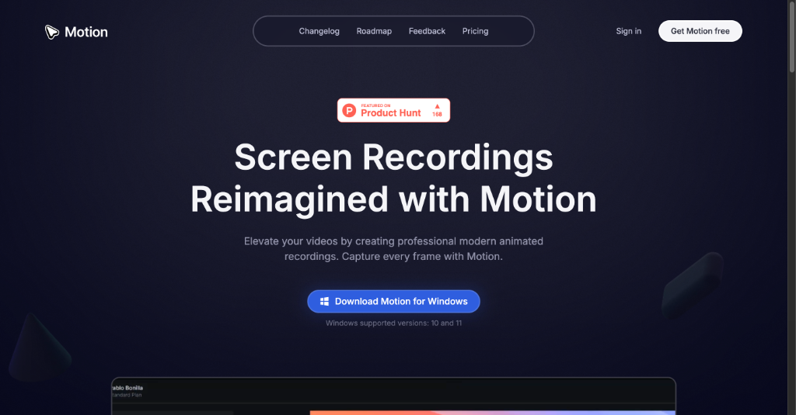
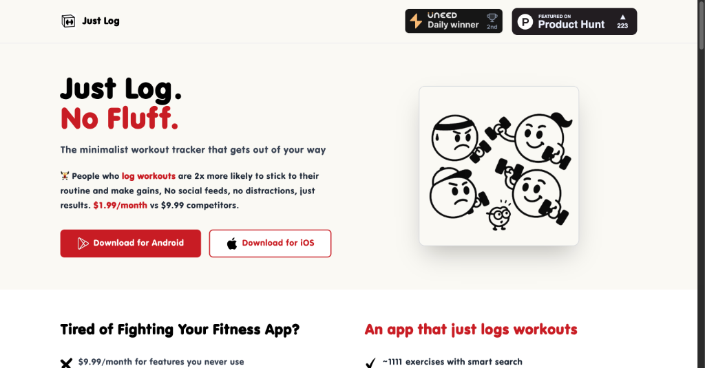
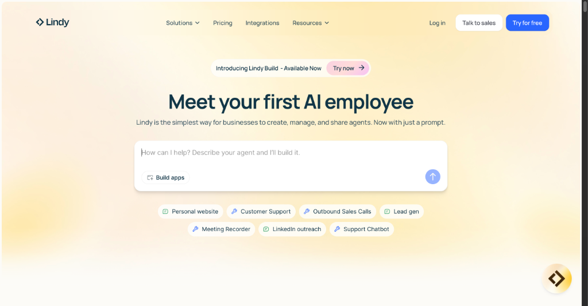

# 逆天了！AI自动修Bug神器来了！ AI 产品头条 - 第 3 期 | 2025年08月31日

👋 嗨，欢迎来到 AI 产品头条！

今天在 Product Hunt 上挖到了 **4 款惊艳全场的 AI 新工具**，最让人拍案叫绝的是：**AI 竟然能自动发现并修复代码 Bug，还能一键生成完整应用**！

从极简健身记录到 4K 高清录屏，再到智能简历筛选，本期全是「用了就回不去」的硬核神器。无论你是开发者、HR 还是健身达人，这期内容都值得你收藏！

---

## 🎯 今日精选产品

### Motion Software - 4K高清录屏+自动美化，视频创作从未如此简单

**适合人群**：产品经理、开发者、内容创作者、营销人员

还在为制作产品演示视频而头疼？Motion Software 让你从繁琐的剪辑中彻底解放！它不仅能以最高 4K 分辨率录制屏幕，还能自动添加智能缩放、美化鼠标轨迹、替换专业级光标，甚至一键导出成 polished 的成品视频。

- 🎯 **主要功能**：高清录屏 + 智能缩放 + 光标美化 + 时间线编辑
- ⚡ **AI 特色**：点击时自动触发“智能缩放”，像专业剪辑师一样突出重点
- 🌟 **独特之处**：无需 Premiere 或 Final Cut，3 步完成专业级视频：录制 → 编辑 → 导出
- 💡 **使用场景**：产品功能演示、教学视频制作、客户提案展示、SaaS 营销素材

> **Maker 这么说**：Motion Software 致力于重新定义你展示产品的方式。不再需要复杂难用的视频编辑器，Motion 为你自动完成一切，让你专注于内容本身。目前支持 Windows，未来还将推出更多功能。

产品链接：[https://www.producthunt.com/products/motion-software](https://www.producthunt.com/products/motion-software)

---

### Just Log - 极简主义健身记录，专注训练，拒绝干扰

**适合人群**：健身爱好者、力量训练者、极简主义者

受够了那些充满社交动态、营养建议和花哨通知的健身 App？Just Log 就是为你而生的“反内卷”工具。它没有社交功能，没有推送打扰，只有一个核心目标：让你在 30 秒内完成训练记录。

- 🎯 **主要功能**：快速记录训练组数、PR 追踪、彩色日历视图、智能搜索
- ⚡ **AI 特色**：智能搜索支持模糊匹配 1000+ 动作名称（比如输入“bench”就能找到“Barbell Bench Press”）
- 🌟 **独特之处**：极简设计哲学，不做多余功能，专注提升记录效率
- 💡 **使用场景**：健身房快速打卡、居家训练追踪、力量增长进度管理

> **Maker 这么说**：我厌倦了为不需要的功能付费，于是亲手打造了 Just Log。它从一个 Side Project 起步，如今已有 2000+ 用户。有时候，最好的产品不是功能最多，而是最简单的。

产品链接：[https://www.producthunt.com/products/just-log](https://www.producthunt.com/products/just-log)

---

### Lindy Build - 描述即开发，AI 自动构建应用并修复 Bug

**适合人群**：创业者、产品经理、无代码开发者、技术原型设计者

“描述你的应用，Lindy 自动构建它”——这不再是科幻。Lindy Build 将“Vibe Coding”推向新高度：你只需描述想要的功能，它就能从代码生成到 QA 测试全自动完成，甚至能自主发现 Bug 并修复！

- 🎯 **主要功能**：自然语言生成应用、自动 QA 测试、自主修复 Bug
- ⚡ **AI 特色**：内置“浏览代理”，可模拟用户操作，自动发现并修复界面和逻辑问题
- 🌟 **独特之处**：不只是生成代码，而是交付“可运行、无 Bug”的完整原型
- 💡 **使用场景**：MVP 快速验证、产品原型设计、自动化测试、无代码开发进阶

> **Maker 这么说**：Vibe Coding 前 5 分钟很魔幻，但后续调试很痛苦。Lindy Build 解决了这个问题——你去吃个午饭，回来就是一个可运行的成品。

产品链接：[https://www.producthunt.com/products/lindy](https://www.producthunt.com/products/lindy)

---

### AI Resume Screener by Hyring - 招聘效率提升 10 倍的智能简历筛选器

**适合人群**：HR 招聘官、技术主管、初创公司创始人

还在手动翻阅上百份简历？Hyring 的 AI 简历筛选器能瞬间完成候选人初筛，不仅支持关键词匹配，更能基于技能、工作年限、职业空窗期、公司层级等维度生成“适配分”，精准识别谁值得面试。

- 🎯 **主要功能**：智能适配评分、优势与差距分析、批量上传、ATS 集成
- ⚡ **AI 特色**：超越传统关键词匹配，理解候选人真实能力与岗位需求的深层匹配
- 🌟 **独特之处**：与 AI 电话初筛、AI 视频面试无缝衔接，打造全自动招聘流水线
- 💡 **使用场景**：技术岗位招聘、校园招聘、高流量职位初筛、HR 效率优化

> **Maker 这么说**：市面上的简历筛选器大多停留在关键词匹配。我们构建 Hyring 是为了让筛选更公平、更深入、更高效。筛选后的候选人可直接进入 AI 电话和视频面试，实现端到端自动化招聘。

产品链接：[https://www.producthunt.com/products/ai-interviewer-by-hyring](https://www.producthunt.com/products/ai-interviewer-by-hyring)

---

## 🔗 今日产品链接一览

> 方便大家收藏和分享：

1. **Motion Software(4K录屏+自动美化视频)**: [https://www.producthunt.com/products/motion-software](https://www.producthunt.com/products/motion-software)
2. **Just Log(极简健身记录工具)**: [https://www.producthunt.com/products/just-log](https://www.producthunt.com/products/just-log)
3. **Lindy Build(AI自动建应用+修Bug)**: [https://www.producthunt.com/products/lindy](https://www.producthunt.com/products/lindy)
4. **AI Resume Screener by Hyring(智能简历筛选+招聘自动化)**: [https://www.producthunt.com/products/ai-interviewer-by-hyring](https://www.producthunt.com/products/ai-interviewer-by-hyring)

---

## 💬 互动时间

**🎯 产品体验分享**：你试用过今天推荐的哪个产品？体验如何？

**🔍 产品推荐**：你最近发现了什么好用的 AI 工具？分享给大家吧！  
**⭐ 需求征集**：你希望有什么样的 AI 工具来解决你的困扰？  
**💡 使用技巧**：有什么 AI 工具的使用小技巧想要分享？

> 💬 在评论区留言，让我们一起构建最实用的 AI 产品库！

---

## 🔮 明日预告

🚀 明天会为大家带来更多 Product Hunt 上的 AI 新品，敬请期待！

❓ 有想看的特定类型产品吗？留言告诉我们吧~

---