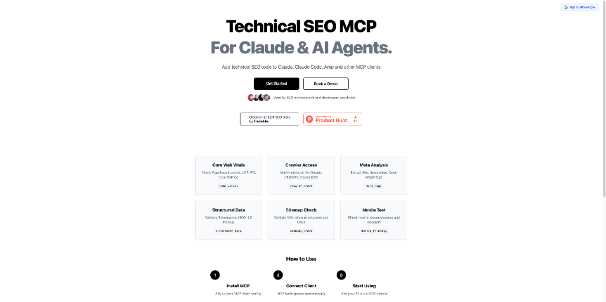
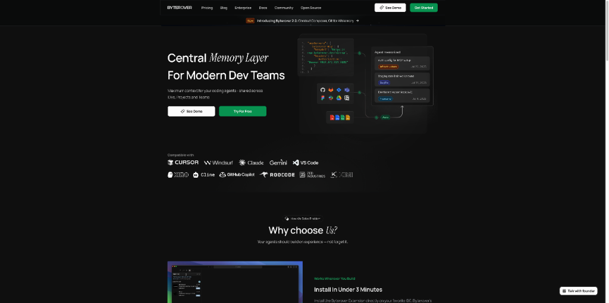
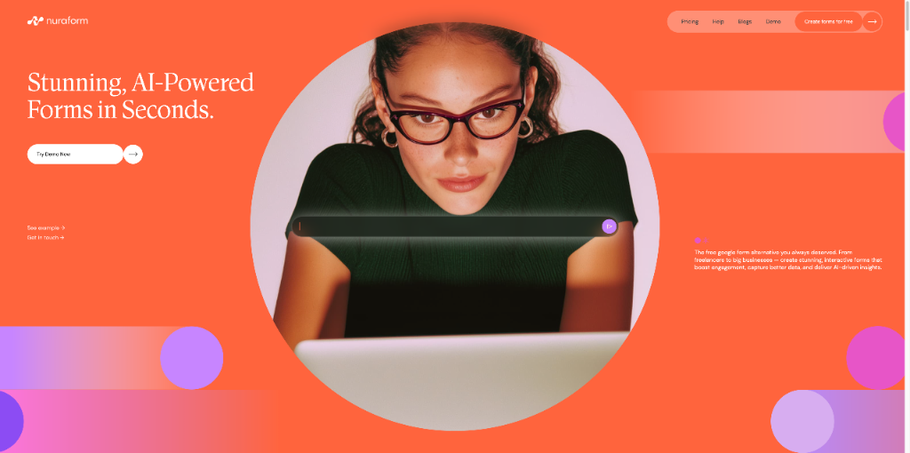
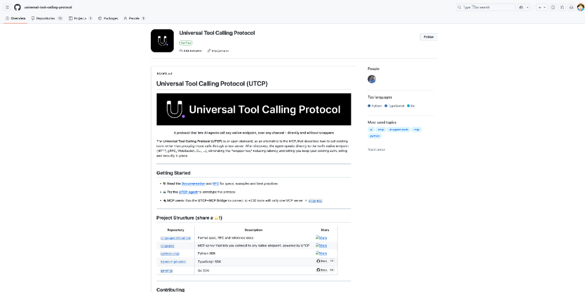

# 逆天了！谷歌Whisk 3.0发布！ AI 产品头条 - 第 4 期 | 2025年08月31日

> 🔥 **今日封面亮点**：谷歌实验室放大招！Whisk 3.0 携带 **Precise Mode** 震撼登场，图像生成进入「像素级控制」时代！告别模糊创意，迎来精准创作——这波更新，真的把 AI 创作的自由度拉满了！

👋 嗨，欢迎来到 AI 产品头条！

今天在 Product Hunt 上发现了 **8 个超棒的 AI 工具**，最让人兴奋的是：**谷歌 Whisk 3.0 正式上线 Precise Mode，支持上传参考图实现角色、风格、场景的高精度还原**！

从 AI 图像生成到技术 SEO 自动化，从开发者智能体到 AI 表单神器，本期产品覆盖设计、开发、营销全链条，每一个都能让你的工作流快上一个台阶。

准备好了吗？让我们一起开启今天的 AI 探索之旅！

---

## 🎯 今日精选产品

### Google Whisk 3.0 - 精准控制 AI 图像生成的新纪元

**适合人群**：设计师、内容创作者、AI 艺术家、品牌视觉团队

谷歌实验室这次真的放大招了！Whisk 3.0 推出 **Precise Mode（精准模式）**，彻底解决 AI 生成图像中「角色走形、风格跑偏、场景混乱」的老大难问题。

- 🎯 **主要功能**：上传最多 3 张上下文图（主体+场景）和 1 张风格图，AI 直接基于图像生成，而非依赖文字描述
- ⚡ **AI 特色**：结合 **veo3** 与 **Gemini 2.5 Flash**，实现更精准的视觉理解与快速编辑
- 🌟 **独特之处**：与 Creative Mode 不同，Precise Mode 绕过文字描述环节，直接使用图像输入，大幅提升一致性
- 💡 **使用场景**：
  - 固定角色 IP 的系列插画创作
  - 品牌视觉风格统一的海报设计
  - 影视分镜与动画角色设定

> **Maker 这么说**：Precise Mode 是创作者的一大步！它能让你的输出更贴近预期的角色、风格和场景。只需在提示栏设置中切换“Precise Ref”，上传参考图并搭配清晰文字指令，效果惊人。小贴士：如需保留人物身份，请使用清晰、正面、自然色彩的人脸照片。

产品链接：[https://labs.google](https://labs.google)

---

### Technical SEO MCP - 让 AI 自动帮你跑 SEO 检测

**适合人群**：SEO 顾问、数字营销团队、独立开发者、 agencies

还在手动复制粘贴网站 URL 做技术 SEO 检查？**Technical SEO MCP** 让 AI 代理帮你搞定一切！

- 🎯 **主要功能**：集成到 Claude、Amp、LM Studio 等 AI 工具中，自动执行爬虫检测、Core Web Vitals 分析
- ⚡ **AI 特色**：支持批量检查上百个潜在客户网站，AI 自动生成摘要报告
- 🌟 **独特之处**：减少重复性工作，让 SEO 专家专注策略优化而非数据搬运
- 💡 **使用场景**：
  - 客户 prospecting 时快速评估网站健康度
  - 竞品技术 SEO 分析
  - 定期自动化网站体检

> **Maker 这么说**：跑检查、查 PageSpeed、看 CrUx 数据，过去要花几小时。现在只需把列表交给 AI 代理，它就能自动完成并总结问题，省下大量时间做真正有价值的事。

产品链接：[https://technicalseomcp.com/](https://technicalseomcp.com/)

---

### Byterover 2.0 - 开发团队的 AI 记忆中枢

**适合人群**：软件工程团队、AI 编程代理使用者、技术负责人

当多个 AI 代理协同开发时，上下文混乱怎么办？**Byterover 2.0** 给你一个「Git for AI Memory」！

- 🎯 **主要功能**：统一管理 AI 代理的上下文，支持从文档、代码库、MCP 服务器获取信息
- ⚡ **AI 特色**：Context Composer 工具让人类精准配置任务上下文
- 🌟 **独特之处**：支持创建、更新、回滚 AI 记忆版本，像管理代码一样管理 AI 上下文
- 💡 **使用场景**：
  - 多代理协作开发大型项目
  - 防止 AI 忘记关键架构决策
  - 团队知识沉淀与复用

> **Maker 这么说**：我们想让 ByteRover 成为 agentic coding 的正确上下文来源。通过 Context Composer 和 Git 式记忆管理，团队可以自信地构建、分叉和复用记忆库。

产品链接：[https://byterover.dev/](https://byterover.dev/)

---

### Nuraform - 用 AI 秒建高转化率表单

**适合人群**：产品经理、独立开发者、自由职业者、营销人员

「描述你的表单，AI 自动生成」——**Nuraform** 让表单创建快到飞起！

- 🎯 **主要功能**：AI 根据自然语言描述生成完整表单结构与逻辑
- ⚡ **AI 特色**：支持 AI 自动生成提交摘要、上下文感知的智能追问
- 🌟 **独特之处**：不仅生成快，还自带 WebGL 动态背景、交互式布局，颜值拉满
- 💡 **使用场景**：
  - 客户需求调研表单
  - 会议后自动生成跟进问卷
  - 用户反馈收集与分析

> **Maker 这么说**：我厌倦了笨拙的表单工具，于是亲手打造了 Nuraform。它能根据会议笔记生成问卷，还能自动总结开放题答案，真正把时间还给创造。

产品链接：[https://www.nuraform.com/?ref=producthunt](https://www.nuraform.com/?ref=producthunt)

---

### UTCP Agent - 4行代码打造工具调用 AI 代理

**适合人群**：开发者、AI 工程师、开源爱好者

想构建能调用工具的 AI 代理？现在只需 **4 行代码**！**UTCP Agent** 让你快速上手。

- 🎯 **主要功能**：开源 SDK，支持在自有基础设施中快速部署工具调用代理
- ⚡ **AI 特色**：轻量级替代 MCP，直接调用任意工具或 API 端点
- 🌟 **独特之处**：已在 AWS、Microsoft、NVIDIA 等工程师中获得验证，GitHub 星标超 1k
- 💡 **使用场景**：
  - 快速搭建自动化工作流代理
  - 集成内部工具到 AI 系统
  - 教学与原型开发

> **Maker 这么说**：我们希望开发者把精力放在构建酷炫的代理流程上，而不是被基础设施困扰。UTCP Agent 就是为了让这件事变得极其简单。

产品链接：[https://utcp.io](https://utcp.io)

---

### A01 - 你的私人新闻代理

**适合人群**：信息过载者、投资人、产品经理、科研人员

每天被海量新闻淹没？**A01** 是你的个人新闻 AI 代理，只推送你真正关心的内容。

- 🎯 **主要功能**：自动聚合、过滤、摘要个性化新闻源
- ⚡ **AI 特色**：学习你的兴趣偏好，主动推荐高价值信息
- 🌟 **独特之处**：极简设计，专注信息密度而非噪音
- 💡 **使用场景**：
  - 每日高效获取行业动态
  - 投资决策前的信息准备
  - 竞品监控与市场洞察

> **Maker 这么说**：（暂无公开信息，产品页面访问受限）

产品链接：[https://www.producthunt.com/products/a01](https://www.producthunt.com/products/a01)

---

### Higgsfield Speak 2.0 - 让虚拟头像真正“开口说话”

**适合人群**：内容创作者、教育工作者、游戏开发者、元宇宙项目团队

静态头像太无聊？**Higgsfield Speak 2.0** 让你的数字人拥有「灵魂之声」！

- 🎯 **主要功能**：AI 驱动的唇形同步与自然语音合成
- ⚡ **AI 特色**：语音语调自然，唇动匹配精准，支持多语言与情感表达
- 🌟 **独特之处**：已被全球创作者用于教育视频、虚拟主播、互动叙事
- 💡 **使用场景**：
  - 制作 AI 教师教学视频
  - 虚拟偶像直播内容生成
  - 游戏 NPC 对话系统

> **Maker 这么说**：我们推出了 Higgsfield Speak 2.0，让数字头像拥有最逼真的语音表现。结合高级唇形同步与自然声音调制，创造前所未有的真实感。

产品链接：[https://higgsfield.ai](https://higgsfield.ai)

---

### UseArticle - 一键将产品链接变 affiliate 网站

**适合人群**： affiliate 营销者、内容创作者、电商从业者

想做 affiliate 却不会建站？**UseArticle** 只需一个链接，30 秒生成完整网站！

- 🎯 **主要功能**：输入产品 URL，AI 自动生成内容、设计、SEO 优化的 affiliate 网站
- ⚡ **AI 特色**：内容自然植入 affiliate 链接，SEO 友好，5 分钟上线
- 🌟 **独特之处**：完全自动化，无需设计或写作技能
- 💡 **使用场景**：
  - 推广亚马逊、Shopify 产品
  - 快速测试 affiliate 创意
  - 批量创建利基网站

> **Maker 这么说**：我之前的产品失败了，于是 pivoted 到 affiliate 市场。现在你只需输入产品和 affiliate 链接，AI 就能帮你建站、写内容、做 SEO，完全免费试用！

产品链接：[https://usearticle.com/](https://usearticle.com/)

---

## 🔗 今日产品链接一览

> 方便大家收藏和分享：

1. **Google Whisk 3.0(精准控制AI图像生成)**: [https://labs.google](https://labs.google)
2. **Technical SEO MCP(自动化技术SEO检测)**: [https://technicalseomcp.com/](https://technicalseomcp.com/)
3. **Byterover 2.0(开发者团队AI记忆中枢)**: [https://byterover.dev/](https://byterover.dev/)
4. **Nuraform(用AI秒建高颜值表单)**: [https://www.nuraform.com/?ref=producthunt](https://www.nuraform.com/?ref=producthunt)
5. **UTCP Agent(4行代码构建AI代理)**: [https://utcp.io](https://utcp.io)
6. **A01(私人AI新闻代理)**: [https://www.producthunt.com/products/a01](https://www.producthunt.com/products/a01)
7. **Higgsfield Speak 2.0(让头像真正开口说话)**: [https://higgsfield.ai](https://higgsfield.ai)
8. **UseArticle(一键生成affiliate网站)**: [https://usearticle.com/](https://usearticle.com/)

---

## 💬 互动时间

**🎯 产品体验分享**：你试用过今天推荐的哪个产品？体验如何？

**🔍 产品推荐**：你最近发现了什么好用的 AI 工具？分享给大家吧！  
**⭐ 需求征集**：你希望有什么样的 AI 工具来解决你的困扰？  
**💡 使用技巧**：有什么 AI 工具的使用小技巧想要分享？

> 💬 在评论区留言，让我们一起构建最实用的 AI 产品库！

---

## 🔮 明日预告

🚀 明天会为大家带来更多 Product Hunt 上的 AI 新品，敬请期待！

❓ 有想看的特定类型产品吗？留言告诉我们吧~

---