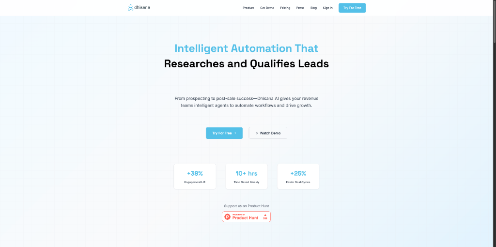
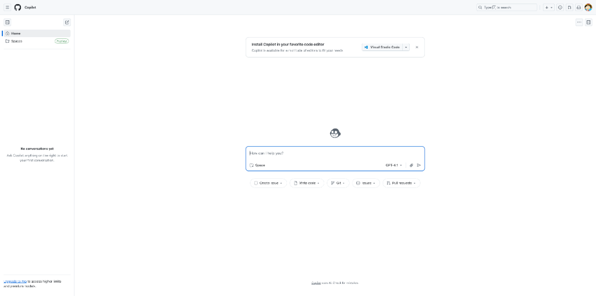
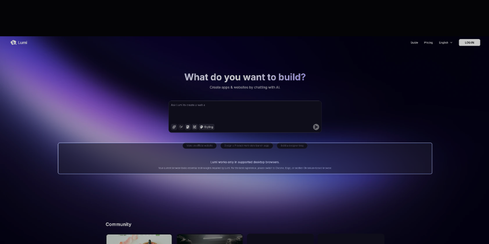
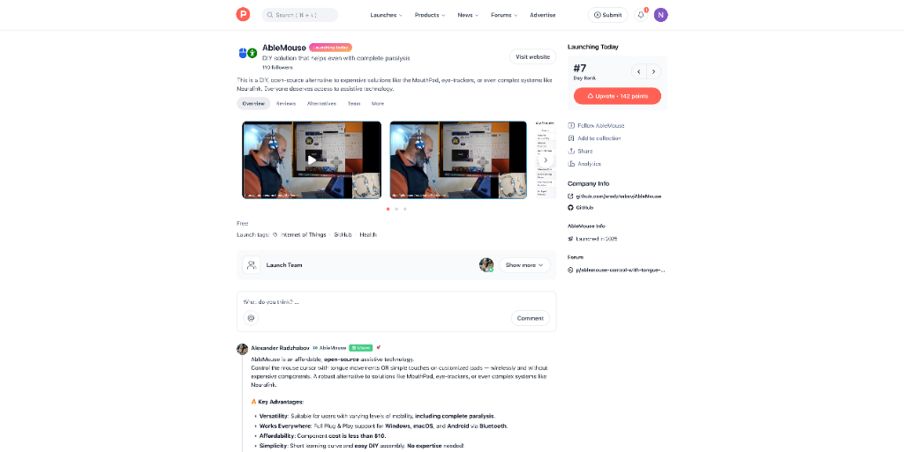
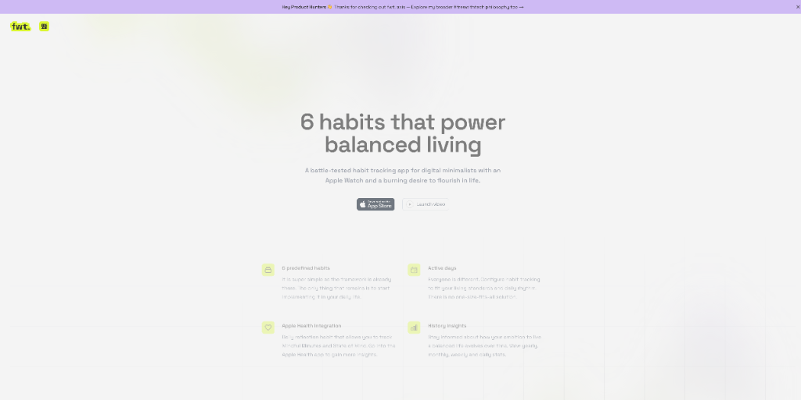

# 逆天了！AI员工上线了。 AI 产品头条 - 第 4 期 | 2025年09月02日

👋 嗨，欢迎来到 AI 产品头条！

今天在 Product Hunt 上发现了 **8 个超棒的 AI 工具**，最让人兴奋的是：**AI 正式开始“上岗”担任全职员工了**——从设计师、销售到开发者助手，通通由 AI 代理自动完成！

从全栈 AI Agent 开发平台，到能自主跑销售流程的智能体，再到普通人也能一键建站的对话式应用生成器，本期全是“生产力革命”级别的硬核产品。准备好迎接你的 AI 员工团队了吗？

---

## 🎯 今日精选产品

### xpander.ai - AI工程师的全栈开发平台

**适合人群**：AI 工程师、Agent 开发者、技术负责人

xpander.ai 是专为 AI 工程师打造的全栈开发平台，集成了 MCP 连接器、状态化数据库、AI 网关、测试环境回滚、运行时与 Agent 托管等能力。你可以在云端或自托管环境中运行，真正实现从开发到部署的一站式闭环。

- 🎯 **主要功能**：可视化构建 AI Agent，支持 Webhook 触发、Slack 集成、MCP 服务组合
- ⚡ **AI 特色**：内置 MCP 服务器、自动工具生成、指令自动生成、容器化运行时
- 🌟 **独特之处**：既支持低代码快速迭代，也允许无缝切换到代码开发，不锁死开发者自由
- 💡 **使用场景**：快速构建生产级 AI Agent、团队协作开发、私有化部署 AI 应用

> **Maker 这么说**：我们看到开发者在将 AI Agent 从本地迁移到云端时，不得不自己搭建数据库、认证、可观测性系统，甚至要等运维团队。xpander.ai 就是为了解决这个问题而生——就像 Supabase 之于数据库，我们是 AI Agent 的“全栈底座”。

产品链接：[https://www.producthunt.com/products/xpander-ai](https://www.producthunt.com/products/xpander-ai)

---

### JoggAI AvatarX - 会“动情”的AI虚拟人

**适合人群**：内容创作者、数字营销人员、虚拟偶像运营者

JoggAI AvatarX 是目前最逼真的 AI 虚拟人生成模型，不仅能生成超写实人脸，还能赋予角色真实的情感表达——从微妙的微笑到激动的情绪波动，全都能自然呈现。

- 🎯 **主要功能**：AI 驱动虚拟人表情与口型同步，支持任意图像输入（如油画、乐高、雕塑）
- ⚡ **AI 特色**：顶级唇形同步技术，告别僵硬面部；支持情感级动画生成
- 🌟 **独特之处**：不只是“看起来像人”，而是“感觉像人”，让虚拟角色真正有生命力
- 💡 **使用场景**：品牌虚拟代言人、AI 主播、教育视频角色、元宇宙形象

> **Maker 这么说**：我们不只是让虚拟人动起来，而是让他们“感觉”活着。AvatarX 能带来真实的情感表达，无论是商业广告还是创意项目，都能让你的角色活灵活现。

产品链接：[https://www.producthunt.com/products/jogg-ai](https://www.producthunt.com/products/jogg-ai)

---

### Dhisana AI - 销售团队的“Cursor”级助手

**适合人群**：销售团队、客户成功经理、SaaS 企业

Dhisana AI 被誉为“销售界的 Cursor”，它通过 AI 智能体自动化整个销售漏斗——从线索挖掘、客户触达到会议纪要、CRM 更新，全部由 AI 完成。

- 🎯 **主要功能**：描述需求即可生成销售工作流，自动执行多渠道跟进、会议摘要、风险预警
- ⚡ **AI 特色**：Agentic Workflows 支持自主决策，预测交易滑坡并推荐下一步动作
- 🌟 **独特之处**：让销售团队摆脱重复劳动，专注客户关系而非数据录入
- 💡 **使用场景**：销售自动化、客户会议智能分析、CRM 实时同步、销售预测

> **Maker 这么说**：销售本应是建立关系，而不是做数据录入。Dhisana AI 让你只需描述目标，AI 代理就会自动完成研究、跟进、更新和预测，真正解放销售生产力。

产品链接：[https://www.producthunt.com/products/dhisana-ai](https://www.producthunt.com/products/dhisana-ai)

---

### Genspark AI Designer - 你的AI设计员工

**适合人群**：创业者、产品经理、小企业主

Genspark AI Designer 是你的专属 AI 设计师，只需一个提示词，就能生成品牌系统、LOGO、包装、网站、广告甚至门店布局。无需设计经验，人人都是设计师。

- 🎯 **主要功能**：一键生成完整品牌设计方案，支持多轮迭代
- ⚡ **AI 特色**：从概念到视觉落地，全流程自动化
- 🌟 **独特之处**：不是单点工具，而是“设计员工”，能独立完成复杂设计项目
- 💡 **使用场景**：创业品牌搭建、产品包装设计、营销素材生成、门店空间规划

> **Maker 这么说**：我们用它为一个咖啡品牌“Meadow”设计了全套视觉：LOGO、包装、门店概念、营销图——全部在几分钟内完成。以前需要多个设计师和数周时间，现在只需一个提示词。

产品链接：[https://www.producthunt.com/products/genspark](https://www.producthunt.com/products/genspark)

---

### GitHub Copilot for Raycast - 从命令栏启动AI编程代理

**适合人群**：开发者、技术极客、效率控

GitHub Copilot 现已深度集成 Raycast，让你可以直接在 Raycast 中启动和跟踪 Copilot 的编码任务。无需切换窗口，一键调用 AI 编程助手。

- 🎯 **主要功能**：在 Raycast 中触发 Copilot 编码任务，实时查看进度
- ⚡ **AI 特色**：AI 编程代理化，任务可追踪、可中断、可复用
- 🌟 **独特之处**：将 AI 编程从“辅助补全”升级为“任务代理”
- 💡 **使用场景**：快速生成代码片段、重构函数、编写测试用例、文档生成

> **Maker 这么说**：Start and track GitHub Copilot coding agent tasks from Raycast 🤖

产品链接：[https://www.producthunt.com/products/github-copilot](https://www.producthunt.com/products/github-copilot)

---

### Lumi.new - 对话式无代码建站平台

**适合人群**：非技术创业者、产品经理、创意人士

Lumi.new 是一个真正“对话即开发”的无代码平台。你只需描述想法，它就能生成完整网站或轻量级应用，内置数据库、认证、存储和分析，无需集成任何第三方服务。

- 🎯 **主要功能**：通过自然语言对话构建全栈应用
- ⚡ **AI 特色**：支持长对话上下文，复杂逻辑也能准确理解
- 🌟 **独特之处**：不只是生成 UI，而是构建可运行的 MVP，包含后端逻辑
- 💡 **使用场景**：快速验证创业点子、搭建客户门户、创建内部工具

> **Maker 这么说**：我们被 AI “vibe coding” 工具惊艳，但它们往往止步于页面设计。Lumi 的使命是：让每个人都能通过对话构建一个真正可用的产品，而不仅仅是一个原型。

产品链接：[https://www.producthunt.com/products/lumi-new-2](https://www.producthunt.com/products/lumi-new-2)

---

### AbleMouse - 用舌头或触摸控制鼠标的开源方案

**适合人群**：行动不便用户、残障人士、辅助技术开发者

AbleMouse 是一款低成本、开源的辅助技术，允许用户通过舌头移动或定制触摸板来无线控制鼠标。成本不到10美元，支持 Windows、macOS 和 Android。

- 🎯 **主要功能**：蓝牙无线控制鼠标，支持多种输入方式
- ⚡ **AI 特色**：虽无 AI，但极简设计与高兼容性使其成为数字包容的典范
- 🌟 **独特之处**：开源、低成本、易组装，是 Neuralink 和眼动仪的平替方案
- 💡 **使用场景**：残障人士电脑操作、医疗康复辅助、DIY 技术项目

> **Maker 这么说**：AbleMouse 是一个开放、可修改的项目，我们希望让更多人能轻松获得技术控制权。GitHub 开源地址：https://github.com/aradzhabov/AbleMouse

产品链接：[https://www.producthunt.com/products/ablemouse-control-with-tongue-or-touch](https://www.producthunt.com/products/ablemouse-control-with-tongue-or-touch)

---

### fwt. axis - 极简主义者的习惯追踪器

**适合人群**：数字极简主义者、Apple Watch 用户、自我提升爱好者

fwt. axis 是一款为“数字极简者”设计的习惯追踪应用，专注于六大核心习惯，支持 Apple Watch 直接查看与记录，帮助你平衡生活、专注成长。

- 🎯 **主要功能**：极简界面，专注六大关键习惯
- ⚡ **AI 特色**：虽无 AI，但设计理念强调“少即是多”，与主流复杂 App 形成鲜明对比
- 🌟 **独特之处**：从手腕 glance 一眼即可掌握生活平衡状态
- 💡 **使用场景**：日常习惯养成、正念生活、数据驱动自我优化

> **Maker 这么说**：我是个“模拟优先”的人。当纸笔日记不在身边时，我需要一个能快速记录并分析习惯的工具。于是我自己做了一个——简单、专注、直接从 Apple Watch 使用。

产品链接：[https://www.producthunt.com/products/fwt-axis](https://www.producthunt.com/products/fwt-axis)

---

## 🔗 今日产品链接一览

> 方便大家收藏和分享：

1. **xpander.ai(全栈AI Agent开发平台)**: [https://www.producthunt.com/products/xpander-ai](https://www.producthunt.com/products/xpander-ai)
2. **JoggAI AvatarX(情感级AI虚拟人)**: [https://www.producthunt.com/products/jogg-ai](https://www.producthunt.com/products/jogg-ai)
3. **Dhisana AI(销售智能体自动化)**: [https://www.producthunt.com/products/dhisana-ai](https://www.producthunt.com/products/dhisana-ai)
4. **Genspark AI Designer(一键生成品牌设计)**: [https://www.producthunt.com/products/genspark](https://www.producthunt.com/products/genspark)
5. **GitHub Copilot for Raycast(命令栏调用AI编程)**: [https://www.producthunt.com/products/github-copilot](https://www.producthunt.com/products/github-copilot)
6. **Lumi.new(对话式无代码建站)**: [https://www.producthunt.com/products/lumi-new-2](https://www.producthunt.com/products/lumi-new-2)
7. **AbleMouse(开源鼠标控制方案)**: [https://www.producthunt.com/products/ablemouse-control-with-tongue-or-touch](https://www.producthunt.com/products/ablemouse-control-with-tongue-or-touch)
8. **fwt. axis(极简习惯追踪器)**: [https://www.producthunt.com/products/fwt-axis](https://www.producthunt.com/products/fwt-axis)

---

## 💬 互动时间

**🎯 产品体验分享**：你试用过今天推荐的哪个产品？体验如何？

**🔍 产品推荐**：你最近发现了什么好用的 AI 工具？分享给大家吧！  
**⭐ 需求征集**：你希望有什么样的 AI 工具来解决你的困扰？  
**💡 使用技巧**：有什么 AI 工具的使用小技巧想要分享？

> 💬 在评论区留言，让我们一起构建最实用的 AI 产品库！

---

## 🔮 明日预告

🚀 明天会为大家带来更多 Product Hunt 上的 AI 新品，敬请期待！

❓ 有想看的特定类型产品吗？留言告诉我们吧~

---