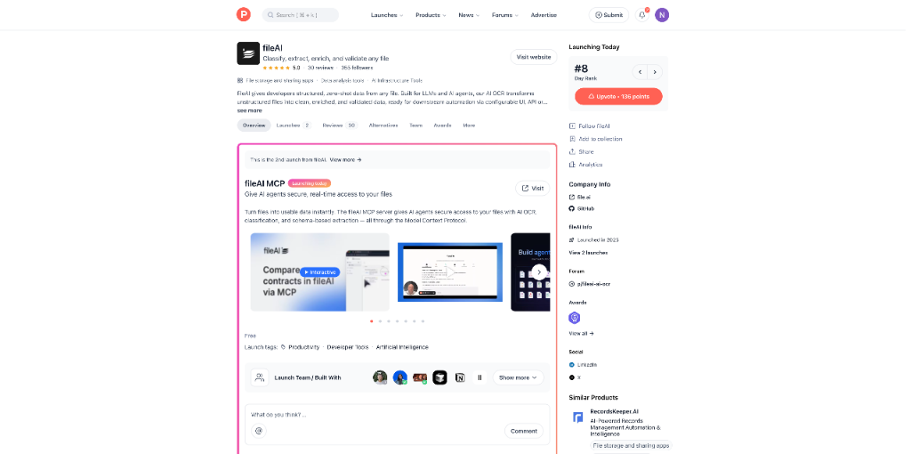

# 逆天了！AI自动记账神器来了！ AI 产品头条 - 第 5 期 | 2025年09月03日

> 🔥 **今日封面语**：AI 正在接管后台，而你只需专注创造！

👋 嗨，欢迎来到 AI 产品头条！

今天在 Product Hunt 上发现了 **19 个超棒的 AI 工具**，最让人兴奋的是：**AI 竟然能自动帮你找发票、记账、报税，还能一键生成 App**！

从财务自动化到无代码开发，从智能图表生成到企业级 AI 安全平台，这一期简直是生产力工具的“核爆”现场。特别是那个能让 AI 自动整理数年发票的神器，真的让人直呼“早该有了”！

别再手动翻邮箱找发票了，也别为画架构图头疼了——今天这些 AI 工具，正在重新定义“高效”二字。

---

## 🎯 今日精选产品

### Receiptor AI - 书本级自动化记账，AI帮你翻邮箱找发票

**适合人群**：自由职业者、小微企业主、独立开发者、会计师

你是否也经历过年底翻邮箱找发票的噩梦？Receiptor AI 直接终结这一痛苦——它能**自动扫描你的邮箱，从过去到现在所有收据和发票统统抓取**，AI 自动提取商户、金额、日期、税额，并分类同步到 Xero 或 QuickBooks。

更厉害的是，它现在支持团队协作、多实体管理（比如区分个人和公司支出），还能用 AI 创建自定义规则，比如“所有超过500元的支出自动标记为‘高优先级’”。你甚至可以直接问 AI：“上季度餐饮支出最多的是哪个月？”

> **Maker 这么说**：我们帮助超过 5,000 名小微企业家、独立创业者、CEO 和会计师自动化繁琐的记账工作。今天发布的升级版让我们离“完全无需干预的记账”更近一步。

产品链接：[https://www.producthunt.com/products/receiptor-ai](https://www.producthunt.com/products/receiptor-ai)

---

### Google Finance Beta - 谷歌的AI金融大脑上线了！

**适合人群**：投资者、理财新手、金融从业者、数据分析师

等等，谷歌终于认真做金融了？Google Finance Beta 不再只是看行情的工具，而是**用 AI 提供个性化投资建议、预测趋势、生成可视化图表**。它结合谷歌搜索与 AI 能力，让金融数据变得“会说话”。

无论是想了解某支股票的长期趋势，还是想对比不同行业的表现，它都能用直观的图表+AI解读帮你快速决策。界面极简，但背后是强大的数据处理能力。

> **Maker 这么说**：我们正在重新构想人们与金融数据的互动方式。通过结合谷歌的搜索和 AI 能力，我们希望让金融洞察变得人人可及。

产品链接：[https://www.producthunt.com/products/google-finance-beta](https://www.producthunt.com/products/google-finance-beta)

---

### Bhava - 一句话生成专业架构图，AI画图神器！

**适合人群**：产品经理、工程师、技术创始人、系统架构师

“帮我画一个包含 AWS S3、Lambda 和 API Gateway 的 Serverless 架构图。”——回车，搞定。

Bhava 就是这样一个**用文字生成专业图表的 AI 工具**。支持流程图、UML、ERD、泳道图、电气系统图等，还能识别手绘草图并转为可编辑的数字图表。更酷的是，你可以在图中直接输入 `@bhava 修改颜色为深色主题`，AI 就会自动调整。

从此告别 Visio 和手动画图，PM 和工程师的协作效率直接起飞。

> **Maker 这么说**：编程已经有了 AI 时刻，现在轮到图表了。我们 built it because 我们喜欢在文档里加流程图，现在它变得超级简单。

产品链接：[https://www.producthunt.com/products/bhava](https://www.producthunt.com/products/bhava)

---

### Copilot Audio Expressions - 让文字拥有灵魂的声音

**适合人群**：内容创作者、播客主、教育者、多模态开发者

文字再美，没有声音也难打动人。Copilot Audio Expressions 是微软推出的**免费文本转语音工具**，支持“情感模式”自定义语调、节奏，还有“故事模式”让 AI 自动为你生成带叙述感的音频。

最实用的是：**所有生成的音频都能下载为 MP3**，方便嵌入视频、播客或课件。AI 生成的声音自然度极高，几乎听不出是机器。

> **Maker 这么说**：无论文字多美，没有生动的声音，我们的世界都不会如此精彩。Emotive 模式让我能精确控制情绪，而且能下载音频，这对多模态创作太重要了。

产品链接：[https://www.producthunt.com/products/the-new-microsoft-copilot](https://www.producthunt.com/products/the-new-microsoft-copilot)

---

### Upvoted - 用户投票决定产品方向，轻量级反馈系统

**适合人群**：SaaS 创业者、产品经理、社区运营者

还在用笨重的工具收集用户反馈？Upvoted 是一个极简的**功能投票与产品反馈工具**。用户可以提交建议、投票、评论，你则能清晰看到哪些功能最被期待，并生成可读性强的路线图。

支持公开或私有看板、Slack/Zapier 集成、一键嵌入网站，API 也齐全。关键是：**设置只需几分钟，价格还很友好**。

> **Maker 这么说**：我付钱买了一个大工具，结果只用了基础功能。我想要一个干净的工具，让人们能提建议、投票、评论，而我能快速决定下一步做什么。

产品链接：[https://www.producthunt.com/products/upvoted-3](https://www.producthunt.com/products/upvoted-3)

---

### CatDoes - 用对话造App，AI多智能体协作开发

**适合人群**：中小企业主、非技术创始人、设计师、快速原型开发者

“我想做个预约美容院的 App，要有会员系统和支付。”——CatDoes 的 AI 团队就开始工作了。

它采用**多智能体架构**：需求代理理解你的想法，设计代理生成 UI，软件代理写代码，发布代理帮你上架 App Store。整个过程无需写代码，还能持续迭代，支持分支和回滚。

真正实现“对话即开发”，让非技术人员也能快速拥有自己的原生应用。

> **Maker 这么说**：我们 built CatDoes 让任何人，无论技术背景，都能通过对话创建并发布原生移动应用。

产品链接：[https://www.producthunt.com/products/catdoes-2](https://www.producthunt.com/products/catdoes-2)

---

### Bugster - AI QA工程师，专挑Next.js的刺

**适合人群**：Next.js 开发者、前端工程师、技术负责人

测试写不完？Bugster 是一个**专为 Next.js 设计的 AI QA 工程师**。它像真实用户一样操作你的应用，自动发现边界情况和潜在 Bug，无需写测试代码，零维护，每次 Pull Request 都自动运行。

它不只验证功能，还会“故意搞破坏”——比如疯狂点击、输入异常值、模拟网络中断，确保你的应用在各种极端情况下依然稳定。

> **Maker 这么说**：我们每个开发者都经历过测试通过但生产环境崩溃的痛苦。Bugster 就是那个专门找茬的 AI QA，像最有创造力的用户一样尝试破坏你的应用。

产品链接：[https://www.producthunt.com/products/bugster](https://www.producthunt.com/products/bugster)

---

### fileAI MCP - 给AI代理安全访问文件的“万能钥匙”

**适合人群**：开发者、企业IT、AI系统架构师

AI 再强，没有数据也白搭。fileAI MCP 是一个**通过 Model Context Protocol（MCP）协议，让 AI 代理安全、实时访问你文件的服务器**。

支持 AI OCR、自动分类、基于 Schema 的字段提取。一次接入，所有 AI 代理都能发现并使用你的文件数据，无需为每个工具写定制连接器。

> **Maker 这么说**：AI 代理很强大，但没有正确数据就难以发挥。MCP 就像 AI 的通用接口，插上就能用，不再需要脆弱的连接器或自定义代码。

产品链接：[https://www.producthunt.com/products/fileai-ai-ocr](https://www.producthunt.com/products/fileai-ai-ocr)

---

### Floor796 - 像Waldo一样探索的像素艺术宇宙

**适合人群**：艺术爱好者、游戏玩家、流行文化迷

这不是一个工具，而是一个**巨大的互动像素艺术世界**。Floor796 充满了 meme、动漫、音乐彩蛋，你可以点击探索隐藏任务、玩小游戏、创作像素画和旋律，甚至发布自己的广告。

像“找Waldo”一样在画面中发现惊喜，适合放松、解压，也适合和朋友一起“云探险”。

> **Maker 这么说**：我朋友给我看了这个，我立刻上瘾了。这是一个充满流行文化符号、参考和角色背景故事的美丽世界。

产品链接：[https://www.producthunt.com/products/floor796](https://www.producthunt.com/products/floor796)

---

### Ghost - Figma + Cursor + PowerPoint 的终极融合体

**适合人群**：设计师、产品经理、内容创作者、团队协作人员

PPT 太卡？AI 生成的幻灯片不能编辑？Ghost 是一个**GPU 加速、AI 原生的幻灯片编辑器**，体验如 Figma 般流畅。用 AI 生成内容，每一处修改都可自由调整，完全不像传统 AI 工具输出“静态垃圾”。

目标是成为 Cursor（AI代码）、Figma（设计）、PowerPoint（演示）的三合一工具，让创作真正自由。

> **Maker 这么说**：我们厌倦了 PPT 的笨重和 AI 工具输出不可编辑的内容。Ghost 的 AI 生成的是可完全编辑的内容。

产品链接：[https://www.producthunt.com/products/ghost-6](https://www.producthunt.com/products/ghost-6)

---

### Coherence X5 for macOS - 网站变原生Mac应用

**适合人群**：Mac 用户、多任务工作者、网站重度使用者

想把 Gmail、Notion、Figma 变成独立的 Mac 应用？Coherence X5 可以**将任何网站封装成独立的 Mac App**，使用 Chrome 内核，支持扩展、配置文件，行为完全像原生应用。

新版本支持 macOS 26 和 Liquid Glass 设计，性能更快，体验更无缝，是提升专注力和工作效率的利器。

> **Maker 这么说**：Coherence X5 将 Chrome 的强大功能打包成干净、独立的 Mac 应用，真正感觉像 macOS 的一部分。

产品链接：[https://www.producthunt.com/products/unite-for-macos](https://www.producthunt.com/products/unite-for-macos)

---

### Chronos for Jira - Jira时间追踪的Harvest平替

**适合人群**：Jira 用户、自由职业者、开发团队、项目经理

Jira 的时间追踪太难用？Chronos 是一个**专为 Jira 设计的桌面时间追踪应用**，灵感来自 Harvest。实时计时、多账户支持、暗黑模式、快捷键、提醒功能一应俱全。

界面简洁，专注工作流，还能补上 Jira 缺失的细节，比如为每个工作区添加 Logo。

> **Maker 这么说**：我从 Harvest 切到 Jira 后，时间追踪变得笨拙。所以我 built Chronos，把 Harvest 的简洁带到 Jira。

产品链接：[https://www.producthunt.com/products/chronos-for-jira](https://www.producthunt.com/products/chronos-for-jira)

---

### Guitar Wiz - 为吉他手打造的AI伴学神器

**适合人群**：吉他爱好者、音乐学习者、创作人

从调音、节拍器到和弦库、歌曲创作，Guitar Wiz 是一个**为 iPhone、iPad 和 Mac 打造的全能吉他伴侣**。支持音频预览、耳训练习、和弦进行探索，甚至能通过“Chord Assist”监听你的演奏并指导你。

最贴心的是“无障碍优先”设计，连视障用户也能使用。

> **Maker 这么说**：我是个独立开发者兼音乐人，Guitar Wiz 是我最雄心勃勃的项目，从一个和弦库成长为吉他手的完整工具包。

产品链接：[https://www.producthunt.com/products/guitar-wiz](https://www.producthunt.com/products/guitar-wiz)

---

### Compot - SwiftUI组件库 + AI编码助手

**适合人群**：iOS 开发者、SwiftUI 初学者、效率追求者

还在网上搜 SwiftUI 代码片段？Compot 提供**100+ 可直接复制粘贴的 SwiftUI 组件和模板**，还有 AI 助手帮你解释、调试、重构代码。

支持从文字或图片生成 SwiftUI 代码，所有代码无依赖，干净可复用，是 iOS 开发者的效率加速器。

> **Maker 这么说**：我 built Compot 是为了让 iOS 开发者少找片段，多创造。它集成了组件库、代码生成器和 AI 助手。

产品链接：[https://www.producthunt.com/products/compot](https://www.producthunt.com/products/compot)

---

### OAK - 企业级AI平台，数据主权与安全第一

**适合人群**：企业IT、合规团队、AI决策者

企业想用AI，但担心数据泄露？OAK 是一个**为企业打造的AI平台**，支持本地部署、GDPR合规、连接主流LLM（OpenAI、Anthropic等），确保数据主权和安全。

提供AI发现工作坊、部署指导、成本监控，帮助企业安全、可控地规模化AI应用。

> **Maker 这么说**：我们 built OAK 因为标准的“入门套件”无法满足组织的真实需求。如果你关心合规、数据主权和可扩展性，这就是为你准备的。

产品链接：[https://www.producthunt.com/products/open-agent-kit-build-agents-in-minutes](https://www.producthunt.com/products/open-agent-kit-build-agents-in-minutes)

---

### NoteWave - 会议录音秒变智能纪要

**适合人群**：会议频繁的团队、远程工作者、项目经理

NoteWave 是一个**AI会议助手**，支持实时录音、上传音频、连接在线会议，自动生成准确转录和摘要。

无论是一对一通话、团队站会还是客户访谈，它都能帮你捕捉关键信息，让你专注对话而非记笔记。

> **Maker 这么说**：我们 tired 了在会议中丢失重要细节和浪费时间记笔记。NoteWave 让你能专注于对话本身。

产品链接：[https://www.producthunt.com/products/notewave-3](https://www.producthunt.com/products/notewave-3)

---

### SpatialChat - 虚拟共空间，让远程团队真正连接

**适合人群**：远程团队、创意工作者、虚拟活动组织者

SpatialChat 是一个**为“创造者”打造的虚拟共空间**，支持站立会、头脑风暴、全体会议等场景。新功能包括管理员退出自动关闭房间、禁用私聊、强制移动用户、透明头像等，提升管理效率和协作体验。

> **Maker 这么说**：我们希望人们无论身处何地，都能有意义地聚集。新功能让虚拟活动更流畅、更专注。

产品链接：[https://www.producthunt.com/products/spatialchat](https://www.producthunt.com/products/spatialchat)

---

### Gromet - Python脚本变一键自动化

**适合人群**：数据分析师、开发团队、非技术团队协作者

写了个Python脚本想分享给同事？Gromet 让你**把脚本变成一键运行的自动化工具**，无需安装、无需依赖、无需终端。只需分享一个 Vault Key，同事就能秒运行。

完美解决“环境不一致”、“依赖缺失”、“同事不会用命令行”的痛点。

> **Maker 这么说**：我 built Gromet 因为分享Python自动化太痛苦了，尤其是对非技术团队。现在，写一次，一键分享。

产品链接：[https://www.producthunt.com/products/gromet-python-automations-made-simple](https://www.producthunt.com/products/gromet-python-automations-made-simple)

---

### ShareBox - macOS上的极简安全文件分享

**适合人群**：Mac 用户、设计师、开发者、需要传大文件的人

ShareBox 是一个**macOS 原生文件分享应用**，直接从 Finder 上传，生成带访问控制和过期时间的链接。注重隐私、速度和简洁，让分享大文件变得安全又轻松。

> **Maker 这么说**：我是 Astrix（Finder扩展）的作者，现在推出 ShareBox，一个简单快速的 macOS 文件分享工具，安全且以隐私为中心。

产品链接：[https://www.producthunt.com/products/sharebox](https://www.producthunt.com/products/sharebox)

---

## 🔗 今日产品链接一览

> 方便大家收藏和分享：

1. **Receiptor AI(自动化记账神器)**: [https://www.producthunt.com/products/receiptor-ai](https://www.producthunt.com/products/receiptor-ai)
2. **Google Finance Beta(谷歌AI金融平台)**: [https://www.producthunt.com/products/google-finance-beta](https://www.producthunt.com/products/google-finance-beta)
3. **Bhava(一句话生成专业图表)**: [https://www.producthunt.com/products/bhava](https://www.producthunt.com/products/bhava)
4. **Copilot Audio Expressions(文字转情感语音)**: [https://www.producthunt.com/products/the-new-microsoft-copilot](https://www.producthunt.com/products/the-new-microsoft-copilot)
5. **Upvoted(用户投票决定产品方向)**: [https://www.producthunt.com/products/upvoted-3](https://www.producthunt.com/products/upvoted-3)
6. **CatDoes(用对话造App)**: [https://www.producthunt.com/products/catdoes-2](https://www.producthunt.com/products/catdoes-2)
7. **Bugster(AI QA测试Next.js)**: [https://www.producthunt.com/products/bugster](https://www.producthunt.com/products/bugster)
8. **fileAI MCP(安全文件访问协议)**: [https://www.producthunt.com/products/fileai-ai-ocr](https://www.producthunt.com/products/fileai-ai-ocr)
9. **Floor796(像素艺术互动世界)**: [https://www.producthunt.com/products/floor796](https://www.producthunt.com/products/floor796)
10. **Ghost(Figma+PPT的AI幻灯片)**: [https://www.producthunt.com/products/ghost-6](https://www.producthunt.com/products/ghost-6)
11. **Coherence X5 for macOS(网站变Mac应用)**: [https://www.producthunt.com/products/unite-for-macos](https://www.producthunt.com/products/unite-for-macos)
12. **Chronos for Jira(Jira时间追踪利器)**: [https://www.producthunt.com/products/chronos-for-jira](https://www.producthunt.com/products/chronos-for-jira)
13. **Guitar Wiz(吉他学习全能助手)**: [https://www.producthunt.com/products/guitar-wiz](https://www.producthunt.com/products/guitar-wiz)
14. **Compot(SwiftUI组件+AI)**: [https://www.producthunt.com/products/compot](https://www.producthunt.com/products/compot)
15. **OAK(企业级AI安全平台)**: [https://www.producthunt.com/products/open-agent-kit-build-agents-in-minutes](https://www.producthunt.com/products/open-agent-kit-build-agents-in-minutes)
16. **NoteWave(会议智能纪要)**: [https://www.producthunt.com/products/notewave-3](https://www.producthunt.com/products/notewave-3)
17. **SpatialChat(虚拟共空间)**: [https://www.producthunt.com/products/spatialchat](https://www.producthunt.com/products/spatialchat)
18. **Gromet(Python一键自动化)**: [https://www.producthunt.com/products/gromet-python-automations-made-simple](https://www.producthunt.com/products/gromet-python-automations-made-simple)
19. **ShareBox(Mac安全文件分享)**: [https://www.producthunt.com/products/sharebox](https://www.producthunt.com/products/sharebox)

---

## 💬 互动时间

**🎯 产品体验分享**：你试用过今天推荐的哪个产品？体验如何？

**🔍 产品推荐**：你最近发现了什么好用的 AI 工具？分享给大家吧！  
**⭐ 需求征集**：你希望有什么样的 AI 工具来解决你的困扰？  
**💡 使用技巧**：有什么 AI 工具的使用小技巧想要分享？

> 💬 在评论区留言，让我们一起构建最实用的 AI 产品库！

---

## 🔮 明日预告

🚀 明天会为大家带来更多 Product Hunt 上的 AI 新品，敬请期待！

❓ 有想看的特定类型产品吗？留言告诉我们吧~

---