# 逆天了！AI数据分析师来了！ AI 产品头条 - 第 6 期 | 2025年09月04日

> 🔥 **今日AI神器大爆发！**

👋 嗨，欢迎来到 AI 产品头条！

今天在 Product Hunt 上发现了 **14 个超棒的 AI 工具**，最让人兴奋的是：**AI 正在彻底取代传统数据分析师和自动化工程师**！

从一键生成专业数据报告的 Ada，到用聊天就能构建复杂工作流的 Sidekick，再到能自动同步 GitHub 代码片段的 SnippSync——这些工具正在让专业工作变得前所未有地简单。

无论你是数据分析师、开发者、营销人员，还是创业者，今天推荐的每一款产品都能帮你节省数小时的重复劳动。准备好了吗？让我们一起开启今天的 AI 工具发现之旅！

---

## 🎯 今日精选产品

### Ada - 你的专属 AI 数据分析师

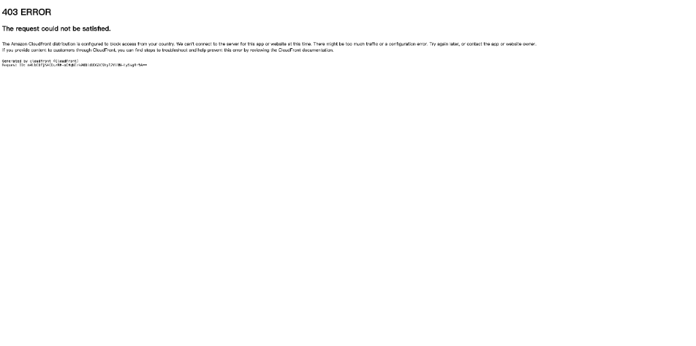

**适合人群**：数据分析师、业务运营、市场研究人员、非技术背景管理者

还在为制作周报、月报而熬夜？Ada 是世界上第一个 AI 数据分析师，只需点击一下，就能将任何数据集自动转化为专业的分析报告。它不仅能自动生成图表和布局，还能深入挖掘趋势、相关性，并提供可执行的洞察建议。

- 🎯 **主要功能**：自动清洗、整合多源数据，一键生成完整报告
- ⚡ **AI 特色**：结合工作流自动化与分析智能，真正理解数据背后的业务逻辑
- 🌟 **独特之处**：无需代码或专业知识，普通人也能做出专业级数据分析
- 💡 **使用场景**：
  - 市场团队快速生成投放效果报告
  - 财务人员自动化月度营收分析
  - 创业者实时监控关键业务指标

> **Maker 这么说**："Ada 是我们对数据报告方式的重新构想。用户不再需要在僵化的 BI 工具和简化的电子表格之间挣扎，而是让 AI 自动完成数据抓取、清洗、分析和设计，把时间还给真正的洞察工作。"

产品链接：[https://www.producthunt.com/products/ada-2](https://www.producthunt.com/products/ada-2)

---

### Sidekick - 用聊天构建 Zapier 级别的自动化

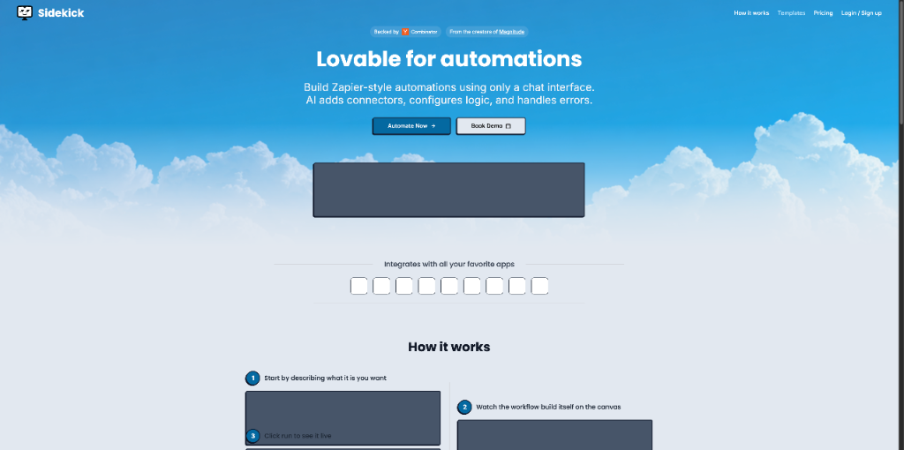

**适合人群**：非技术背景的运营、产品经理、中小企业主、自动化初学者

厌倦了 Zapier 那复杂的节点式界面？Sidekick 让你只需在聊天框中描述你的工作流，AI 就会自动帮你构建完整的自动化流程。无论是从 Gmail 抽取内容到 Google Sheets，还是为销售会议自动抓取并总结客户公司信息，Sidekick 都能轻松搞定。

- 🎯 **主要功能**：通过自然语言描述创建复杂自动化
- ⚡ **AI 特色**：自动处理 API 集成、循环、条件判断和错误处理
- 🌟 **独特之处**：所有构建和编辑都在聊天中完成，右侧仅展示可视化流程
- 💡 **使用场景**：
  - 自动同步客户表单到 CRM
  - 定期抓取竞品价格并生成报告
  - 为会议自动准备客户背景资料

> **Maker 这么说**："即使我们有计算机科学学位，也被 Zapier 这类工具的复杂性压垮。我们希望让每个人都能轻松构建自动化，而不是像学习一门新语言。"

产品链接：[https://www.producthunt.com/products/sidekick-11](https://www.producthunt.com/products/sidekick-11)

---

### Astra API Security Platform - 发现并保护每一个 API

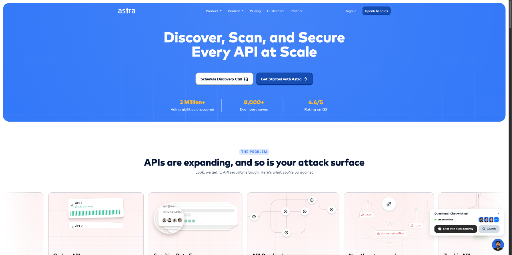

**适合人群**：安全工程师、CISO、开发者、AI 应用构建团队

API 已成为安全漏洞的首要入口。Astra API 安全平台通过实时流量分析，自动发现你基础设施中所有未记录、影子、僵尸和休眠的 API，并执行超过 15,000 个测试用例的主动 DAST 扫描，远超 OWASP API Top 10 范围。

- 🎯 **主要功能**：自动发现 + 深度安全扫描 + 风险检测
- ⚡ **AI 特色**：AI 驱动的逻辑测试，可识别 BOLA、IDOR 等真实世界风险
- 🌟 **独特之处**：专为 API 设计，支持 REST、GraphQL、内部和移动 API
- 💡 **使用场景**：
  - 防止数据泄露和认证漏洞
  - 确保 AI 代理和应用的安全性
  - 满足合规要求（SOC 2, HIPAA）

> **Maker 这么说**："API 是当今 breaches 的首要起点——不要让盲点付出代价。"

产品链接：[https://www.producthunt.com/products/astra-api-security-platform](https://www.producthunt.com/products/astra-api-security-platform)

---

### Rork App - 从想法到 App Store，只需几天

**适合人群**：创业者、独立开发者、产品经理、有创意想法的普通人

Rork 是移动应用开发的“Lovable”，它让你在几分钟内将想法变成手机上的原生应用。使用 Expo 和 React Native 构建，支持在几天内发布到 App Store。已帮助用户创建超过 50 万个项目，2000 多个应用上线。

- 🎯 **主要功能**：无代码/低代码构建原生 iOS 应用
- ⚡ **AI 特色**：AI 辅助开发流程，加速原型和发布
- 🌟 **独特之处**：真正实现“想法 → 应用 → 上架”全流程加速
- 💡 **使用场景**：
  - 快速验证产品创意
  - 为企业构建内部工具
  - 个人项目或游戏开发

> **Maker 这么说**："我们移民后靠做 App 谋生，但当时连 iPhone 都买不起。花了数年才掌握开发技能。现在，我们把当年梦寐以求的工具交给你。"

产品链接：[https://www.producthunt.com/products/rork-app-for-ios](https://www.producthunt.com/products/rork-app-for-ios)

---

### AgentSea - 统一、私密且安全的 AI 聊天界面

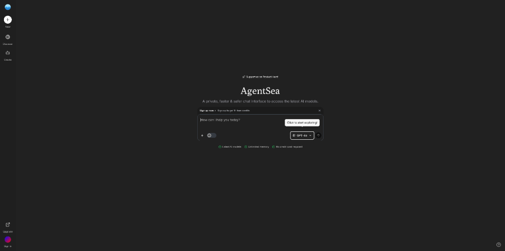

**适合人群**：多 AI 工具使用者、注重隐私的专业人士、内容创作者

还在为 ChatGPT、Claude、Gemini 各自为政而烦恼？AgentSea 提供了一个统一的聊天界面，让你在一个地方访问所有主流 AI 模型，且不会丢失上下文。支持跨模型切换、图像生成、社交搜索（X, Reddit, YouTube）和数百个社区构建的智能代理。

- 🎯 **主要功能**：聚合所有 AI 模型，保持上下文连续
- ⚡ **AI 特色**：安全模式确保敏感信息不进入训练管道
- 🌟 **独特之处**：每月仅 $15，包含 1000+ 社区代理
- 💡 **使用场景**：
  - 比较不同模型的回答
  - 安全地处理敏感数据
  - 使用特定任务代理（如写作、编程）

> **Maker 这么说**："管理多个 AI 订阅是噩梦。每次切换模型，你都得从头开始。AgentSea 让这一切变得简单。"

产品链接：[https://www.producthunt.com/products/agentsea](https://www.producthunt.com/products/agentsea)

---

### Morningmate 2.0 - 专为对外团队设计的协作工具

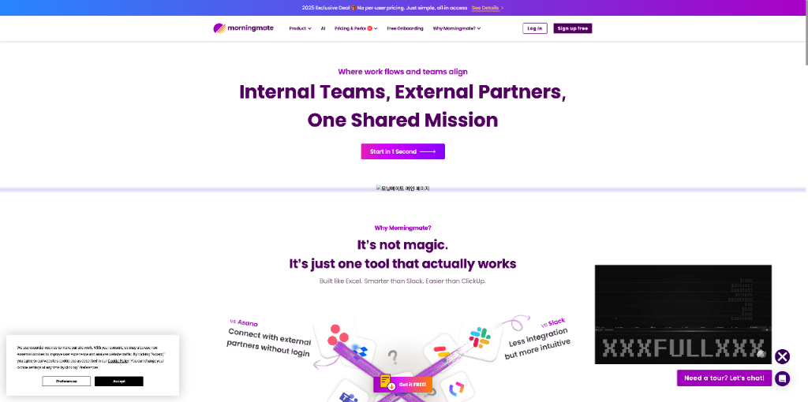

**适合人群**：客户成功团队、项目管理、自由职业者、与外部伙伴协作的团队

Morningmate 2.0 是 Slack + Asana 的升级版，专为需要与客户、自由职业者等外部伙伴协作的团队设计。全新 UI 和可定制任务管理，深度集成 Google Workspace，并即将推出公共链接分享功能，让外部协作无缝衔接。

- 🎯 **主要功能**：内部与外部团队一体化协作
- ⚡ **AI 特色**：虽非 AI 核心，但为 AI 团队提供高效协作基础
- 🌟 **独特之处**：真正打破内外协作壁垒
- 💡 **使用场景**：
  - 与客户同步项目进度
  - 管理自由职业者任务
  - 共享文件、邮件和日历

> **Maker 这么说**："工作不止于内部团队，你的协作工具也不应止步于此。"

产品链接：[https://www.producthunt.com/products/morningmate](https://www.producthunt.com/products/morningmate)

---

### Toffu AI - 不会明天就忘记的营销代理

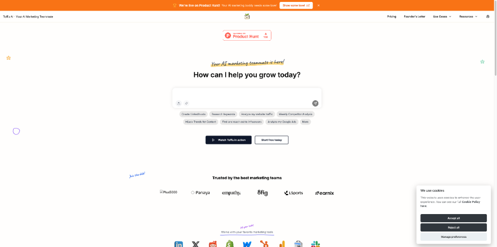

**适合人群**：B2B SaaS 营销团队、营销机构、独立运营者

Toffu 是你的 AI 营销队友，通过简单的聊天帮你执行营销策略、分析数据并做出数据驱动的决策。它连接 Google Analytics、Meta Ads、LinkedIn Ads 等所有主流工具，帮你管理 PPC、SEO、监控表现并生成报告。

- 🎯 **主要功能**：全栈营销自动化
- ⚡ **AI 特色**：在浏览器或 Slack 中通过聊天控制所有营销活动
- 🌟 **独特之处**：真正“执行”而非“建议”营销任务
- 💡 **使用场景**：
  - 自动创建和管理广告系列
  - 实时监控并调整广告表现
  - 自动生成跨平台营销报告

> **Maker 这么说**："Toffu 运行你的营销，而不是让你在多个工具间切换。早期客户每周节省数小时，并获得更多线索和注册。"

产品链接：[https://www.producthunt.com/products/toffu-ai](https://www.producthunt.com/products/toffu-ai)

---

### Koncile - 从文档中提取结构化数据的 AI OCR

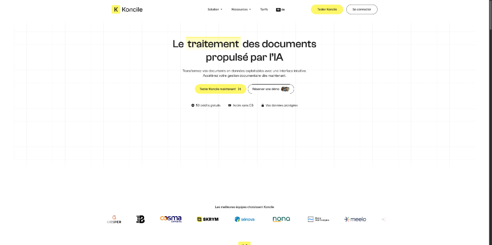

**适合人群**：财务、采购、运营团队、需要处理大量纸质或 PDF 文档的人员

还在手动输入发票、合同信息？Koncile 使用视觉 + 大语言模型引擎，将 PDF 和图像中的非结构化数据转化为结构化、可操作的信息。无需模板，支持智能页面分割和自动分类。

- 🎯 **主要功能**：AI 驱动的 OCR，提取表格、发票、合同数据
- ⚡ **AI 特色**：基于视觉和 LLM 的混合引擎，理解复杂文档结构
- 🌟 **独特之处**：支持 100+ 预设模板，可与 Zapier、Make 等集成
- 💡 **使用场景**：
  - 自动化发票处理
  - 从合同中提取关键条款
  - 采购订单数据录入

> **Maker 这么说**："我们 built it to help teams extract structured data from messy PDFs without needing templates or manual setup。"

产品链接：[https://www.producthunt.com/products/koncile](https://www.producthunt.com/products/koncile)

---

### ElevenLabs SFX v2 - 用一句话生成无限循环音效

**适合人群**：内容创作者、播客主、游戏开发者、视频制作人

ElevenLabs 推出 SFX v2 模型，可仅凭一个文本提示生成高质量、可无限循环的音效。支持设置影响程度、持续时间（最长 30 秒），为你的内容增添专业级听觉体验。

- 🎯 **主要功能**：文本生成音效（SFX）
- ⚡ **AI 特色**：生成最逼真、丰富、生动的声音
- 🌟 **独特之处**：专为创作者设计，支持 29 种语言、100+ 声音
- 💡 **使用场景**：
  - 为视频添加背景音效
  - 制作播客过渡音
  - 游戏内环境音生成

> **Maker 这么说**："你可以现在就用文本提示创建工作室级音效。支持无限循环、提示影响和最长 30 秒的持续时间。"

产品链接：[https://www.producthunt.com/products/elevenlabs](https://www.producthunt.com/products/elevenlabs)

---

### Stable - 企业的虚拟地址与邮箱

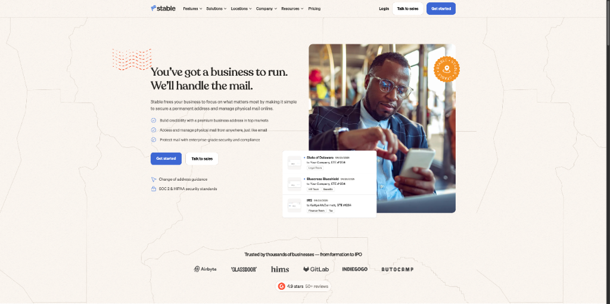

**适合人群**：远程创业团队、分布式企业、需要专业商业地址的自由职业者

Stable 提供虚拟商业地址和邮箱服务，让你无论身处何地都能拥有一个专业的商业地址。支持邮件自动扫描、智能路由到团队，并符合 SOC 2 和 HIPAA 合规要求。现已覆盖美国 21 个城市。

- 🎯 **主要功能**：虚拟地址 + 邮件数字化管理
- ⚡ **AI 特色**：新推出的 Workflow Automations 可自动路由邮件
- 🌟 **独特之处**：API/webhooks 支持自定义集成
- 💡 **使用场景**：
  - 注册公司时使用专业地址
  - 远程团队集中管理商务信件
  - 自动将发票路由给财务团队

> **Maker 这么说**："我们帮助创始人和企业摆脱管理商业地址和邮件的痛苦。Workflow Automations 让正确的邮件自动到达正确的人。"

产品链接：[https://www.producthunt.com/products/stable-delaware](https://www.producthunt.com/products/stable-delaware)

---

### MetaSurvey AI - AI 驱动的精美问卷

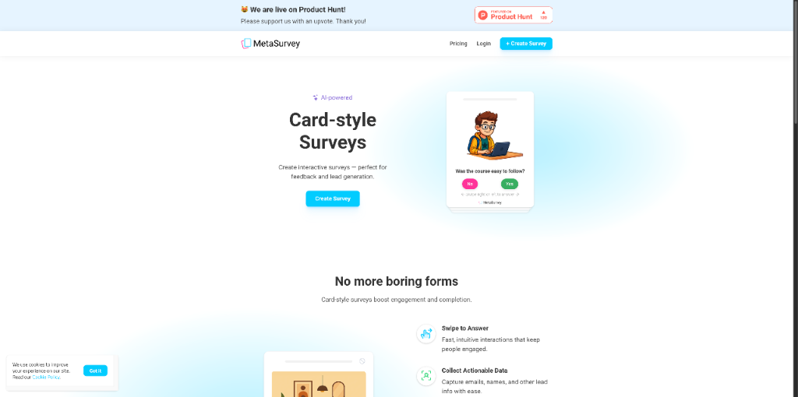

**适合人群**：市场研究人员、产品经理、内容创作者、需要用户反馈的团队

MetaSurvey AI 让你几秒钟内创建卡片式、游戏化的精美问卷。AI 自动生成问题，支持 Unsplash 图片插入，即时预览结果。将枯燥的长表单变成用户乐于参与的互动体验。

- 🎯 **主要功能**：AI 生成卡片式问卷
- ⚡ **AI 特色**：AI 自动生成问题和设计
- 🌟 **独特之处**：近乎所有功能免费，支持无限响应（付费）
- 💡 **使用场景**：
  - 用户反馈调查
  - 潜在客户生成
  - 产品使用体验调研

> **Maker 这么说**："用 AI 创建精美问卷，添加图片，即时预览结果。让无聊的长表单变成人们乐于回答的卡片式问卷。"

产品链接：[https://www.producthunt.com/products/metasurvey](https://www.producthunt.com/products/metasurvey)

---

### Hipocap - 用简单提示自动化任何任务

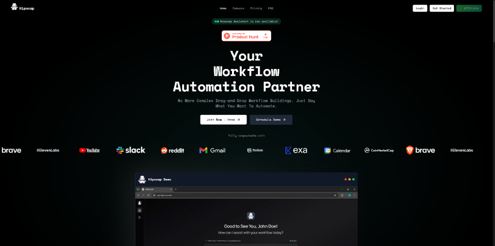

**适合人群**：希望自动化复杂流程但不想学编程的任何人

Hipocap 是 AI 原生的自动化平台，你只需用自然语言描述想要的自动化，它就能自动构建并执行。告别节点式构建的“蜘蛛网”，让 AI 代理层理解你的目标并完成跨应用任务。

- 🎯 **主要功能**：文本提示驱动的自动化
- ⚡ **AI 特色**：AI 代理层将目标分解为逻辑步骤
- 🌟 **独特之处**：真正“描述即构建”，无需任何开发思维
- 💡 **使用场景**：
  - 新线索自动添加到 CRM
  - 定期抓取网站数据并分析
  - 跨平台数据同步

> **Maker 这么说**："我们厌倦了在自动化工具中迷失于节点之间。为什么不能只描述目标，让自动化自动构建？这就是 Hipocap 的诞生原因。"

产品链接：[https://www.producthunt.com/products/hipocap](https://www.producthunt.com/products/hipocap)

---

### SnippSync - 让代码片段与 GitHub 实时同步

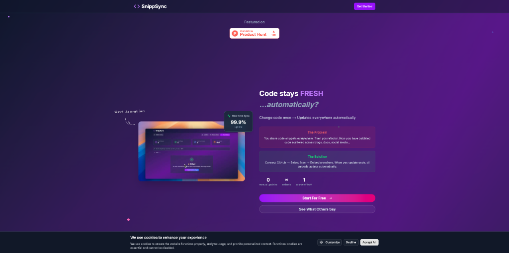

**适合人群**：开发者、技术博主、开源项目维护者、技术文档撰写者

教程里的代码总是过时？SnippSync 直接从你的 GitHub 仓库拉取代码，生成可嵌入 Notion、博客或文档的“活”代码片段。一旦你推送更新，所有嵌入的片段自动同步，永远保持最新。

- 🎯 **主要功能**：GitHub 代码片段自动同步
- ⚡ **AI 特色**：虽非 AI 核心，但为 AI 时代的技术分享提供基础设施
- 🌟 **独特之处**：支持注释、品牌化和 PNG 导出
- 💡 **使用场景**：
  - 维护技术博客中的代码示例
  - 同步项目 README
  - 在 Notion 中嵌入实时代码

> **Maker 这么说**："我厌倦了代码示例与实际代码不同步。SnippSync 让你设置一次，然后忘记它——所有片段都会自动更新。"

产品链接：[https://www.producthunt.com/products/snippsync](https://www.producthunt.com/products/snippsync)

---

### Mnemosphere AI - 高绩效者的 ChatGPT

**适合人群**：研究人员、分析师、学生、深度思考者

ChatGPT 很好，但研究是混乱且非线性的。Mnemosphere 为高绩效者打造，支持多模型并行对话（ChatGPT, Claude, Gemini），一键生成思维导图，分析 YouTube 视频，并在聊天中添加笔记和高亮，让复杂信息处理更高效。

- 🎯 **主要功能**：多模型研究助手
- ⚡ **AI 特色**：模型身份感知，各 AI 知道其他模型说了什么
- 🌟 **独特之处**：支持分支对话、聊天索引和即时思维导图
- 💡 **使用场景**：
  - 比较不同 AI 模型的回答
  - 深度研究复杂主题
  - 分析视频内容并生成章节

> **Maker 这么说**："研究是混乱的。Mnemosphere 拥抱这种混乱，提供一个更高效的 AI 聊天界面，让深度思考者不再受限于传统聊天框。"

产品链接：[https://www.producthunt.com/products/mnemosphere](https://www.producthunt.com/products/mnemosphere)

---

### Locki - 在输入时直接加密/解密文本

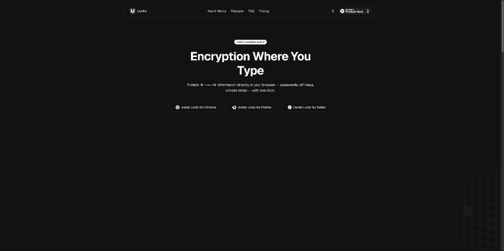

**适合人群**：需要分享敏感信息的任何人（API 密钥、密码、机密数据）

Locki 是一款轻量级浏览器扩展，让你在 Gmail、Notion、Slack 等任何地方输入时，一键加密敏感文本。接收方只需用同一工具解密，确保通信私密安全，防止数据泄露。

- 🎯 **主要功能**：实时文本加密/解密
- ⚡ **AI 特色**：虽非 AI 核心，但为 AI 时代的隐私保护提供基础工具
- 🌟 **独特之处**：加密片段可见但不可读，支持团队密钥管理
- 💡 **使用场景**：
  - 安全分享 API 密钥
  - 在文档中嵌入加密密码
  - 团队间安全通信

> **Maker 这么说**："我创建 Locki 是为了让文本加密变得简单实用。在任何地方输入时，都能轻松保护敏感信息。"

产品链接：[https://www.producthunt.com/products/locki-2](https://www.producthunt.com/products/locki-2)

---

## 🔗 今日产品链接一览

> 方便大家收藏和分享：

1. **Ada(你的专属 AI 数据分析师)**: [https://www.producthunt.com/products/ada-2](https://www.producthunt.com/products/ada-2)
2. **Sidekick(用聊天构建自动化)**: [https://www.producthunt.com/products/sidekick-11](https://www.producthunt.com/products/sidekick-11)
3. **Astra API Security Platform(全面保护你的 API)**: [https://www.producthunt.com/products/astra-api-security-platform](https://www.producthunt.com/products/astra-api-security-platform)
4. **Rork App(从想法到 App Store)**: [https://www.producthunt.com/products/rork-app-for-ios](https://www.producthunt.com/products/rork-app-for-ios)
5. **AgentSea(统一所有 AI 模型的聊天界面)**: [https://www.producthunt.com/products/agentsea](https://www.producthunt.com/products/agentsea)
6. **Morningmate 2.0(专为对外团队设计的协作工具)**: [https://www.producthunt.com/products/morningmate](https://www.producthunt.com/products/morningmate)
7. **Toffu AI(执行营销任务的 AI 代理)**: [https://www.producthunt.com/products/toffu-ai](https://www.producthunt.com/products/toffu-ai)
8. **Koncile(AI 驱动的文档数据提取)**: [https://www.producthunt.com/products/koncile](https://www.producthunt.com/products/koncile)
9. **ElevenLabs SFX v2(文本生成专业音效)**: [https://www.producthunt.com/products/elevenlabs](https://www.producthunt.com/products/elevenlabs)
10. **Stable(企业的虚拟地址与邮箱)**: [https://www.producthunt.com/products/stable-delaware](https://www.producthunt.com/products/stable-delaware)
11. **MetaSurvey AI(AI 驱动的精美问卷)**: [https://www.producthunt.com/products/metasurvey](https://www.producthunt.com/products/metasurvey)
12. **Hipocap(用提示自动化任何任务)**: [https://www.producthunt.com/products/hipocap](https://www.producthunt.com/products/hipocap)
13. **SnippSync(代码片段与 GitHub 同步)**: [https://www.producthunt.com/products/snippsync](https://www.producthunt.com/products/snippsync)
14. **Mnemosphere AI(高绩效者的 AI 研究工具)**: [https://www.producthunt.com/products/mnemosphere](https://www.producthunt.com/products/mnemosphere)
15. **Locki(输入时直接加密文本)**: [https://www.producthunt.com/products/locki-2](https://www.producthunt.com/products/locki-2)

---

## 💬 互动时间

**🎯 产品体验分享**：你试用过今天推荐的哪个产品？体验如何？

**🔍 产品推荐**：你最近发现了什么好用的 AI 工具？分享给大家吧！  
**⭐ 需求征集**：你希望有什么样的 AI 工具来解决你的困扰？  
**💡 使用技巧**：有什么 AI 工具的使用小技巧想要分享？

> 💬 在评论区留言，让我们一起构建最实用的 AI 产品库！

---

## 🔮 明日预告

🚀 明天会为大家带来更多 Product Hunt 上的 AI 新品，敬请期待！

❓ 有想看的特定类型产品吗？留言告诉我们吧~

---