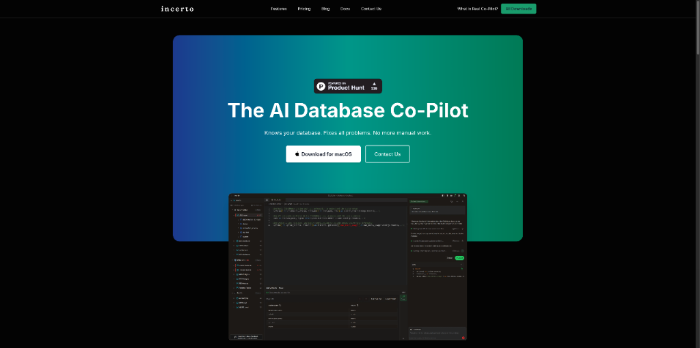
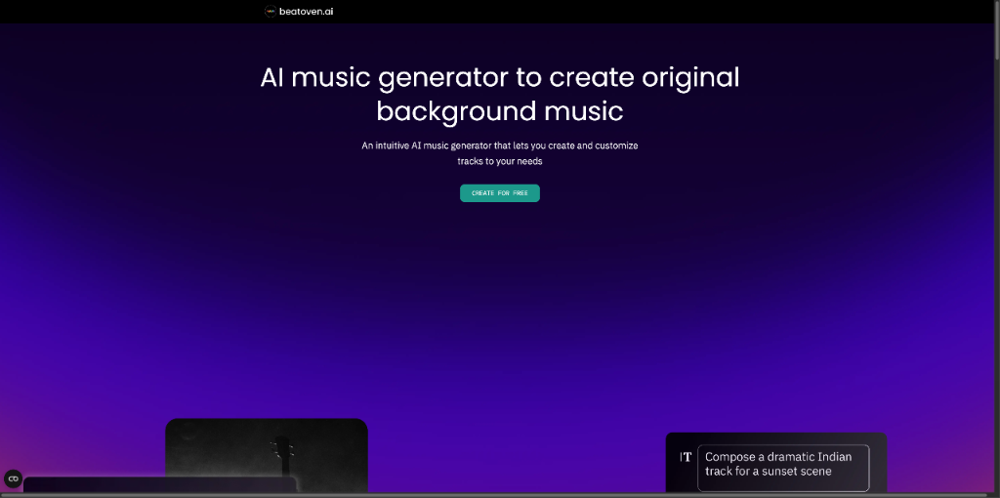
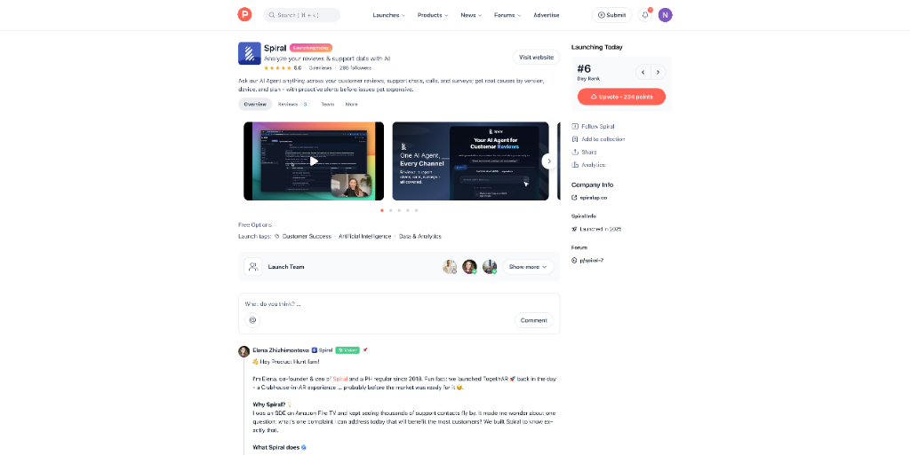
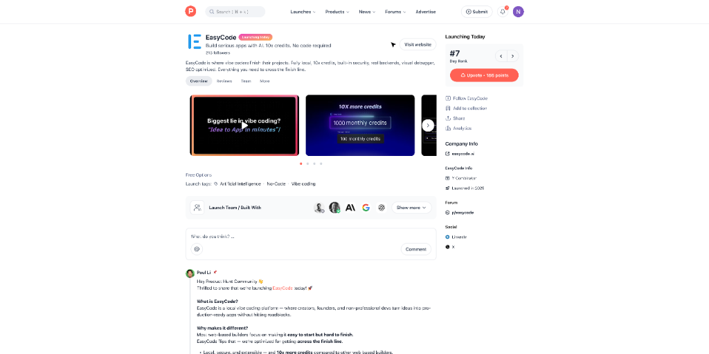
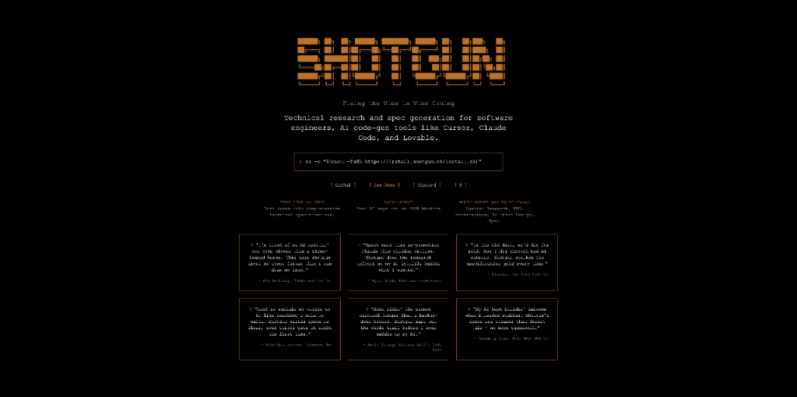
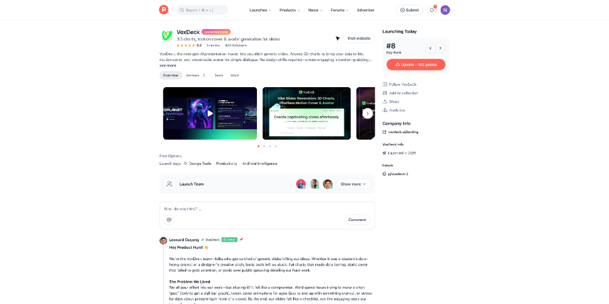

# 逆天了！AI Copilot直接操作数据库？！ AI 产品头条 - 第 6 期 | 2025年09月05日

> 🔥 **今日AI神器大爆发！**

👋 嗨，欢迎来到 AI 产品头条！

今天在 Product Hunt 上发现了 **18 个超棒的 AI 工具**，最让人兴奋的是：**AI 竟然能直接操作数据库，还能生成有版权保障的音乐，甚至让CRM系统彻底告别工具堆叠！**

从开发者到内容创作者，从独立开发者到企业团队，这些 AI 产品正在重新定义工作效率的边界。准备好迎接一场生产力的革命了吗？让我们一起探索今日最值得关注的 AI 新星！

---

## 🎯 今日精选产品

### Incerto - 数据库的 AI Copilot，告别手动SQL

**适合人群**：开发者、数据库管理员、数据工程师、技术团队

你是否也经历过这样的崩溃时刻：让AI生成SQL，结果它凭空创建了一个与你现有结构完全不符的`users`表？Incerto 就是为解决这个痛点而生的 **AI-native 数据库 Copilot**。它不是简单的“文本转SQL”，而是“文本转任务”——你的AI助手能真正理解你的数据库结构、索引、业务场景，并完成端到端的任务。

- 🎯 **主要功能**：用自然语言编写和优化查询、创建/修改表结构、管理索引、迁移数据
- ⚡ **AI 特色**：上下文感知的AI代理，能理解你的schema，避免“幻觉”
- 🌟 **独特之处**：支持“为什么这个时段内存高？”这类复杂问题的排查，是真正的数据库协作者
- 💡 **使用场景**：快速生成复杂查询、自动化数据库变更、新成员快速上手数据库结构

> **Maker 这么说**：“Think of Incerto like \"Cursor for databases\" — a copilot to interact and work on databases. 我们相信 CONTEXT IS EVERYTHING（上下文就是一切），我们为此而生。”

产品链接：[https://www.producthunt.com/products/incerto](https://www.producthunt.com/products/incerto)

---

### maestro by beatoven.ai - 你的个人AI作曲家，音乐创作从此无版权之忧

**适合人群**：播客主、影视创作者、游戏开发者、内容创作者

还在为背景音乐的版权和费用发愁吗？maestro 是一个**完全基于授权数据集训练的AI音乐生成模型**。它由 beatoven.ai 自主研发，训练数据来自 Rightsify、Soundtrack Loops 等合作伙伴的350万首授权曲目，确保生成的每一首音乐都安全、合法。

- 🎯 **主要功能**：通过文本提示生成高质量背景音乐（44.1kHz）
- ⚡ **AI 特色**：深度创意控制，可调节乐器、节奏、调性，生成时长最长2分30秒
- 🌟 **独特之处**：建立了一个公平的生态系统，使用maestro产生的收入将回馈给贡献艺术家
- 💡 **使用场景**：为播客制作片头片尾、为短视频生成配乐、为游戏场景营造氛围

> **Maker 这么说**：“我们相信在AI时代，艺术家也应得到公平回报。maestro 不仅是一个工具，更是我们对音乐创作生态的承诺。”

产品链接：[https://www.producthunt.com/products/beatoven-ai](https://www.producthunt.com/products/beatoven-ai)

---

### ClearCRM - 小企业的一站式CRM，终结工具混乱

**适合人群**：独立创业者、小型团队、自由职业者

“上一个项目，我花了1200美元请代理公司配置HubSpot，结果还是乱成一团。” 这是 ClearCRM 创始人Adil的亲身经历。ClearCRM 正是为解决这种“工具过载”而生的**一体化CRM套件**，它将销售、项目、账单和营销自动化无缝整合。

- 🎯 **主要功能**：可视化销售漏斗、内置营销自动化、项目与工单管理、报价与开票
- ⚡ **AI 特色**：AI副驾驶可自动生成邮件、设置自动工单回复
- 🌟 **独特之处**：专为独立开发者和小团队打造，无代码、易上手、性价比极高
- 💡 **使用场景**：管理客户线索、自动化营销活动、跟踪项目进度、快速生成发票

> **Maker 这么说**：“我厌倦了把十几个工具拼凑在一起。ClearCRM 让小企业能用一个简单、实惠的工具，专注于增长。”

产品链接：[https://www.producthunt.com/products/clearcrm](https://www.producthunt.com/products/clearcrm)

---

### Web to MCP - 告别截图，一键将网页组件发送给AI编码

**适合人群**：前端开发者、设计师、全栈工程师

“帮我做一个像Stripe那样的按钮”——这是不是你和AI编码工具最常说的话？结果往往不尽人意。Web to MCP 彻底改变了这一点。通过Chrome扩展，你可以**一键捕获任何网站上的组件**，并通过Model Context Protocol (MCP) 直接发送给 Cursor 或 Claude Code，让AI获得精确的组件数据，生成像素级还原的代码。

- 🎯 **主要功能**：捕获网页组件并直接发送给AI编码助手
- ⚡ **AI 特色**：利用MCP协议，为AI提供精确的上下文，而非模糊描述
- 🌟 **独特之处**：完美解决设计与开发之间的“翻译”鸿沟，提升协作效率
- 💡 **使用场景**：快速实现UI设计、学习优秀网站的实现方式、减少沟通成本

> **Maker 这么说**：“我们厌倦了AI生成的代码‘差不多’但就是不对。Web to MCP 提供了缺失的那一环——精确的组件数据。”

产品链接：[https://www.producthunt.com/products/web-to-mcp](https://www.producthunt.com/products/web-to-mcp)

---

### Spiral - 用AI分析用户反馈，找出问题的根因

**适合人群**：产品经理、客户成功团队、应用开发者

面对成千上万的用户评论、支持工单和调查问卷，如何快速找到最需要解决的问题？Spiral 的AI代理可以**深入分析所有客户反馈数据**，自动归纳问题，并让你用自然语言提问，获取证据支持的答案。

- 🎯 **主要功能**：聚合分析用户评论、支持聊天、电话记录、调查等
- ⚡ **AI 特色**：AI Agent可回答“最新版本有哪些新bug？”或“用户为什么要求退款？”
- 🌟 **独特之处**：能根据版本、设备、用户计划等元数据进行根因分析
- 💡 **使用场景**：产品迭代决策、客户满意度提升、快速响应市场反馈

> **Maker 这么说**：“在亚马逊Fire TV工作时，我总在想：哪个问题能影响最多的用户？Spiral 就是为了回答这个问题而生。”

产品链接：[https://www.producthunt.com/products/spiral-7](https://www.producthunt.com/products/spiral-7)

---

### EasyCode - 本地化的AI编程平台，助你完成项目

**适合人群**：独立黑客、初创公司创始人、非专业开发者

很多AI编程工具让你轻松开始，却难以完成。EasyCode 正是为“**完成项目**”而优化的本地AI编程平台。它提供Next.js + Supabase的完整栈，内置真实后端和数据库，让你的项目不再是Demo。

- 🎯 **主要功能**：基于AI的本地应用开发，支持完整后端和认证
- ⚡ **AI 特色**：10倍于其他平台的信用额度，专为完成项目设计
- 🌟 **独特之处**：代码完全本地化，私密安全，无厂商锁定
- 💡 **使用场景**：快速构建和发布MVP、个人项目开发、学习全栈开发

> **Maker 这么说**：“EasyCode 是一个本地的‘vibe coding’平台，帮助创造者、创始人和非专业开发者将想法变成可上线的应用。”

产品链接：[https://www.producthunt.com/products/easycode](https://www.producthunt.com/products/easycode)

---

### Shotgun CLI - 你的AI开发团队，为代码生成准备规范

**适合人群**：软件架构师、技术负责人、资深开发者

AI生成的代码为何常常“看起来对，但跑不起来”？因为AI对你的代码库一无所知。Shotgun CLI 是一个**代码库感知的规范引擎**，它拥有一个由研究员、架构师、产品经理和规范撰写者组成的AI团队，能为你的项目生成决策就绪的规范文档。

- 🎯 **主要功能**：多智能体协作，研究、规划并生成项目规范
- ⚡ **AI 特色**：能读取你的代码库，生成与现有系统匹配的架构
- 🌟 **独特之处**：本地优先，你的数据和密钥永不离开你的机器
- 💡 **使用场景**：启动新功能开发、重构复杂模块、确保AI生成代码符合预期

> **Maker 这么说**：“我们称之为你的AI团队（AI posse）。Shotgun 能读取你的代码库，确保生成的规范真正符合你的系统。”

产品链接：[https://www.producthunt.com/products/shotgun-cli](https://www.producthunt.com/products/shotgun-cli)

---

### VoxDeck - 用AI生成3D图表和虚拟形象，打造惊艳演示

**适合人群**：学生、设计师、产品经理、演讲者

厌倦了千篇一律的PPT？VoxDeck 是下一代AI演示制作工具，让你**通过简单对话**，就能生成3D动态图表、自动匹配的封面视频，甚至用AI虚拟形象代替你进行演讲。

- 🎯 **主要功能**：AI生成3D数据可视化、自动搜索匹配的封面视频、AI虚拟形象演讲
- ⚡ **AI 特色**：无需设计技能，输入目标即可生成专业级演示文稿
- 🌟 **独特之处**：特别适合不擅长公开演讲的用户，让AI形象代你表达
- 💡 **使用场景**：学术报告、创意提案、产品发布、在线课程

> **Maker 这么说**：“我们厌倦了枯燥的图表和平面的封面。VoxDeck 让你的想法以最引人入胜的方式呈现。”

产品链接：[https://www.producthunt.com/products/voxdeck-2](https://www.producthunt.com/products/voxdeck-2)

---

## 🔗 今日产品链接一览

> 方便大家收藏和分享：

1. **Incerto(数据库的AI Copilot，告别手动SQL)**: [https://www.producthunt.com/products/incerto](https://www.producthunt.com/products/incerto)
2. **maestro by beatoven.ai(基于授权数据的AI音乐生成)**: [https://www.producthunt.com/products/beatoven-ai](https://www.producthunt.com/products/beatoven-ai)
3. **ClearCRM(小企业一站式CRM)**: [https://www.producthunt.com/products/clearcrm](https://www.producthunt.com/products/clearcrm)
4. **Web to MCP(一键将网页组件发送给AI编码)**: [https://www.producthunt.com/products/web-to-mcp](https://www.producthunt.com/products/web-to-mcp)
5. **Spiral(用AI分析用户反馈)**: [https://www.producthunt.com/products/spiral-7](https://www.producthunt.com/products/spiral-7)
6. **EasyCode(本地化AI编程，助你完成项目)**: [https://www.producthunt.com/products/easycode](https://www.producthunt.com/products/easycode)
7. **Shotgun CLI(你的AI开发团队，生成项目规范)**: [https://www.producthunt.com/products/shotgun-cli](https://www.producthunt.com/products/shotgun-cli)
8. **VoxDeck(用AI生成3D图表和虚拟形象)**: [https://www.producthunt.com/products/voxdeck-2](https://www.producthunt.com/products/voxdeck-2)
...

---

## 💬 互动时间

**🎯 产品体验分享**：你试用过今天推荐的哪个产品？体验如何？

**🔍 产品推荐**：你最近发现了什么好用的 AI 工具？分享给大家吧！  
**⭐ 需求征集**：你希望有什么样的 AI 工具来解决你的困扰？  
**💡 使用技巧**：有什么 AI 工具的使用小技巧想要分享？

> 💬 在评论区留言，让我们一起构建最实用的 AI 产品库！

---

## 🔮 明日预告

🚀 明天会为大家带来更多 Product Hunt 上的 AI 新品，敬请期待！

❓ 有想看的特定类型产品吗？留言告诉我们吧~

---